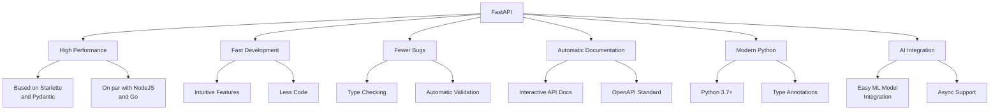
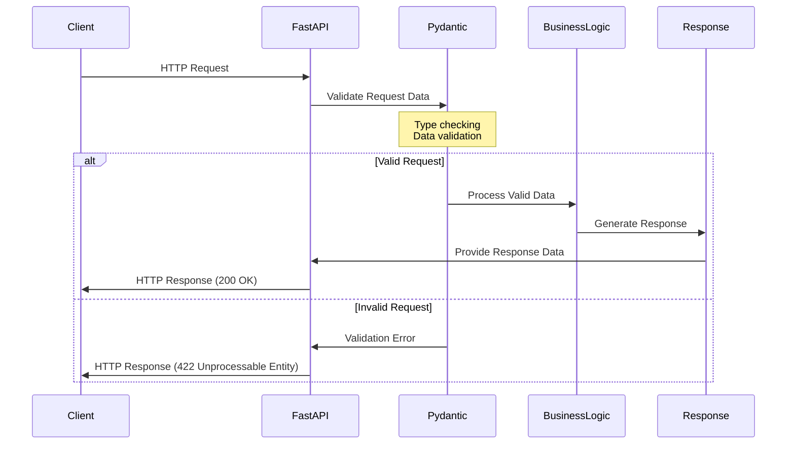

# Introduction to FastAPI

FastAPI is a modern, high-performance web framework for building APIs with Python 3.7+ based on standard Python type hints. It's designed to be easy to use while offering high performance and modern features.

## What is FastAPI?

FastAPI is built on top of Starlette (for web functionality) and Pydantic (for data validation). It automatically generates:
- API documentation with Swagger UI
- Schema validation using JSON Schema
- Client code generation tools

## Why FastAPI?



FastAPI is one of the fastest Python frameworks available, with performance comparable to NodeJS and Go.

### Key Advantages

1. **Fast to code**: Increases development speed by approximately 200-300%
2. **Automatic validation**: Validates requests and responses with minimal code 
3. **Interactive documentation**: Provides automatic, interactive API documentation
4. **Modern Python**: Leverages the latest Python features (type hints, async)
5. **Easy AI integration**: Ideal for machine learning and AI applications

## FastAPI vs Other Frameworks

| Feature | FastAPI | Flask | Django | Express.js |
|---------|---------|-------|--------|-----------|
| Performance | ⭐⭐⭐⭐⭐ | ⭐⭐⭐ | ⭐⭐⭐ | ⭐⭐⭐⭐ |
| Easy to Learn | ⭐⭐⭐⭐ | ⭐⭐⭐⭐⭐ | ⭐⭐⭐ | ⭐⭐⭐⭐ |
| Documentation | ⭐⭐⭐⭐⭐ | ⭐⭐⭐ | ⭐⭐⭐⭐ | ⭐⭐⭐ |
| Type Safety | ⭐⭐⭐⭐⭐ | ⭐ | ⭐⭐ | ⭐⭐ |
| Async Support | ⭐⭐⭐⭐⭐ | ⭐⭐ | ⭐⭐⭐ | ⭐⭐⭐⭐⭐ |
| ML Integration | ⭐⭐⭐⭐⭐ | ⭐⭐⭐ | ⭐⭐⭐ | ⭐⭐⭐ |

## How FastAPI Works



## Basic Example

Let's create a simple FastAPI application:

```python
from fastapi import FastAPI

# Create FastAPI instance
app = FastAPI()

# Define a route
@app.get("/")
def read_root():
    return {"message": "Hello World"}

# Define a route with a path parameter
@app.get("/items/{item_id}")
def read_item(item_id: int):
    return {"item_id": item_id}
```

## Running Your FastAPI Application

To run a FastAPI application, you need a server that supports ASGI (Asynchronous Server Gateway Interface). The most common choice is Uvicorn.

```bash
# Install uvicorn if you haven't already
pip install uvicorn

# Run the application
uvicorn main:app --reload
```

- `main` refers to the Python file `main.py`
- `app` refers to the FastAPI instance created with `app = FastAPI()`
- `--reload` enables auto-reloading during development

## API Documentation

One of FastAPI's most powerful features is automatic API documentation. When you run your FastAPI application, you can access:

- Swagger UI: `/docs`
- ReDoc: `/redoc`

These interactive documentation pages are automatically generated from your code, making it easy to test and share your API.

## Next Steps

In the next section, we'll explore Python type hints, which are fundamental to how FastAPI works.

## Practice Exercise

Create a simple FastAPI application that:
1. Has a root endpoint (`/`) that returns a welcome message
2. Has an endpoint (`/square/{number}`) that returns the square of a number
3. Run the application and explore the automatic documentation at `/docs` 