# 🚀 Welcome to FastAPI - Let's Build Amazing APIs!

Imagine you're a tech-savvy coffee shop owner who wants to create the coolest digital experience for your customers. You want them to browse your menu online, place orders through an app, and even get personalized coffee recommendations based on their mood. That's exactly what we'll build together using **FastAPI**! ☕

FastAPI is like having a super-smart assistant that helps you build APIs (the bridges between your app and your data) incredibly fast and with fewer bugs than ever before.

## 🤔 What is FastAPI?

Think of FastAPI as your **digital waiter** that:
- Takes orders (HTTP requests) from customers (users)
- Validates that orders make sense (data validation)
- Serves the right food (responses) quickly
- Automatically creates a menu (API documentation) that everyone can understand

FastAPI is built on two powerful foundations:
- **Starlette**: Handles all the web server magic (like a super-fast kitchen)
- **Pydantic**: Makes sure all data is correct (like a quality control manager)

## 🎯 Why Choose FastAPI? (It's Like Having Superpowers!)

```mermaid
graph TD
    A[🚀 FastAPI Superpowers] --> B[⚡ Lightning Fast]
    A --> C[🛠️ Easy to Code]
    A --> D[🐛 Fewer Bugs]
    A --> E[📚 Auto Documentation]
    A --> F[🐍 Modern Python]
    A --> G[🤖 AI-Ready]
    
    B --> B1[Faster than most<br/>other frameworks]
    B --> B2[Handles thousands<br/>of requests]
    
    C --> C1[Write less code<br/>do more things]
    C --> C2[Intuitive and<br/>beginner-friendly]
    
    D --> D1[Catches errors<br/>before they happen]
    D --> D2[Smart data<br/>validation]
    
    E --> E1[Beautiful interactive<br/>API playground]
    E --> E2[Documentation that<br/>updates itself]
    
    F --> F1[Uses the latest<br/>Python features]
    F --> F2[Type hints make<br/>code clearer]
    
    G --> G1[Perfect for machine<br/>learning projects]
    G --> G2[Async support for<br/>real-time features]
```



### 🏆 Why Developers Love FastAPI

1. **🚄 Speed Demon**: Write APIs 200-300% faster than traditional methods
2. **🛡️ Built-in Bodyguard**: Automatically validates data and catches errors
3. **📖 Self-Documenting**: Creates beautiful, interactive documentation without extra work
4. **🔮 Future-Proof**: Uses modern Python features that make code cleaner and safer
5. **🤖 AI-Friendly**: Perfect for integrating machine learning models and AI features

## 🥊 FastAPI vs The Competition

| Feature | FastAPI | Flask | Django | Express.js |
|---------|---------|-------|--------|-----------|
| 🏃‍♂️ Performance | ⭐⭐⭐⭐⭐ | ⭐⭐⭐ | ⭐⭐⭐ | ⭐⭐⭐⭐ |
| 🎯 Easy to Learn | ⭐⭐⭐⭐⭐ | ⭐⭐⭐⭐⭐ | ⭐⭐⭐ | ⭐⭐⭐⭐ |
| 📚 Documentation | ⭐⭐⭐⭐⭐ | ⭐⭐⭐ | ⭐⭐⭐⭐ | ⭐⭐⭐ |
| 🔒 Type Safety | ⭐⭐⭐⭐⭐ | ⭐ | ⭐⭐ | ⭐⭐ |
| ⚡ Async Support | ⭐⭐⭐⭐⭐ | ⭐⭐ | ⭐⭐⭐ | ⭐⭐⭐⭐⭐ |
| 🤖 AI Integration | ⭐⭐⭐⭐⭐ | ⭐⭐⭐ | ⭐⭐⭐ | ⭐⭐⭐ |

*FastAPI consistently wins in most categories that matter for modern development!*

## 🎬 How FastAPI Works Behind the Scenes

```mermaid
sequenceDiagram
    participant 👤 Customer
    participant 🏪 FastAPI
    participant 🔍 Pydantic
    participant ⚙️ YourCode
    participant 📦 Response
    
    👤->>🏪: "I want a large latte!"
    🏪->>🔍: "Is this order valid?"
    Note over 🔍: Checks if latte exists<br/>Validates size options
    alt ✅ Valid Order
        🔍->>⚙️: "Order looks good!"
        ⚙️->>📦: "Here's your latte!"
        📦->>🏪: "Order ready!"
        🏪->>👤: "☕ Your latte is ready!"
    else ❌ Invalid Order
        🔍->>🏪: "Sorry, we don't have that"
        🏪->>👤: "❌ Order error: Invalid size"
    end
```



## 🍼 Your First FastAPI App - A Coffee Shop!

Let's create a simple coffee shop API that's way more fun than "Hello World":

```python
from fastapi import FastAPI

# Create your coffee shop!
app = FastAPI(title="☕ Brew Master Coffee Shop")

# Welcome customers
@app.get("/")
def welcome_to_coffee_shop():
    return {
        "message": "☕ Welcome to Brew Master Coffee Shop!",
        "todays_special": "Vanilla Latte with extra foam",
        "wifi_password": "BrewMaster2024"
    }

# Show coffee details by ID
@app.get("/menu/coffee/{coffee_id}")
def get_coffee_by_id(coffee_id: int):
    coffee_menu = {
        1: {"name": "Espresso", "price": 2.50},
        2: {"name": "Latte", "price": 4.50},
        3: {"name": "Cappuccino", "price": 4.00}
    }
    return coffee_menu.get(coffee_id, {"error": "Coffee not found!"})
```

**What's happening here?**
- `@app.get("/")` creates a web page at your main URL
- `coffee_id: int` automatically converts the URL number to an integer
- If someone visits `/menu/coffee/1`, they get info about coffee #1

## 🚀 Launch Your Coffee Shop!

Time to bring your coffee shop to life:

```bash
# First, install FastAPI and its server
pip install fastapi uvicorn

# Start your coffee shop!
uvicorn main:app --reload
```

**What these commands do:**
- `fastapi uvicorn`: Install the required tools
- `uvicorn main:app`: Start a server using your `main.py` file
- `--reload`: Automatically restart when you change code (perfect for development!)

## 🎮 Interactive Playground - The Coolest Feature!

Once your coffee shop is running, visit these magical URLs:

- **🎮 Swagger UI**: `http://localhost:8000/docs` 
  - An interactive playground where you can test your API
  - Click buttons to try different coffee orders
  - See exactly what data is sent and received

- **📖 ReDoc**: `http://localhost:8000/redoc`
  - Beautiful, clean documentation
  - Perfect for sharing with team members

**This is pure magic** ✨ - FastAPI automatically creates this documentation from your code!

## 🎯 Real-World Example: Smart Coffee Recommendations

Here's how you could build a coffee recommendation system:

```python
@app.get("/recommend/")
def recommend_coffee(mood: str, caffeine_level: str = "medium"):
    """Get coffee recommendations based on your current mood!"""
    
    recommendations = {
        "tired": {"coffee": "Double Espresso", "note": "You need the strong stuff!"},
        "relaxed": {"coffee": "Vanilla Latte", "note": "Perfect for chilling"},
        "social": {"coffee": "Cappuccino", "note": "Great for conversations"},
        "focused": {"coffee": "Americano", "note": "Clean and simple"}
    }
    
    suggestion = recommendations.get(mood, {"coffee": "House Blend", "note": "A safe choice!"})
    
    return {
        "your_mood": mood,
        "recommended_coffee": suggestion["coffee"],
        "barista_note": suggestion["note"],
        "caffeine_level": caffeine_level
    }
```

Try it: `http://localhost:8000/recommend/?mood=tired&caffeine_level=high`

## 🎓 What You've Learned (You're Already Amazing!)

🎉 **Congratulations!** You've just learned:

- ✅ How to create a FastAPI application
- ✅ How to define API endpoints (routes)
- ✅ How to handle path parameters (`{coffee_id}`)
- ✅ How to work with query parameters (`?mood=tired`)
- ✅ How automatic documentation works
- ✅ How to run and test your API

## 🏃‍♂️ What's Next?

In the next section, we'll explore **Python Type Hints** - the secret sauce that makes FastAPI so powerful and beginner-friendly. You'll learn how to make your code self-documenting and catch errors before they happen!

## 🏋️‍♀️ Practice Challenge: Build Your Dream Coffee Shop

Ready for a fun challenge? Create a coffee shop API with these features:

1. **☕ Menu Endpoint**: `GET /menu` - Show all available coffees
2. **💰 Price Calculator**: `GET /calculate/{coffee_price}` - Add tax and tip
3. **⭐ Rating System**: `GET /rate/{coffee_id}/{rating}` - Rate coffees 1-5 stars
4. **🔍 Search**: `GET /search?name=latte` - Find coffees by name

**Bonus Challenge**: Add emoji responses and fun messages that would make customers smile!

**🎯 Success Tip**: Don't worry about making it perfect. The goal is to experiment and have fun. Every expert was once a beginner who kept trying! 