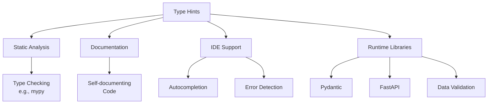
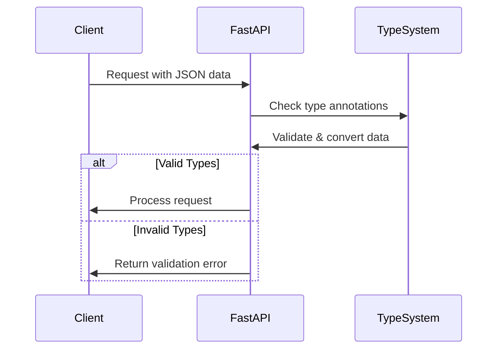

# Type Hints in Python

Type hints are annotations that specify the expected type of variables, function parameters, and return values in Python code. They were introduced in Python 3.5 with PEP 484 and have become increasingly important for modern Python development, especially with frameworks like FastAPI.

## What Are Type Hints?

Type hints add optional static typing to Python, allowing you to specify the expected types of variables, function parameters, and return values. They don't affect runtime behavior but enable better tooling support through static analysis.



## Basic Type Hint Syntax

```python
# Variable annotation
name: str = "John"
age: int = 30
is_active: bool = True

# Function parameters and return value
def greet(name: str, age: int) -> str:
    return f"Hello, {name}! You are {age} years old."
```

## Common Type Annotations

| Type Hint | Description | Example |
|-----------|-------------|---------|
| `int` | Integer | `age: int = 30` |
| `float` | Floating point number | `height: float = 1.75` |
| `bool` | Boolean value | `is_active: bool = True` |
| `str` | String | `name: str = "John"` |
| `list` | List of items | `numbers: list = [1, 2, 3]` |
| `dict` | Dictionary | `user: dict = {"name": "John"}` |
| `tuple` | Tuple of items | `point: tuple = (10, 20)` |
| `set` | Set of unique items | `tags: set = {"python", "coding"}` |
| `None` | Null value | `result: None = None` |
| `Any` | Any type | `data: Any = get_data()` |

## Complex Type Annotations

For complex types, you need to import types from the `typing` module:

```python
from typing import List, Dict, Tuple, Optional, Union

# List of specific types
names: List[str] = ["Alice", "Bob", "Charlie"]

# Dictionary with specific key and value types
user_ages: Dict[str, int] = {"Alice": 30, "Bob": 25}

# Tuple with specific types
point: Tuple[int, int] = (10, 20)

# Optional type (can be the specified type or None)
middle_name: Optional[str] = None  # Same as Union[str, None]

# Union type (can be one of several types)
id_number: Union[int, str] = "ABC-123"
```

## Type Hints in FastAPI

Type hints are fundamental to how FastAPI works. They allow FastAPI to:

1. **Validate request data**: Ensure incoming data matches expected types
2. **Convert data**: Parse request parameters to correct Python types
3. **Document API**: Generate OpenAPI schema documentation
4. **Generate client code**: Enable tools to auto-generate client libraries



## Why Type Hints Matter for FastAPI

1. **Automatic Validation**: FastAPI uses your type annotations to automatically validate incoming requests.
2. **Clear Interfaces**: Type hints make your API endpoints' expectations explicit.
3. **Better Documentation**: Swagger UI and ReDoc use type hints to generate detailed documentation.
4. **Fewer Bugs**: Catch type-related errors at development time rather than runtime.
5. **Better IDE Support**: Get autocompletion and error checking as you code.

## Type Hints in FastAPI Path Operations

```python
from fastapi import FastAPI
from typing import List, Optional
from pydantic import BaseModel

app = FastAPI()

class Item(BaseModel):
    name: str
    description: Optional[str] = None
    price: float
    tax: Optional[float] = None
    tags: List[str] = []

@app.post("/items/")
def create_item(item: Item) -> dict:
    return {"item_id": 123, **item.dict()}

@app.get("/items/{item_id}")
def read_item(item_id: int, q: Optional[str] = None) -> dict:
    return {"item_id": item_id, "q": q}
```

## Type Checking with mypy

While type hints don't enforce types at runtime, you can use tools like `mypy` to check your code statically:

```bash
pip install mypy
mypy your_file.py
```

This helps catch type errors before running your code, making your application more robust.

## Best Practices for Type Hints

1. **Be consistent**: Add type hints to all functions or none
2. **Start with public API**: Focus on adding types to public interfaces first
3. **Use precise types**: Prefer `List[str]` to `list` for better validation
4. **Consider using Optional**: Use `Optional[Type]` for parameters that might be None
5. **Add docstrings**: Combine type hints with docstrings for complete documentation

## Next Steps

In the next section, we'll explore Pydantic, a data validation library that leverages Python type annotations to validate complex data structures in FastAPI.

## Practice Exercise

1. Add type hints to the following function:
   ```python
   def process_user_data(user_id, name, age, is_active, tags, settings):
       # Process user data
       return {
           "id": user_id,
           "name": name,
           "age": age,
           "is_active": is_active,
           "tags": tags,
           "settings": settings
       }
   ```

2. Create a FastAPI endpoint that uses the above function with proper type hints 