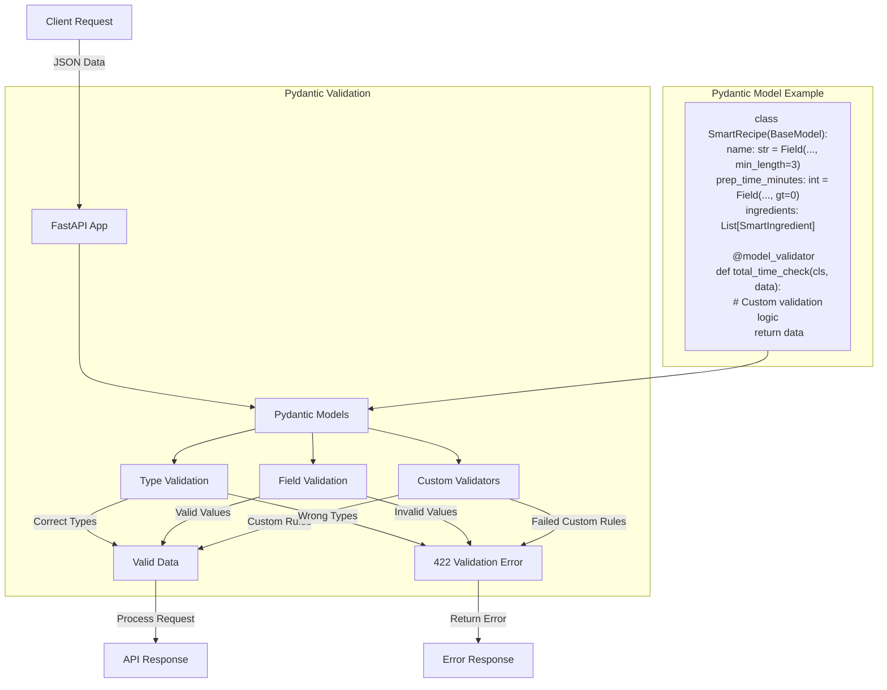

# 👨‍🍳 Section 3: Pydantic Data Validation - Recipe Master

This section introduces **Pydantic**, a powerful Python library that makes sure the data you're working with is always correct and in the right format. Think of it as a quality control system for your data!

## 🎯 What You'll Learn

- How to define simple data models with Pydantic.
- How to add rules (like "must be a number between 0 and 100") to your data using `Field`.
- How Pydantic helps you catch errors early and provides clear messages.
- How to implement custom validation logic using `@field_validator` and `@model_validator`.

## 👨‍🍳 Meet Recipe Master (Simplified!)

Our "Recipe Master" application now has a very focused set of features to demonstrate Pydantic:

**What Pydantic helps us do in this simplified example:**
- 🍳 Validate basic recipe details like name, description, and cooking times.
- 🥘 Check individual ingredient quantities.
- ⏰ Ensure total preparation and cooking times are reasonable.

## 📊 Pydantic Validation Flow



## 🔥 Pydantic in Action: Key Concepts

Pydantic works by letting you define data "schemas" using Python classes that inherit from `BaseModel`. You specify the expected type for each piece of data (e.g., `str` for text, `int` for whole numbers) and can add extra rules.

### **1. Basic Data Models & Field Validation**

You define a class where each attribute is a data field. Using `Field()`, you can add validation rules like minimum/maximum lengths for text or value ranges for numbers. If data doesn't meet these rules, Pydantic automatically flags it.

*Purpose*: Ensures that basic data types are correct and values meet predefined criteria.

```python
from pydantic import BaseModel, Field

class SmartIngredient(BaseModel):
    # Field validation:
    # - name: Must be between 1 and 50 characters.
    # - quantity: Must be a number greater than 0.
    name: str = Field(..., min_length=1, max_length=50)
    quantity: float = Field(..., gt=0)
    unit: str = Field(..., min_length=1, max_length=20)
```

### **2. Custom Validation Logic (`@field_validator` & `@model_validator`)**

For more complex business rules, Pydantic allows you to write your own validation functions.

-   **`@field_validator`**: Checks a single field. For example, checking if an ingredient quantity is unusually high.
-   **`@model_validator`**: Checks the entire model after individual fields are validated. This is useful for rules that depend on multiple fields, like ensuring the total recipe time is reasonable.

*Purpose*: Lets you implement any custom logic needed to validate your data beyond simple checks.

```python
from pydantic import BaseModel, field_validator, model_validator

class SmartIngredient(BaseModel):
    name: str
    quantity: float
    unit: str
    
    @field_validator('quantity')
    def quantity_reasonable(cls, v):
        if v > 100:
            raise ValueError('Quantity seems very high! Double-check measurements.')
        return v

class SmartRecipe(BaseModel):
    prep_time_minutes: int
    cook_time_minutes: int
    
    @model_validator(mode='after')
    def total_time_check(self):
        total_time = self.prep_time_minutes + self.cook_time_minutes
        if total_time > 720: # Max 12 hours
            raise ValueError('Total time exceeds 12 hours.')
        return self
```

### **3. Enums for Fixed Choices**

Enums (enumerations) let you define a fixed set of allowed values for a field. This prevents typos and ensures data consistency by limiting choices to a predefined list.

*Purpose*: Guarantees that certain fields only accept valid options, improving data quality.

```python
from enum import Enum

class DifficultyLevel(str, Enum):
    BEGINNER = "beginner"
    INTERMEDIATE = "intermediate"  
    ADVANCED = "advanced"
    EXPERT = "expert"
```

## 🚀 Pydantic + FastAPI: A Perfect Pair

FastAPI works seamlessly with Pydantic. When you define your API's expected input data using Pydantic models, FastAPI automatically:

-   **Validates Incoming Data**: Checks if the data sent by the user matches your Pydantic model's rules. If not, it sends clear error messages back (a `422 Unprocessable Entity` response with details).
-   **Generates API Documentation**: Automatically creates interactive documentation (Swagger UI/OpenAPI) showing exactly what data your API expects and returns. This makes it incredibly easy for others to understand and use your API.

```python
# Example: See the API endpoints in main.py where SmartRecipe is used as input
```

## 🛠️ Running Recipe Master

To see Pydantic in action:

```bash
cd 03-pydantic
pip install "fastapi[all]"  # Install FastAPI with all common extras, including Pydantic
uvicorn main:app --reload

# After running, open your browser to http://127.0.0.1:8000/docs to see the auto-generated API documentation.

# --- Example POST Requests ---
# Make sure the FastAPI application is running (uvicorn main:app --reload) before trying these.
# We'll use "Chicken Tikka Masala" to test our validation rules.

# 1. Successful Recipe Creation (POST /recipes/)
#    This request should pass all validation rules.
#    Expected: 200 OK, with a success message.
curl -X POST "http://127.0.0.1:8000/recipes/" \
     -H "Content-Type: application/json" \
     -d '{
  "name": "Classic Chicken Tikka Masala",
  "description": "A delicious and creamy chicken tikka masala, marinated in yogurt and spices, then simmered in a rich tomato-based sauce. A restaurant-quality dish you can make at home.",
  "difficulty": "intermediate",
  "prep_time_minutes": 45,
  "cook_time_minutes": 30,
  "ingredients": [
    {"name": "Chicken Breast", "quantity": 50, "unit": "g"},
    {"name": "Yogurt", "quantity": 1, "unit": "cup"},
    {"name": "Tomatoes", "quantity": 40, "unit": "g"},
    {"name": "Garam Masala", "quantity": 2, "unit": "tbsp"}
  ],
  "cuisine_type": "asian"
}'

# 2. Invalid Request: Basic Field Errors
#    - 'name' is too short (min 3 chars).
#    - 'description' is too short (min 20 chars).
#    - 'prep_time_minutes' is not > 0.
#    Expected: 422 Unprocessable Entity, with detailed validation errors for each field.
curl -X POST "http://127.0.0.1:8000/recipes/" \
     -H "Content-Type: application/json" \
     -d '{
  "name": "CK",
  "description": "Tasty curry.",
  "difficulty": "beginner",
  "prep_time_minutes": 0,
  "cook_time_minutes": 25,
  "ingredients": [
    {"name": "Chicken", "quantity": 50, "unit": "g"}
  ],
  "cuisine_type": "american"
}'

# 3. Invalid Request: Enum & Custom Field Validator Errors
#    - 'difficulty' is not a valid choice (not in the Enum).
#    - 'cuisine_type' is not a valid choice ('indian' is not in our list).
#    - ingredient 'quantity' is too high (> 100), triggering the @field_validator.
#    Expected: 422 Unprocessable Entity, with multiple validation errors.
curl -X POST "http://127.0.0.1:8000/recipes/" \
     -H "Content-Type: application/json" \
     -d '{
  "name": "Spicy Chicken Tikka",
  "description": "A very spicy version of the classic dish, be careful with the heat level as it is quite intense.",
  "difficulty": "masterchef",
  "prep_time_minutes": 30,
  "cook_time_minutes": 40,
  "ingredients": [
    {"name": "Chicken", "quantity": 50, "unit": "g"},
    {"name": "Chili Powder", "quantity": 101, "unit": "g"}
  ],
  "cuisine_type": "indian"
}'

# 4. Invalid Request: List Validation Error
#    - The 'ingredients' list is empty, which violates `min_items=1`.
#    Expected: 422 Unprocessable Entity, with an error about the ingredients list.
curl -X POST "http://127.0.0.1:8000/recipes/" \
     -H "Content-Type: application/json" \
     -d '{
  "name": "Invisible Chicken Tikka",
  "description": "This is a magical dish that requires absolutely no ingredients to make, defying all laws of physics.",
  "difficulty": "expert",
  "prep_time_minutes": 10,
  "cook_time_minutes": 15,
  "ingredients": [],
  "cuisine_type": "asian"
}'


# 5. Invalid Request (Advanced Validation): Custom Model Validator
#    - This endpoint uses the @model_validator to check cross-field logic.
#    - The total time (prep + cook) exceeds 720 minutes (12 hours).
#    Expected: 422 Unprocessable Entity, due to the 'total_time_check' validator.
curl -X POST "http://127.0.0.1:8000/recipes/validate-advanced/" \
     -H "Content-Type: application/json" \
     -d '{
  "name": "Marathon Chicken Tikka",
  "description": "A chicken tikka so complex it takes more than half a day to prepare and cook, testing the limits of your patience.",
  "difficulty": "expert",
  "prep_time_minutes": 300,
  "cook_time_minutes": 500,
  "ingredients": [
    {"name": "Chicken", "quantity": 1, "unit": "kg"},
    {"name": "Spice Mix", "quantity": 50, "unit": "g"}
  ],
  "cuisine_type": "french"
}'
```

## 🔥 Why Pydantic is Awesome (Key Benefits)

| Benefit             | How Pydantic Helps                                            |
|---------------------|---------------------------------------------------------------|
| **Less Code**       | You write significantly less code for data validation, as Pydantic handles much of it automatically based on your model definitions. |
| **Clear Errors**    | Provides precise, machine-readable, and user-friendly error messages when data is invalid, making debugging and API usage simpler. |
| **Type Safety**     | Ensures that data conforms to expected Python types, reducing common programming mistakes and improving code reliability. |
| **Auto-Documentation**| Generates comprehensive API documentation for free, making it incredibly easy for developers to understand and interact with your API. |
| **Reliability**     | Makes your application more robust and predictable by ensuring all incoming and outgoing data adheres to defined schemas. |

## 💡 Best Practices

1.  **Use `Field()`**: Always use `Field()` for detailed validation rules (e.g., `min_length`, `gt`).
2.  **Custom Logic**: Implement complex business rules or cross-field validations using `@field_validator` and `@model_validator`.
3.  **Clear Models**: Keep your Pydantic models clear and representative of your data structure.

## 🚀 What's Next?

In **Section 4: Routing**, we'll explore how to organize more complex APIs into smaller, manageable parts using FastAPI's routing features!

**Key Takeaway**: Pydantic streamlines data validation, turning a tedious task into an efficient, robust, and self-documenting process! 👨‍🍳✨ 