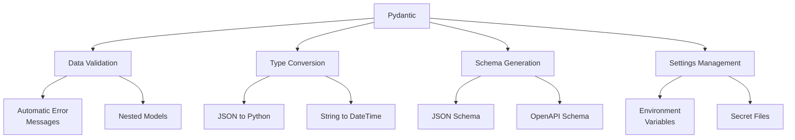
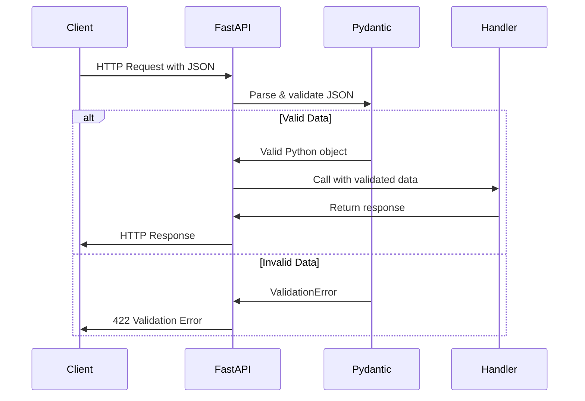

# Pydantic Data Validation

Pydantic is a data validation library that uses Python type annotations to validate data structures. It's a core component of FastAPI, handling all the request validation and data conversion.

## What is Pydantic?

Pydantic enforces type hints at runtime, generating clear error messages when data is invalid. It provides:

- Data validation
- Settings management
- Data parsing
- Schema generation



## Pydantic Models

The core of Pydantic is the `BaseModel` class:

```python
from pydantic import BaseModel, Field
from typing import List, Optional
from datetime import datetime

class User(BaseModel):
    id: int
    name: str
    email: str
    password: str
    is_active: bool = True
    created_at: datetime = datetime.now()
    tags: List[str] = []
    description: Optional[str] = None
```

## Data Validation with Pydantic

Pydantic models automatically validate data:

```python
# Valid data
user = User(
    id=1,
    name="John Doe",
    email="john@example.com",
    password="secret123",
    tags=["user", "customer"]
)

# Invalid data would raise ValidationError
try:
    invalid_user = User(
        id="not_an_integer",  # Type error: should be int
        name="Jane Doe",
        email="not_an_email",  # Could add email validator
        password=123  # Will be converted to string
    )
except ValueError as e:
    print(f"Validation error: {e}")
```

## Field Validations

Pydantic provides rich field validation options:

```python
from pydantic import BaseModel, Field, EmailStr, validator

class User(BaseModel):
    id: int = Field(..., gt=0)  # ... means required, gt=0 means greater than 0
    name: str = Field(..., min_length=2, max_length=50)
    email: EmailStr
    password: str = Field(..., min_length=8)
    age: int = Field(..., ge=18)  # ge=18 means greater than or equal to 18
    
    # Custom validator
    @validator('password')
    def password_must_contain_special_char(cls, v):
        if not any(char in "!@#$%^&*()_+" for char in v):
            raise ValueError('Password must contain a special character')
        return v
```

## Nested Models

Pydantic supports nested models for complex data structures:

```python
from pydantic import BaseModel
from typing import List, Dict, Optional

class Address(BaseModel):
    street: str
    city: str
    country: str
    postal_code: str

class User(BaseModel):
    name: str
    addresses: List[Address]
    metadata: Dict[str, str] = {}
```

## How Pydantic Works with FastAPI

FastAPI uses Pydantic models to:

1. **Convert request data**: Parse JSON data into Python objects
2. **Validate data**: Ensure data matches expected types and constraints
3. **Document API**: Generate OpenAPI schema for documentation
4. **Serialize responses**: Convert Python objects back to JSON



## Using Pydantic in FastAPI

```python
from fastapi import FastAPI, Path, Query
from pydantic import BaseModel, Field
from typing import List, Optional

app = FastAPI()

class Item(BaseModel):
    name: str = Field(..., min_length=1, max_length=50)
    description: Optional[str] = Field(None, max_length=500)
    price: float = Field(..., gt=0)
    tax: Optional[float] = Field(None, ge=0)
    tags: List[str] = []

@app.post("/items/")
def create_item(item: Item):
    return item

@app.get("/items/{item_id}")
def read_item(
    item_id: int = Path(..., gt=0),
    q: Optional[str] = Query(None, min_length=3, max_length=50)
):
    return {"item_id": item_id, "q": q}
```

In this example:
- The `Item` model validates the request body
- `Path` validates the path parameter
- `Query` validates the query parameter

## Request Body Validation

FastAPI uses Pydantic models to validate request bodies:

```python
from fastapi import FastAPI
from pydantic import BaseModel

app = FastAPI()

class User(BaseModel):
    username: str
    email: str
    full_name: str
    disabled: bool = False

@app.post("/users/")
def create_user(user: User):
    # user is already validated by Pydantic
    return {"user": user.dict()}
```

## Response Models

Pydantic models can also define response schemas to:
- Filter out sensitive data
- Ensure consistent response format
- Document response structure

```python
from fastapi import FastAPI
from pydantic import BaseModel
from typing import List

app = FastAPI()

class UserIn(BaseModel):
    username: str
    email: str
    password: str

class UserOut(BaseModel):
    username: str
    email: str

@app.post("/users/", response_model=UserOut)
def create_user(user: UserIn):
    # Password will be excluded from the response
    return user
```

## Advanced Pydantic Features

### Config

Customize model behavior with the Config class:

```python
class User(BaseModel):
    name: str
    email: str
    
    class Config:
        orm_mode = True  # Work with ORM models
        allow_population_by_field_name = True  # Allow aliased fields
        schema_extra = {
            "example": {
                "name": "John Doe",
                "email": "john@example.com"
            }
        }
```

### Field Aliases

Use different field names in Python and JSON:

```python
class User(BaseModel):
    name: str
    email: str = Field(..., alias="emailAddress")
```

### Validators

Add custom validation logic:

```python
from pydantic import BaseModel, validator

class User(BaseModel):
    name: str
    password: str
    password_confirm: str
    
    @validator('password_confirm')
    def passwords_match(cls, v, values):
        if 'password' in values and v != values['password']:
            raise ValueError('passwords do not match')
        return v
```

## Next Steps

In the next section, we'll explore routing in FastAPI, where we'll build more complex API endpoints.

## Practice Exercise

1. Create a Pydantic model for a `Product` with these fields:
   - `id`: integer (positive)
   - `name`: string (1-100 characters)
   - `description`: optional string
   - `price`: float (positive)
   - `is_in_stock`: boolean, default True
   - `tags`: list of strings
   - `dimensions`: nested model with height, width, depth (all floats)

2. Add a custom validator to ensure that at least one tag is provided

3. Create a FastAPI endpoint that uses this model 