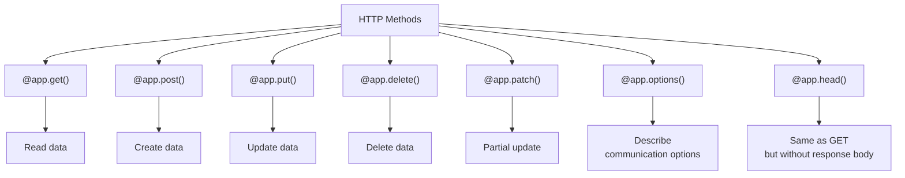
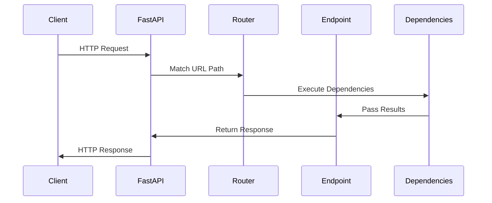

# Routing in FastAPI

Routing is the mechanism that FastAPI uses to direct HTTP requests to the correct "path operation function" based on the URL path, HTTP method, and other parameters. FastAPI provides a clean and intuitive way to define routes.

## HTTP Methods

FastAPI supports all standard HTTP methods, with decorator functions for each:



## Basic Routing

At its simplest, routing in FastAPI involves decorating functions with HTTP methods and paths:

```python
from fastapi import FastAPI

app = FastAPI()

@app.get("/")
def read_root():
    return {"message": "Hello World"}

@app.get("/items")
def read_items():
    return {"items": ["Item1", "Item2"]}
```

## Path Parameters

Path parameters are parts of the URL path that are extracted as function parameters:

```python
@app.get("/items/{item_id}")
def read_item(item_id: int):
    return {"item_id": item_id}
```

In this example:
- `item_id` is extracted from the URL path
- It's automatically converted to an `int` because of the type annotation
- If conversion fails, FastAPI returns a clear error message

## Query Parameters

Query parameters are the key-value pairs that appear after the `?` in a URL:

```python
@app.get("/items/")
def read_items(skip: int = 0, limit: int = 10):
    # skip and limit are query parameters
    return {"skip": skip, "limit": limit}
```

Accessing this with: `/items/?skip=20&limit=30`

## Request Body

To receive JSON in the request body, declare a parameter with a Pydantic model:

```python
from pydantic import BaseModel

class Item(BaseModel):
    name: str
    price: float
    is_offer: bool = False

@app.post("/items/")
def create_item(item: Item):
    return item
```

## Path Operation Order

Routes are evaluated in the order they are defined, so more specific routes should come before more general ones:

```python
@app.get("/users/me")  # More specific - must come first
def read_current_user():
    return {"user_id": "the_current_user"}

@app.get("/users/{user_id}")  # More general - must come second
def read_user(user_id: str):
    return {"user_id": user_id}
```

If these were reversed, `/users/me` would never be matched because `/users/{user_id}` would capture it first.

## Path Parameter Types

FastAPI can validate and convert path parameters to specific types:

```python
@app.get("/items/{item_id}")
def read_item(item_id: int):  # Must be an integer
    return {"item_id": item_id}

@app.get("/models/{model_name}")
def get_model(model_name: str):  # Can be any string
    return {"model_name": model_name}
```

## Predefined Values with Enums

You can limit path parameters to specific values using Python's `Enum`:

```python
from enum import Enum

class ModelName(str, Enum):
    alexnet = "alexnet"
    resnet = "resnet"
    lenet = "lenet"

@app.get("/models/{model_name}")
def get_model(model_name: ModelName):
    if model_name == ModelName.alexnet:
        return {"model_name": model_name, "message": "Deep Learning FTW!"}
    
    if model_name.value == "lenet":
        return {"model_name": model_name, "message": "LeCNN all the images"}
        
    return {"model_name": model_name, "message": "Have some residuals"}
```

## Path Parameters with Paths

For path parameters that should contain paths (with `/`), use the special Starlette parameter:

```python
@app.get("/files/{file_path:path}")
def read_file(file_path: str):
    return {"file_path": file_path}
```

This would match URLs like `/files/folder/file.txt`.

## APIRouter for Modular Routes

For larger applications, you can use `APIRouter` to organize routes into modules:

```python
from fastapi import APIRouter, FastAPI

app = FastAPI()
router = APIRouter(prefix="/users", tags=["users"])

@router.get("/")
def read_users():
    return {"users": ["Rick", "Morty"]}

@router.get("/{user_id}")
def read_user(user_id: str):
    return {"user_id": user_id}

# Include the router in the main app
app.include_router(router)
```

## Route Dependency Injection

You can add dependencies to specific routes or routers:

```python
from fastapi import Depends, FastAPI

app = FastAPI()

def get_token_header(x_token: str = Header(...)):
    if x_token != "fake-super-secret-token":
        raise HTTPException(status_code=400, detail="X-Token header invalid")
    return x_token

@app.get("/items/", dependencies=[Depends(get_token_header)])
def read_items():
    return [{"item": "Foo"}, {"item": "Bar"}]
```

## Using Tags for API Organization

Tags help organize your API documentation:

```python
@app.get("/items/", tags=["items"])
def read_items():
    return [{"name": "Foo"}]

@app.get("/users/", tags=["users"])
def read_users():
    return [{"name": "John"}]
```

## Advanced Routing Features

### Response Status Code

Customize the HTTP status code of responses:

```python
@app.post("/items/", status_code=201)  # Created
def create_item(item: Item):
    return item
```

### Include_in_schema

Control whether an endpoint appears in the documentation:

```python
@app.get("/hidden/", include_in_schema=False)
def hidden_endpoint():
    return {"hidden": True}
```

### Operation ID

Specify a unique operation ID for the endpoint:

```python
@app.get("/items/", operation_id="list_all_items")
def read_items():
    return [{"item": "Foo"}, {"item": "Bar"}]
```

## Route Flow



## Practical Example - Building an API with Multiple Routes

Here's a more complete example showing different routing patterns:

```python
from fastapi import FastAPI, APIRouter, Depends, HTTPException, Header
from pydantic import BaseModel
from typing import List, Optional

app = FastAPI()

# Models
class Item(BaseModel):
    name: str
    description: Optional[str] = None
    price: float

# Dependencies
def verify_token(x_token: str = Header(...)):
    if x_token != "fake-token":
        raise HTTPException(status_code=401, detail="Invalid X-Token")
    return x_token

# Main routes
@app.get("/")
def read_root():
    return {"message": "Welcome to the API"}

@app.get("/health")
def health_check():
    return {"status": "healthy"}

# Items router
items_router = APIRouter(
    prefix="/items",
    tags=["items"],
    dependencies=[Depends(verify_token)]
)

@items_router.get("/")
def read_items():
    return [{"name": "Item 1"}, {"name": "Item 2"}]

@items_router.get("/{item_id}")
def read_item(item_id: int):
    return {"item_id": item_id}

@items_router.post("/", status_code=201)
def create_item(item: Item):
    return item

# Users router
users_router = APIRouter(
    prefix="/users",
    tags=["users"]
)

@users_router.get("/")
def read_users():
    return [{"name": "User 1"}, {"name": "User 2"}]

@users_router.get("/me")
def read_current_user():
    return {"name": "Current User"}

@users_router.get("/{user_id}")
def read_user(user_id: int):
    return {"user_id": user_id}

# Include routers
app.include_router(items_router)
app.include_router(users_router)
```

## Next Steps

In the next section, we'll explore request and response models in depth, showing how to properly structure your data flows in FastAPI.

## Practice Exercise

Create a FastAPI application that:

1. Has a root endpoint (`/`) that returns a welcome message
2. Has endpoints for managing a collection of books:
   - GET `/books` - Returns a list of books
   - GET `/books/{book_id}` - Returns details for a specific book
   - POST `/books` - Adds a new book
   - PUT `/books/{book_id}` - Updates a book
   - DELETE `/books/{book_id}` - Removes a book

3. Uses an `APIRouter` to organize the book endpoints
4. Includes appropriate tags for documentation 