# 📚 Routing in FastAPI - Build Your Magical Digital Library!

Imagine you're building the most amazing digital library in the world! 🏰 You want readers to find books easily, join book clubs, get personalized recommendations, and track their reading adventures. **That's exactly what we'll build using FastAPI routing!** ✨

Routing is like creating a magical map of your library - it tells visitors exactly where to find what they're looking for, whether it's a specific book, a cozy reading nook, or an exciting book club meeting!

## 🗺️ What is Routing? (Your Library's Navigation System!)

Think of routing as your library's **smart navigation system** that:
- 📖 Directs readers to specific books (`/books/123`)
- 🔍 Helps them search and discover (`/books/?genre=fantasy`)
- 👥 Connects them with book clubs (`/book-clubs/dragons-coffee`)
- 📊 Shows their reading progress (`/members/me`)
- 🎯 Provides personalized recommendations (`/daily-recommendation`)

## 🌟 HTTP Methods - Your Library's Actions

```mermaid
graph TD
    A[📚 Library Actions] --> B["📖 GET - Browse & Read"]
    A --> C["📝 POST - Add New Things"]
    A --> D["✏️ PUT - Update Existing"]
    A --> E["🗑️ DELETE - Remove Items"]
    A --> F["🔧 PATCH - Small Updates"]
    
    B --> B1[Find books<br/>View book clubs<br/>Check reading lists]
    C --> C1[Create book clubs<br/>Add reviews<br/>Join challenges]
    D --> D1[Update profiles<br/>Modify reading lists<br/>Change preferences]
    E --> E1[Leave book clubs<br/>Remove books<br/>Delete reviews]
    F --> F1[Mark as read<br/>Update progress<br/>Change ratings]
```



## 🏠 Basic Library Routes - Your First Magical Destinations

Let's start with the entrance to our magical library:

```python
from fastapi import FastAPI

app = FastAPI(title="📚 Magical Digital Library")

@app.get("/")
def library_entrance():
    return {
        "message": "📚 Welcome to the Magical Digital Library!",
        "todays_featured": "Harry Potter and the Philosopher's Stone",
        "reading_challenge": "Read 12 books this year! 🏆"
    }

@app.get("/books/")
def browse_books():
    return {"books": ["The Midnight Library", "Dune", "Atomic Habits"]}
```

**What's happening here?**
- `@app.get("/")` creates your library's front entrance
- `@app.get("/books/")` creates the main book browsing area
- Each function returns exactly what visitors see when they visit that "room"

## 📖 Path Parameters - Finding Specific Treasures

Path parameters let readers find specific books by their unique ID:

```python
@app.get("/books/{book_id}")
def get_magical_book(book_id: int):
    magical_books = {
        1: {"title": "The Midnight Library", "author": "Matt Haig", "magic": "Shows alternate life paths"},
        2: {"title": "Dune", "author": "Frank Herbert", "magic": "Grants visions of the future"},
        3: {"title": "Atomic Habits", "author": "James Clear", "magic": "Transforms daily routines"}
    }
    
    book = magical_books.get(book_id)
    if book:
        return {"book_id": book_id, **book}
    return {"error": "📚 This book seems to have vanished into the magical mists!"}
```

**The Magic Behind This:**
- `{book_id}` captures whatever number the reader puts in the URL
- `book_id: int` automatically converts it to a number
- If someone visits `/books/1`, they get info about book #1
- If they use an invalid ID, they get a friendly magical error message!

## 🔍 Query Parameters - Customizing the Adventure

Query parameters are like asking our magical librarian for specific help:

```python
@app.get("/books/")
def discover_books(
    genre: Optional[str] = None,
    max_pages: int = 1000,
    quick_read: bool = False
):
    """Find books that match your current mood and available time!"""
    
    if quick_read:
        max_pages = min(max_pages, 300)  # Quick reads are under 300 pages
    
    return {
        "search_criteria": {
            "genre": genre or "all genres",
            "max_pages": max_pages,
            "quick_read_mode": quick_read
        },
        "librarian_note": f"Looking for {genre or 'any'} books under {max_pages} pages! 📚"
    }
```

**Try These Magical URLs:**
- `/books/` - Browse all books
- `/books/?genre=fantasy` - Just fantasy books
- `/books/?genre=mystery&max_pages=400` - Mystery books under 400 pages
- `/books/?quick_read=true` - Books perfect for a short reading session

## 📝 Request Bodies - Sharing Detailed Information

When readers want to create something new (like a book review), they send detailed information:

```python
from pydantic import BaseModel

class BookReview(BaseModel):
    book_id: int
    rating: int = Field(..., ge=1, le=5)  # 1-5 stars
    review_text: str
    recommend_to_friends: bool = True

@app.post("/reviews/")
def share_book_review(review: BookReview):
    return {
        "message": "📝 Thank you for sharing your magical reading experience!",
        "review": review,
        "librarian_response": f"Your {review.rating}-star review helps other readers discover great books! ⭐"
    }
```

## 🛣️ Route Order - The Importance of Magical Paths

**SUPER IMPORTANT:** More specific routes must come before general ones!

```python
# ✅ CORRECT ORDER
@app.get("/members/me")  # Specific - must come first
def get_my_profile():
    return {"message": "Your personal reading profile! 📊"}

@app.get("/members/{member_id}")  # General - must come second  
def get_member_profile(member_id: str):
    return {"member": f"Profile for member {member_id}"}

# ❌ WRONG ORDER - /members/me would never be reached!
@app.get("/members/{member_id}")  # This would catch "me" as a member_id
def get_member_profile(member_id: str):
    return {"member": f"Profile for member {member_id}"}

@app.get("/members/me")  # This would never be reached!
def get_my_profile():
    return {"message": "Your personal reading profile! 📊"}
```

**Why This Matters:**
- FastAPI checks routes in the order you define them
- `/members/me` is more specific than `/members/{member_id}`
- If the general route comes first, it "catches" everything, including "me"!

## 🎭 Enums - Predefined Magical Categories

Limit choices to specific values using Python's `Enum`:

```python
from enum import Enum

class BookGenre(str, Enum):
    FANTASY = "fantasy"
    MYSTERY = "mystery"
    ROMANCE = "romance"
    SCI_FI = "sci_fi"

@app.get("/genre/{genre_name}")
def explore_genre(genre_name: BookGenre):
    genre_descriptions = {
        BookGenre.FANTASY: "🐉 Enter realms of magic, dragons, and epic quests!",
        BookGenre.MYSTERY: "🔍 Solve puzzles and uncover hidden truths!",
        BookGenre.ROMANCE: "💕 Experience love stories that warm the heart!",
        BookGenre.SCI_FI: "🚀 Journey to futures beyond imagination!"
    }
    
    return {
        "genre": genre_name.value,
        "description": genre_descriptions[genre_name],
        "books_available": 150  # Mock count
    }
```

**The Magic Here:**
- Only valid genre names work: `/genre/fantasy` ✅
- Invalid ones get automatic errors: `/genre/invalid` ❌
- Your API documentation shows all valid options automatically!

## 🛤️ Path Parameters with Paths - Navigating Deep Into the Library

For complex library sections with multiple levels:

```python
@app.get("/library/{section_path:path}")
def browse_library_section(section_path: str):
    return {
        "section": section_path,
        "description": f"Welcome to the {section_path} section!",
        "atmosphere": "✨ Filled with magical knowledge and cozy reading nooks"
    }
```

**This Handles Complex Paths:**
- `/library/fiction/fantasy/young-adult`
- `/library/non-fiction/science/astronomy`  
- `/library/special-collections/rare-books/medieval`

## 🏗️ APIRouter - Organizing Your Magical Library

For larger libraries, organize routes into different "wings":

```python
from fastapi import APIRouter

# Create a dedicated book clubs wing
book_clubs_router = APIRouter(
    prefix="/book-clubs",
    tags=["📖 Book Clubs"],
    responses={404: {"description": "Book club not found in our magical realm"}}
)

@book_clubs_router.get("/")
def list_magical_book_clubs():
    return {
        "clubs": [
            {"name": "Dragons & Coffee Book Club", "genre": "fantasy", "members": 45},
            {"name": "Mystery Solvers Society", "genre": "mystery", "members": 32}
        ]
    }

@book_clubs_router.get("/{club_id}")
def get_book_club_details(club_id: int):
    return {
        "club_id": club_id,
        "name": "Dragons & Coffee Book Club",
        "meeting_time": "Every Sunday at 3 PM",
        "current_book": "The Name of the Wind"
    }

# Include the book clubs wing in the main library
app.include_router(book_clubs_router)
```

**Benefits of Organization:**
- 🏗️ **Cleaner Code:** Related routes grouped together
- 📖 **Better Documentation:** Automatic grouping in Swagger UI
- 🔧 **Easy Maintenance:** Changes to one section don't affect others
- 👥 **Team Collaboration:** Different developers can work on different routers

## 🔐 Dependencies - Magical Library Card System

Add authentication and shared logic with dependencies:

```python
from fastapi import Depends, Header, HTTPException

def get_library_card(x_library_card: Optional[str] = Header(None)):
    """Check if the visitor has a valid library card"""
    if x_library_card == "GOLDEN_READER_2024":
        return {"level": "premium", "perks": ["unlimited_borrowing", "early_access"]}
    elif x_library_card == "SILVER_READER_2024":
        return {"level": "standard", "perks": ["standard_borrowing"]}
    return {"level": "basic", "perks": ["limited_borrowing"]}

@app.get("/premium-books/")
def get_premium_books(library_card = Depends(get_library_card)):
    if library_card["level"] == "basic":
        raise HTTPException(status_code=403, detail="Premium library card required! 💳")
    
    return {
        "premium_books": ["Exclusive Early Release", "Author's Personal Collection"],
        "your_level": library_card["level"],
        "message": "🌟 Welcome to the premium collection!"
    }
```

## 🏷️ Tags - Organizing Your Library Documentation

Use tags to group related endpoints in documentation:

```python
@app.get("/books/", tags=["📖 Books"])
def browse_books():
    return {"books": ["Book 1", "Book 2"]}

@app.get("/book-clubs/", tags=["👥 Book Clubs"])  
def list_book_clubs():
    return {"clubs": ["Club 1", "Club 2"]}

@app.get("/members/", tags=["👤 Members"])
def list_members():
    return {"members": ["Member 1", "Member 2"]}
```

**In the Documentation:**
- All book-related endpoints appear under "📖 Books"
- Book club endpoints under "👥 Book Clubs"  
- Member endpoints under "👤 Members"
- Makes the API super easy to navigate! 🧭

## 🌊 The Complete Routing Flow

```mermaid
sequenceDiagram
    participant 👤 Reader
    participant 🏛️ FastAPI
    participant 🗺️ Router
    participant 🎯 Endpoint
    participant 🔐 Dependencies
    
    👤->>🏛️: "I want to find fantasy books!"
    🏛️->>🗺️: Match URL pattern
    🗺️->>🔐: Check library card
    🔐->>🎯: Execute book search
    🎯->>🏛️: Return magical books
    🏛️->>👤: "Here are amazing fantasy books! 📚✨"
```



## 🎮 Practical Example - Building Our Complete Magical Library

Here's how all the routing concepts work together in our enchanted library:

```python
from fastapi import FastAPI, APIRouter, Depends, Path, Query
from enum import Enum
from typing import Optional, List

app = FastAPI(title="📚 Magical Digital Library")

class BookGenre(str, Enum):
    FANTASY = "fantasy"
    MYSTERY = "mystery"  
    ROMANCE = "romance"

def get_library_card(x_library_card: str = Header(None)):
    # Library card validation logic
    return {"level": "premium" if x_library_card else "basic"}

# Main library entrance
@app.get("/", tags=["🏠 Home"])
def library_entrance():
    return {
        "message": "📚 Welcome to the Magical Digital Library!",
        "visitors_today": 1337,
        "featured_book": "The Midnight Library"
    }

# Book discovery routes
@app.get("/books/{book_id}", tags=["📖 Books"])
def get_book(book_id: int = Path(..., ge=1)):
    return {"book_id": book_id, "title": f"Magical Book #{book_id}"}

@app.get("/books/", tags=["📖 Books"])
def search_books(
    genre: Optional[BookGenre] = None,
    max_pages: int = Query(1000, le=2000),
    library_card = Depends(get_library_card)
):
    return {
        "genre": genre,
        "max_pages": max_pages,
        "premium_access": library_card["level"] == "premium"
    }

# Book clubs router
clubs_router = APIRouter(prefix="/book-clubs", tags=["👥 Book Clubs"])

@clubs_router.get("/")
def list_book_clubs():
    return {"clubs": ["Dragons & Coffee", "Mystery Solvers"]}

@clubs_router.post("/")
def create_book_club(name: str, genre: BookGenre):
    return {"message": f"Created {name} club for {genre} lovers! 🎉"}

app.include_router(clubs_router)
```

## 🎯 What You've Learned (You're Becoming a Routing Wizard! 🧙‍♂️)

🎉 **Congratulations!** You now know how to:

- ✅ Create different types of routes (`GET`, `POST`, `PUT`, `DELETE`)
- ✅ Handle path parameters (`/books/{book_id}`)
- ✅ Work with query parameters (`?genre=fantasy&max_pages=400`)
- ✅ Understand route order and why it matters
- ✅ Use enums for controlled choices
- ✅ Organize routes with APIRouter
- ✅ Add dependencies for shared logic
- ✅ Tag routes for better documentation

## 🚀 What's Next?

In the next magical adventure, we'll explore **Request and Response Models** - the art of perfectly structured communication between your library and its visitors! You'll learn how to validate data like a pro and create responses that make readers smile! 📱✨

## 🏋️‍♀️ Practice Challenge: Expand Your Magical Library

Ready to test your routing superpowers? Add these features to your library:

1. **📚 Reading Lists Router** (`/reading-lists/`)
   - `GET /` - List all curated reading lists
   - `GET /{list_id}` - Get specific reading list details
   - `POST /` - Create a new reading list
   - `POST /{list_id}/join` - Join a reading challenge

2. **⭐ Reviews Router** (`/reviews/`)
   - `GET /books/{book_id}/reviews` - Get all reviews for a book
   - `POST /books/{book_id}/reviews` - Add a new review
   - `GET /members/me/reviews` - Get my reviews

3. **🎯 Recommendations** (`/recommendations/`)
   - `GET /daily` - Get daily book recommendation
   - `GET /by-mood?mood=adventurous` - Get mood-based recommendations
   - `GET /similar/{book_id}` - Find similar books

**🌟 Bonus Challenge:** Add dependencies that check for different membership levels and provide different features based on the reader's library card!

**Remember:** Every great library started with a single book, and every expert router started with a simple `@app.get("/")`. You're well on your way to building something magical! 🌟📚 