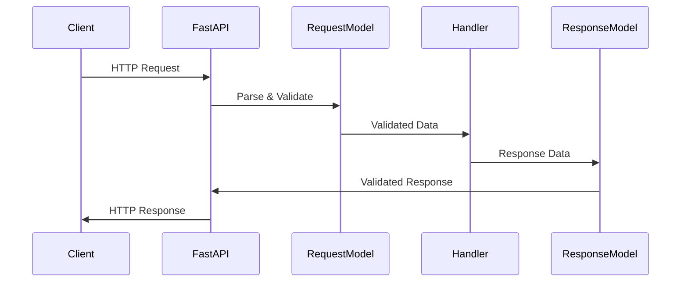
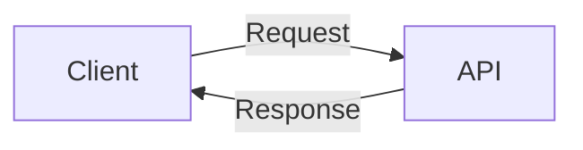
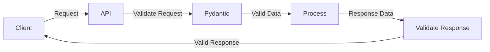

# Request and Response Models in FastAPI

This section covers how to handle incoming request data and structure outgoing responses in FastAPI. Using properly defined request and response models is essential for creating robust and well-documented APIs.

## The Request-Response Cycle



## Request Models

Request models define the structure and validation rules for data that your API receives. In FastAPI, request models are typically defined as Pydantic models.

### Request Body

For JSON request bodies, define a Pydantic model and declare it as a parameter:

```python
from fastapi import FastAPI
from pydantic import BaseModel, Field
from typing import List, Optional

app = FastAPI()

class Item(BaseModel):
    name: str
    description: Optional[str] = None
    price: float
    tax: Optional[float] = None
    tags: List[str] = []

@app.post("/items/")
def create_item(item: Item):
    return {"item": item}
```

### Multiple Body Parameters

You can have multiple body parameters:

```python
class User(BaseModel):
    username: str
    email: str

@app.post("/items/")
def create_item(item: Item, user: User):
    return {"item": item, "user": user}
```

In this case, FastAPI expects a JSON with a nested structure:

```json
{
    "item": {
        "name": "Foo",
        "price": 45.2
    },
    "user": {
        "username": "john",
        "email": "john@example.com"
    }
}
```

### Singular Values in Body

For single values in the body, use the `Body` class:

```python
from fastapi import Body

@app.post("/items/")
def create_item(item: Item, importance: int = Body(..., gt=0)):
    return {"item": item, "importance": importance}
```

### Form Data

For form data, use the `Form` class:

```python
from fastapi import Form

@app.post("/login/")
def login(username: str = Form(...), password: str = Form(...)):
    return {"username": username}
```

### File Uploads

For file uploads, use `File` and `UploadFile`:

```python
from fastapi import File, UploadFile

@app.post("/files/")
def create_file(file: bytes = File(...)):
    return {"file_size": len(file)}

@app.post("/uploadfile/")
def create_upload_file(file: UploadFile = File(...)):
    return {"filename": file.filename}
```

## Response Models

Response models define the structure of the data that your API returns. Using `response_model` helps:

1. Convert output data to the declared type
2. Validate the data
3. Filter out unwanted data
4. Add OpenAPI schema information

### Basic Response Model

```python
class ItemOut(BaseModel):
    name: str
    price: float
    tax: Optional[float] = None

@app.post("/items/", response_model=ItemOut)
def create_item(item: Item):
    # No matter what we return, only the fields in ItemOut will be included
    return item
```

### Filtering Response Data

Using response models helps exclude sensitive information:

```python
class UserIn(BaseModel):
    username: str
    email: str
    password: str

class UserOut(BaseModel):
    username: str
    email: str

@app.post("/users/", response_model=UserOut)
def create_user(user: UserIn):
    # Password won't be included in the response
    return user
```

### List Response Models

For endpoints returning lists:

```python
@app.get("/items/", response_model=List[Item])
def read_items():
    return [
        Item(name="Item 1", price=14.99),
        Item(name="Item 2", price=19.99)
    ]
```

### Union Response Models

For endpoints that might return different models:

```python
from typing import Union

@app.get("/items/{item_id}", response_model=Union[Item, HTTPError])
def read_item(item_id: str):
    if item_id == "foo":
        return Item(name="Foo", price=50.2)
    else:
        return {"detail": "Item not found"}
```

### Response Status Codes

Use the `status_code` parameter to set the HTTP status code:

```python
@app.post("/items/", status_code=201)
def create_item(item: Item):
    # Status code 201: Created
    return item
```

For more refined control, use `status` module:

```python
from fastapi import status

@app.delete("/items/{item_id}", status_code=status.HTTP_204_NO_CONTENT)
def delete_item(item_id: int):
    # No content to return
    return None
```

## Handling Errors

FastAPI provides the `HTTPException` class for error handling:

```python
from fastapi import HTTPException

@app.get("/items/{item_id}")
def read_item(item_id: int):
    if item_id not in items_db:
        raise HTTPException(status_code=404, detail="Item not found")
    return items_db[item_id]
```

### Custom Exception Handlers

For more control, define custom exception handlers:

```python
from fastapi import FastAPI, Request, status
from fastapi.responses import JSONResponse

app = FastAPI()

class ItemNotFoundError(Exception):
    def __init__(self, item_id: int):
        self.item_id = item_id
        self.message = f"Item with ID {item_id} not found"
        super().__init__(self.message)

@app.exception_handler(ItemNotFoundError)
async def item_not_found_exception_handler(request: Request, exc: ItemNotFoundError):
    return JSONResponse(
        status_code=status.HTTP_404_NOT_FOUND,
        content={"detail": exc.message},
    )

@app.get("/items/{item_id}")
def read_item(item_id: int):
    if item_id not in items_db:
        raise ItemNotFoundError(item_id)
    return items_db[item_id]
```

## Response Class and Headers

FastAPI supports different response types:

```python
from fastapi.responses import JSONResponse, HTMLResponse, PlainTextResponse

@app.get("/html/", response_class=HTMLResponse)
def get_html():
    return """
    <html>
        <head>
            <title>FastAPI HTML Response</title>
        </head>
        <body>
            <h1>Hello World!</h1>
        </body>
    </html>
    """

@app.get("/custom-response/")
def get_custom_response():
    content = {"message": "Hello World"}
    headers = {"X-Custom-Header": "Value"}
    return JSONResponse(content=content, headers=headers)
```

## Response Cookies

Set cookies in the response:

```python
from fastapi.responses import Response

@app.get("/cookie/")
def create_cookie():
    response = Response()
    response.set_cookie(key="session", value="value", httponly=True)
    return response
```

## Response Schema Customization

Use the `Field` class to add extra information to response schemas:

```python
class Item(BaseModel):
    name: str = Field(..., example="Foo")
    description: Optional[str] = Field(None, example="A description of the item")
    price: float = Field(..., example=35.4, gt=0)
    tax: Optional[float] = Field(None, example=3.2)

    class Config:
        schema_extra = {
            "example": {
                "name": "Example Item",
                "description": "This is a full example item",
                "price": 42.0,
                "tax": 4.2
            }
        }
```

## Request-Response Flow Patterns

### Simple Request-Response



### Enhanced Request-Response with Validation



## Structured vs. Unstructured Calling

FastAPI supports two ways of receiving data:

### Structured Calling

This is when data comes in a specific, known structure (like JSON with specific fields):

```python
class Item(BaseModel):
    name: str
    price: float

@app.post("/items/")
def create_item(item: Item):
    # Data is validated against the Item model
    return item
```

### Unstructured Calling

This is when data comes in a more free-form manner:

```python
@app.post("/analyze/")
async def analyze_text(text: str = Body(...)):
    # Handle raw text data
    return {"word_count": len(text.split())}
```

## Practical Examples

### Complete API with Request/Response Models

```python
from fastapi import FastAPI, HTTPException, Path, Query, Body
from pydantic import BaseModel, Field, EmailStr, validator
from typing import List, Optional, Dict
from datetime import datetime

app = FastAPI()

# Request Models
class UserBase(BaseModel):
    email: EmailStr
    full_name: str = Field(..., min_length=1, max_length=100)

class UserCreate(UserBase):
    password: str = Field(..., min_length=8)
    
    @validator('password')
    def password_must_be_strong(cls, v):
        if not any(char.isdigit() for char in v):
            raise ValueError('Password must contain at least one digit')
        if not any(char.isupper() for char in v):
            raise ValueError('Password must contain at least one uppercase letter')
        return v

class ItemBase(BaseModel):
    title: str = Field(..., min_length=1, max_length=100)
    description: Optional[str] = Field(None, max_length=1000)
    price: float = Field(..., gt=0)

class ItemCreate(ItemBase):
    seller_id: int = Field(..., gt=0)

# Response Models
class User(UserBase):
    id: int
    is_active: bool = True
    created_at: datetime

    class Config:
        orm_mode = True

class Item(ItemBase):
    id: int
    seller: User
    created_at: datetime

    class Config:
        orm_mode = True

# Endpoints
@app.post("/users/", response_model=User, status_code=201)
def create_user(user: UserCreate):
    # In a real app, this would create the user in the database
    new_user = {
        "id": 1,
        "email": user.email,
        "full_name": user.full_name,
        "is_active": True,
        "created_at": datetime.now()
    }
    return new_user

@app.post("/items/", response_model=Item, status_code=201)
def create_item(item: ItemCreate):
    # In a real app, this would create the item in the database
    seller = {
        "id": item.seller_id,
        "email": "seller@example.com",
        "full_name": "Seller Name",
        "is_active": True,
        "created_at": datetime.now()
    }
    new_item = {
        "id": 1,
        "title": item.title,
        "description": item.description,
        "price": item.price,
        "seller": seller,
        "created_at": datetime.now()
    }
    return new_item

@app.get("/items/", response_model=List[Item])
def read_items(skip: int = 0, limit: int = 10):
    # In a real app, this would query items from the database
    return []

@app.get("/items/{item_id}", response_model=Item)
def read_item(item_id: int = Path(..., ge=1)):
    # In a real app, this would look up the item in the database
    if item_id != 1:
        raise HTTPException(status_code=404, detail="Item not found")
    
    return {
        "id": 1,
        "title": "Example Item",
        "description": "This is an example item",
        "price": 29.99,
        "seller": {
            "id": 1,
            "email": "seller@example.com",
            "full_name": "Seller Name",
            "is_active": True,
            "created_at": datetime.now()
        },
        "created_at": datetime.now()
    }
```

## Next Steps

In the next section, we'll explore Swagger UI and OpenAPI specifications, which provide automatic documentation for your FastAPI applications based on the request and response models you define.

## Practice Exercise

1. Create an API for a simple blog with these models:
   - `Author` with fields for name, email, and bio
   - `Post` with fields for title, content, publication date, and author

2. Implement endpoints for:
   - Creating an author (excluding password from response)
   - Creating a blog post
   - Listing all blog posts
   - Getting a specific post by ID

3. Use appropriate request and response models with validation 