# 📱 Request & Response Models in FastAPI - Build InstaConnect!

Imagine you're building the next viral social media platform! 🚀 You want users to sign up, share amazing posts, react with emojis, and connect with friends around the world. **That's exactly what we'll build using FastAPI's request and response models!** ✨

Request and response models are like having a **smart conversation system** - they ensure everyone speaks the same language, validates what people say, and formats responses perfectly every time!

## 🗣️ What Are Request & Response Models? (Your App's Communication System!)

Think of request and response models as your social media platform's **communication protocol**:

- 📥 **Request Models**: What users send to your app (posts, comments, profile updates)
- 📤 **Response Models**: What your app sends back (formatted posts, user profiles, feed data)
- ✅ **Validation**: Making sure data is correct (strong passwords, valid emails)
- 🔒 **Security**: Hiding sensitive data (passwords never returned to users)
- 📝 **Documentation**: Automatic examples in your API docs

## 🌟 The Power of Pydantic Models

```mermaid
graph TD
    A[👤 User Input] --> B[🔍 Pydantic Validation]
    B --> C{Valid Data?}
    C -->|Yes ✅| D[📝 Process Request]
    C -->|No ❌| E[🚨 Return Error]
    D --> F[📊 Format Response]
    F --> G[📤 Send to User]
    E --> G
    
    B --> B1[Type Checking<br/>Required Fields<br/>Custom Validators]
    F --> F1[Hide Sensitive Data<br/>Add Computed Fields<br/>Format Dates]
```



## 🎯 Real-World Example: User Signup Flow

Let's see how InstaConnect handles user registration:

```python
from pydantic import BaseModel, Field, EmailStr, validator
from datetime import date

class UserSignup(BaseModel):
    username: str = Field(..., min_length=3, max_length=30, description="Your unique username")
    email: EmailStr = Field(..., description="Your email address")
    password: str = Field(..., min_length=8, description="Strong password required")
    full_name: str = Field(..., min_length=1, max_length=100, description="Your display name")
    bio: Optional[str] = Field(None, max_length=500, description="Tell us about yourself!")
    date_of_birth: date = Field(..., description="Your birthday")
    
    @validator('username')
    def username_alphanumeric(cls, v):
        if not v.replace('_', '').isalnum():
            raise ValueError('Username can only contain letters, numbers, and underscores')
        return v.lower()
    
    @validator('password')
    def password_strength(cls, v):
        if not any(char.isdigit() for char in v):
            raise ValueError('Password must contain at least one number')
        if not any(char.isupper() for char in v):
            raise ValueError('Password must contain at least one uppercase letter')
        if not any(char in "!@#$%^&*()_+-=[]{}|;:,.<>?" for char in v):
            raise ValueError('Password must contain at least one special character')
        return v
    
    @validator('date_of_birth')
    def age_check(cls, v):
        today = date.today()
        age = today.year - v.year - ((today.month, today.day) < (v.month, v.day))
        if age < 13:
            raise ValueError('You must be at least 13 years old to join InstaConnect')
        return v

class UserProfile(BaseModel):
    id: int
    username: str
    full_name: str
    bio: Optional[str] = None
    followers_count: int = 0
    following_count: int = 0
    posts_count: int = 0
    verified: bool = False
    joined_date: date
    # Notice: NO PASSWORD in response model! 🔒

@app.post("/auth/signup", response_model=UserProfile, status_code=201)
def create_user_account(user_data: UserSignup):
    # Password is automatically validated by Pydantic
    # And automatically excluded from response by UserProfile model
    return create_new_user(user_data)  # Returns UserProfile format
```

**What Just Happened? ✨**
1. User sends signup data → Pydantic validates everything automatically
2. Invalid data? → User gets clear error messages instantly  
3. Valid data? → Password gets hashed and stored securely
4. Response? → Only safe data returned (no password!)

## 📝 Request Models - What Users Send You

### **Basic Post Creation**

```python
from enum import Enum

class PostType(str, Enum):
    TEXT = "text"
    IMAGE = "image" 
    VIDEO = "video"
    STORY = "story"

class PostCreate(BaseModel):
    content: str = Field(..., min_length=1, max_length=2200, description="What's on your mind?")
    post_type: PostType = Field(PostType.TEXT, description="Type of post you're sharing")
    privacy: PrivacyLevel = Field(PrivacyLevel.PUBLIC, description="Who can see this post?")
    tags: List[str] = Field([], description="Tag friends or topics")
    location: Optional[str] = Field(None, max_length=100, description="Where are you posting from?")
    
    @validator('content')
    def content_not_empty_after_strip(cls, v):
        if not v.strip():
            raise ValueError('Post content cannot be empty or just whitespace')
        return v.strip()
    
    @validator('tags')
    def validate_tags(cls, v):
        if len(v) > 10:
            raise ValueError('Maximum 10 tags allowed per post')
        for tag in v:
            if len(tag) > 50:
                raise ValueError('Each tag must be 50 characters or less')
        return [tag.lower().strip() for tag in v]

@app.post("/posts/", response_model=PostResponse)
def create_post(post: PostCreate):
    """Share your story with the world! 📝"""
    return save_post_to_database(post)
```

### **Advanced Validation: Password Strength**

```python
class UserRegistration(BaseModel):
    email: EmailStr
    password: str = Field(..., min_length=8)
    confirm_password: str
    
    @validator('password')
    def password_strength(cls, v):
        checks = [
            (any(c.isdigit() for c in v), "at least one number"),
            (any(c.isupper() for c in v), "at least one uppercase letter"),
            (any(c.islower() for c in v), "at least one lowercase letter"),
            (any(c in "!@#$%^&*()_+-=[]{}|;:,.<>?" for c in v), "at least one special character")
        ]
        
        failed_checks = [msg for passed, msg in checks if not passed]
        if failed_checks:
            raise ValueError(f"Password must contain {', '.join(failed_checks)}")
        return v
    
    @validator('confirm_password')
    def passwords_match(cls, v, values):
        if 'password' in values and v != values['password']:
            raise ValueError('Passwords do not match')
        return v
```

## 📤 Response Models - What Your App Sends Back

### **Structured Post Response**

```python
class PostResponse(BaseModel):
    id: int
    content: str
    post_type: PostType
    author: UserProfile  # Nested model!
    created_at: datetime
    likes_count: int = 0
    comments_count: int = 0
    shares_count: int = 0
    privacy: PrivacyLevel
    tags: List[str] = []
    location: Optional[str] = None
    
    class Config:
        schema_extra = {
            "example": {
                "id": 98765,
                "content": "Just watched the most amazing sunset! 🌅",
                "post_type": "image",
                "created_at": "2024-01-15T18:30:00",
                "likes_count": 42,
                "comments_count": 8,
                "tags": ["sunset", "nature", "photography"],
                "location": "Golden Gate Bridge, SF"
            }
        }
```

### **Paginated Feed Response**

```python
class FeedResponse(BaseModel):
    posts: List[PostResponse]
    total_posts: int
    page: int
    has_more: bool
    recommended_users: List[UserProfile] = []

@app.get("/feed/", response_model=FeedResponse)
def get_personalized_feed(
    page: int = Query(1, ge=1),
    limit: int = Query(10, ge=1, le=50)
):
    """🌟 Discover amazing content!"""
    return build_personalized_feed(page, limit)
```

## 🎭 Multiple Request Bodies - Complex Operations

Sometimes you need multiple pieces of data in one request:

```python
@app.post("/posts/with-poll/")
def create_post_with_poll(
    post: PostCreate,
    poll_options: List[str] = Body(..., min_items=2, max_items=6),
    poll_duration_hours: int = Body(24, ge=1, le=168)  # 1 hour to 1 week
):
    """📊 Create a post with an interactive poll!"""
    return {
        "message": "Poll post created! 🗳️",
        "post": post,
        "poll": {
            "options": poll_options,
            "duration_hours": poll_duration_hours,
            "ends_at": datetime.now() + timedelta(hours=poll_duration_hours)
        }
    }
```

## 📋 Form Data - Login & File Uploads

### **Login Form**

```python
@app.post("/auth/login/")
def login_user(
    username: str = Form(..., description="Your username or email"),
    password: str = Form(..., description="Your password"),
    remember_me: bool = Form(False, description="Stay logged in")
):
    """🔐 Welcome back to InstaConnect!"""
    if authenticate_user(username, password):
        return {
            "message": "🎉 Welcome back!",
            "access_token": generate_token(),
            "expires_in": "7 days" if remember_me else "24 hours"
        }
    else:
        raise HTTPException(status_code=401, detail="Invalid credentials")
```

### **Media Upload with Validation**

```python
@app.post("/media/upload/")
def upload_media(
    file: UploadFile = File(..., description="Image or video file"),
    caption: Optional[str] = Form(None, description="Caption for your media"),
    tags: str = Form("", description="Comma-separated tags")
):
    """📸 Upload and share your memories!"""
    
    # Validate file type
    allowed_types = {
        "image/jpeg", "image/png", "image/gif", "image/webp",
        "video/mp4", "video/mpeg", "video/quicktime"
    }
    
    if file.content_type not in allowed_types:
        raise HTTPException(
            status_code=400,
            detail="📷 Only images and videos are allowed!"
        )
    
    # Process file and return response
    file_url = save_file_to_storage(file)
    tag_list = [tag.strip() for tag in tags.split(",") if tag.strip()]
    
    return {
        "message": "📸 Media uploaded successfully!",
        "file_url": file_url,
        "caption": caption,
        "tags": tag_list,
        "processing_status": "✅ Ready to share!"
    }
```

## 🚨 Error Handling & Custom Exceptions

### **Custom Error Types**

```python
class InstaConnectError(Exception):
    def __init__(self, message: str, error_code: str):
        self.message = message
        self.error_code = error_code
        super().__init__(self.message)

@app.exception_handler(InstaConnectError)
async def instaconnect_exception_handler(request, exc: InstaConnectError):
    return JSONResponse(
        status_code=400,
        content={
            "error": exc.error_code,
            "message": exc.message,
            "support": "Contact support@instaconnect.com for help"
        }
    )

@app.get("/posts/{post_id}")
def get_post_details(post_id: int):
    if not post_exists(post_id):
        raise InstaConnectError(
            message=f"Post #{post_id} seems to have vanished into the digital void! 🌌",
            error_code="POST_NOT_FOUND"
        )
    return get_post_from_database(post_id)
```

## 🎨 Response Types - Beyond JSON

### **HTML Share Pages**

```python
@app.get("/share/{post_id}", response_class=HTMLResponse)
def share_post_page(post_id: int):
    """🔗 Share posts with beautiful preview pages!"""
    return f"""
    <!DOCTYPE html>
    <html>
        <head>
            <title>Amazing Post on InstaConnect</title>
            <meta property="og:title" content="Check out this amazing post!">
            <meta property="og:description" content="Join InstaConnect to see more">
            <meta property="og:image" content="https://images.instaconnect.com/post_{post_id}.jpg">
        </head>
        <body>
            <div class="post-preview">
                <h1>Amazing content awaits! 🌟</h1>
                <p>Join InstaConnect to see the full post and connect with amazing people!</p>
                <a href="https://instaconnect.com/signup">Join Now! 📱</a>
            </div>
        </body>
    </html>
    """
```

### **CSV Analytics Export**

```python
@app.get("/analytics/engagement/{post_id}")
def get_engagement_analytics(
    post_id: int,
    format: str = Query("json", description="Response format: json or csv")
):
    """📊 Track your post performance!"""
    analytics_data = {
        "post_id": post_id,
        "total_views": 15420,
        "likes": 342,
        "comments": 89,
        "shares": 67,
        "engagement_rate": 4.2
    }
    
    if format == "csv":
        csv_content = "metric,value\n"
        csv_content += f"total_views,{analytics_data['total_views']}\n"
        csv_content += f"likes,{analytics_data['likes']}\n"
        csv_content += f"engagement_rate,{analytics_data['engagement_rate']}%\n"
        
        return Response(
            content=csv_content,
            media_type="text/csv",
            headers={"Content-Disposition": f"attachment; filename=post_{post_id}_analytics.csv"}
        )
    
    return analytics_data
```

## 🔄 Request-Response Flow in Action


## 🎯 Practical Examples

### **Real-Time Reactions System**

```python
class ReactionType(str, Enum):
    LIKE = "like"
    LOVE = "love" 
    LAUGH = "laugh"
    WOW = "wow"
    ANGRY = "angry"

@app.post("/posts/{post_id}/react/")
def react_to_post(
    post_id: int = Path(..., ge=1),
    reaction: ReactionType = Body(..., description="Your reaction")
):
    """❤️ Express yourself with reactions!"""
    
    reaction_messages = {
        ReactionType.LIKE: "👍 You liked this post!",
        ReactionType.LOVE: "❤️ You love this post!", 
        ReactionType.LAUGH: "😂 This made you laugh!",
        ReactionType.WOW: "😮 This amazed you!",
        ReactionType.ANGRY: "😠 This made you angry!"
    }
    
    return {
        "post_id": post_id,
        "reaction": reaction,
        "message": reaction_messages[reaction],
        "total_reactions": update_post_reactions(post_id, reaction)
    }
```

### **Smart Comment System**

```python
class CommentCreate(BaseModel):
    content: str = Field(..., min_length=1, max_length=500, description="Share your thoughts")
    parent_comment_id: Optional[int] = Field(None, description="Reply to another comment")
    
    @validator('content')
    def content_not_empty(cls, v):
        if not v.strip():
            raise ValueError('Comment cannot be empty')
        return v.strip()

class CommentResponse(BaseModel):
    id: int
    content: str
    author: UserProfile
    post_id: int
    parent_comment_id: Optional[int] = None
    created_at: datetime
    likes_count: int = 0
    replies_count: int = 0

@app.post("/posts/{post_id}/comments/", response_model=CommentResponse)
def add_comment(
    post_id: int = Path(..., ge=1),
    comment: CommentCreate = Body(...)
):
    """💬 Join the conversation!"""
    return create_comment_in_database(post_id, comment)
```

## 🛡️ Security Best Practices

### **1. Never Return Sensitive Data**

```python
# ❌ BAD - Includes password in response
class UserBad(BaseModel):
    username: str
    email: str
    password: str  # NEVER DO THIS!

# ✅ GOOD - Password excluded from response  
class UserSafe(BaseModel):
    username: str
    email: str
    # No password field - it's automatically excluded!
```

### **2. Validate Everything**

```python
class ProfileUpdate(BaseModel):
    bio: Optional[str] = Field(None, max_length=500)
    website: Optional[HttpUrl] = None  # Automatically validates URLs
    age: Optional[int] = Field(None, ge=13, le=120)  # Reasonable age range
    
    @validator('bio')
    def bio_no_spam(cls, v):
        if v and len(set(v.split())) < len(v.split()) * 0.5:  # Too many repeated words
            raise ValueError('Bio appears to be spam')
        return v
```

### **3. Rate Limiting & Input Sanitization**

```python
from html import escape

class PostCreate(BaseModel):
    content: str = Field(..., min_length=1, max_length=2200)
    
    @validator('content')
    def sanitize_content(cls, v):
        # Remove potential XSS attacks
        sanitized = escape(v.strip())
        # Add your own content filtering here
        return sanitized
```

## 🎮 Advanced Patterns

### **Conditional Fields Based on Post Type**

```python
class BasePost(BaseModel):
    content: str
    post_type: PostType

class TextPost(BasePost):
    post_type: Literal[PostType.TEXT] = PostType.TEXT
    font_style: Optional[str] = "normal"
    background_color: Optional[str] = "#ffffff"

class ImagePost(BasePost):
    post_type: Literal[PostType.IMAGE] = PostType.IMAGE
    image_url: HttpUrl
    alt_text: Optional[str] = None
    filters_applied: List[str] = []

class VideoPost(BasePost):
    post_type: Literal[PostType.VIDEO] = PostType.VIDEO
    video_url: HttpUrl
    thumbnail_url: Optional[HttpUrl] = None
    duration_seconds: int = Field(..., ge=1, le=600)  # Max 10 minutes

# Use Union for handling different post types
PostCreateUnion = Union[TextPost, ImagePost, VideoPost]

@app.post("/posts/advanced/")
def create_advanced_post(post: PostCreateUnion):
    """🎨 Create posts with type-specific features!"""
    if post.post_type == PostType.IMAGE:
        return handle_image_post(post)
    elif post.post_type == PostType.VIDEO:
        return handle_video_post(post)
    else:
        return handle_text_post(post)
```

## 🎯 What You've Learned (You're Becoming a Data Wizard! 🧙‍♂️)

🎉 **Congratulations!** You now know how to:

- ✅ Create request models with validation (`UserSignup`, `PostCreate`)
- ✅ Design response models that filter sensitive data (`UserProfile`)
- ✅ Handle form data and file uploads (`Form()`, `File()`)
- ✅ Create custom validators for complex rules (`@validator`)
- ✅ Structure nested models (`PostResponse` with `UserProfile`)
- ✅ Handle different response types (JSON, HTML, CSV)
- ✅ Implement proper error handling (`HTTPException`, custom exceptions)
- ✅ Secure your API by hiding sensitive information

## 🚀 What's Next?

In the next exciting chapter, we'll explore **OpenAPI & Swagger Documentation** - the art of creating beautiful, interactive documentation that makes developers love your API! You'll learn how to auto-generate docs that look professional and help others understand your InstaConnect platform! 📚✨

## 🏋️‍♀️ Practice Challenge: Build Stories Feature

Ready to test your request-response mastery? Add a **Stories feature** to InstaConnect:

### **Requirements:**
1. **Story Creation Model** with:
   - Content (text or media URL)
   - Background color for text stories
   - Expiration time (1-72 hours)
   - Auto-validation for story content

2. **Story Response Model** with:
   - All story data except sensitive info
   - Computed fields (is_expired, views_count)
   - Author profile information

3. **Stories Feed Endpoint** that:
   - Returns stories from friends
   - Filters out expired stories
   - Includes pagination support

### **Bonus Challenges:**
- Add story viewing analytics
- Create story reaction system (different from post reactions)
- Build story highlights feature (saved stories)
- Add story privacy controls

### **Solution Template:**

```python
class StoryCreate(BaseModel):
    content: str = Field(..., min_length=1, max_length=500)
    media_url: Optional[HttpUrl] = None
    background_color: Optional[str] = Field("#ffffff", regex=r"^#[0-9A-Fa-f]{6}$")
    expires_in_hours: int = Field(24, ge=1, le=72)

class StoryResponse(BaseModel):
    id: int
    content: str
    author: UserProfile
    created_at: datetime
    expires_at: datetime
    views_count: int = 0
    is_expired: bool = False
    
    @validator('is_expired', always=True)
    def check_expiration(cls, v, values):
        if 'expires_at' in values:
            return datetime.now() > values['expires_at']
        return v

@app.post("/stories/", response_model=StoryResponse)
def create_story(story: StoryCreate):
    """📸 Share your moment with Stories!"""
    # Your implementation here
    pass

@app.get("/stories/", response_model=List[StoryResponse])
def get_stories_feed(include_expired: bool = Query(False)):
    """👀 Catch up on the latest Stories!"""
    # Your implementation here
    pass
```

**Remember:** Every great social media platform started with simple posts and comments. You're building the foundation for the next big thing! Keep experimenting, keep learning, and most importantly - have fun! 🌟📱

## 💡 Pro Tips for Production

1. **Always use response models** - They automatically exclude sensitive data
2. **Validate everything** - Trust no input, validate all data
3. **Use meaningful error messages** - Help users understand what went wrong  
4. **Add examples to your models** - Makes your API docs shine
5. **Test your validators** - Write tests for your custom validation logic
6. **Keep models focused** - One model per specific use case
7. **Use enums for fixed choices** - Prevents invalid values and improves UX 