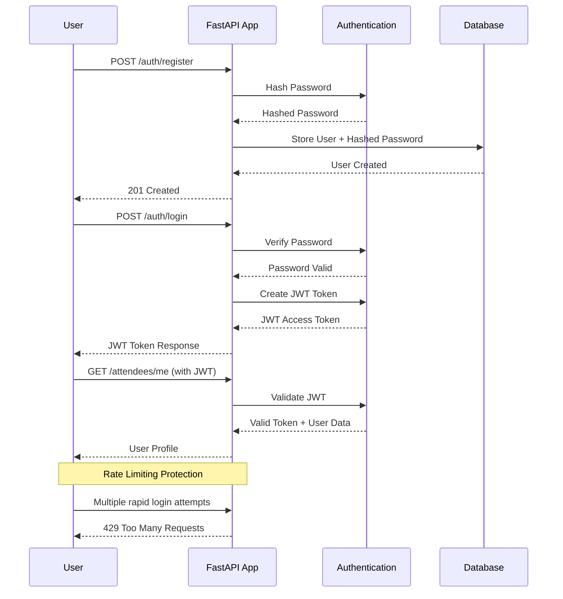

# 🎟️ Section 5: Security - A Simplified Introduction

Welcome to a beginner-friendly guide to **enterprise-grade security** in FastAPI! We'll explore the most important security concepts by building a simplified **Secure Concert API**. This guide focuses on clarity and understanding, using a "concert ticket" analogy to highlight the core security features.

## 🎯 What You'll Learn

-   **JWT Authentication**: How to issue and validate "digital tickets" (JWTs) for secure logins.
-   **Simple Authentication Flow**: How to implement a basic secure authentication system without complex authorization rules.
-   **Password Hashing**: Why we never store plain-text passwords and how to hash them securely.
-   **Rate Limiting**: How to protect your API from simple brute-force attacks.

## 🎟️ Meet the Secure Concert API

Our simplified concert platform demonstrates these core security concepts:

-   🔐 **User Registration**: Securely registering a user for the event with a hashed password.
-   🔑 **User Login**: Authenticating a user and issuing a JWT access token (their digital ticket).
-   🛡️ **Protected Endpoints**: Endpoints that require a valid ticket to access.

## 📊 Security Flow Diagram



## 🚀 Core Security Concepts in Practice

### **1. Password Security with `passlib`**

We never store user passwords directly. Instead, we store a secure hash. This means even if our database is compromised, attackers cannot retrieve user passwords.

```python
from passlib.context import CryptContext

# Use bcrypt for strong, industry-standard password hashing
pwd_context = CryptContext(schemes=["bcrypt"], deprecated="auto")

def get_password_hash(password: str) -> str:
    """Generates a hash from a plain-text password."""
    return pwd_context.hash(password)

def verify_password(plain_password: str, hashed_password: str) -> bool:
    """Checks if a plain-text password matches a stored hash."""
    return pwd_context.verify(plain_password, hashed_password)
```

### **2. JWT Authentication with `jose` - Your Digital Ticket**

After a user logs in, we give them a JSON Web Token (JWT). This is their **digital concert ticket**. They must include this token in the header of future requests to prove who they are. The token is digitally signed by the server to prevent tampering.

#### The "Bearer Token" Concept

Think of this as how you present your ticket. You send your JWT in a special header called `Authorization`, and inside that header, you say `Bearer <YOUR_JWT_TICKET_HERE>`. The word "Bearer" simply means "The person holding this token is authorized."

```python
from datetime import datetime, timedelta
from jose import jwt

SECRET_KEY = "your-secret-key"  # This should be a long, random string from an env var
ALGORITHM = "HS256"
ACCESS_TOKEN_EXPIRE_MINUTES = 30

def create_access_token(data: dict) -> str:
    """Creates a signed JWT (a digital ticket) for a user."""
    to_encode = data.copy()
    expire = datetime.utcnow() + timedelta(minutes=ACCESS_TOKEN_EXPIRE_MINUTES)
    to_encode.update({"exp": expire})
    encoded_jwt = jwt.encode(to_encode, SECRET_KEY, algorithm=ALGORITHM)
    return encoded_jwt
```

### **3. Getting the Current User (Authentication)**

This FastAPI dependency is the security guard at our concert's entrance. It decodes the ticket (token) from the request header to identify the user. Any endpoint that uses this dependency is automatically protected.

```python
from fastapi import Depends, HTTPException
from fastapi.security import OAuth2PasswordBearer

oauth2_scheme = OAuth2PasswordBearer(tokenUrl="auth/login")

async def get_current_user(token: str = Depends(oauth2_scheme)):
    """Decodes ticket, validates user, and returns user data."""
    try:
        payload = jwt.decode(token, SECRET_KEY, algorithms=[ALGORITHM])
        username: str = payload.get("sub")
        if username is None:
            # Raise an error if the ticket is invalid
            raise credentials_exception
    except JWTError:
        raise credentials_exception
    
    # In a real app, you'd fetch the user from a database here
    user = get_user_from_db(username) 
    if user is None:
        raise credentials_exception
    return user
```


## 📋 Security Concepts Summary Table

| Security Concept | Description | Implementation | Benefit |
|------------------|-------------|---------------|---------|
| **Password Hashing** | Store password securely as hashes | `passlib.context.CryptContext` | Protects user passwords even if database is compromised |
| **JWT Authentication** | Issue signed tokens after login | `jose.jwt.encode()` | Stateless authentication without server-side sessions |
| **Bearer Tokens** | Token presentation in requests | `Authorization: Bearer <token>` | Standard way to include authentication in HTTP headers |
| **OAuth2PasswordBearer** | Extract and validate tokens | `OAuth2PasswordBearer(tokenUrl="auth/login")` | Automatic token extraction from requests |
| **Dependency Injection** | Add security to routes | `Depends(get_current_user)` | Protect endpoints and get authenticated user data |
<!-- Removed RBAC row -->
| **HTTP Status Codes** | Proper security responses | `401 Unauthorized`, `403 Forbidden` | Standard HTTP security semantics |
| **Rate Limiting** | Prevent brute force attacks | `slowapi.Limiter` | Protection against automated attacks |
| **Environment Variables** | Secure config storage | `SECRET_KEY = os.getenv("SECRET_KEY")` | Keep sensitive values out of code |
| **Token Expiration** | Time-limited access | `{"exp": datetime.utcnow() + timedelta(minutes=30)}` | Reduce risk from stolen tokens |

## 🛠️ Running the Secure Concert API Demo

To get started and see these concepts in action, follow these steps:

1.  **Navigate to the directory:**
    ```bash
    cd 05-security
    ```

2.  **Install the required packages:**
    You'll need `fastapi`, `uvicorn`, `passlib[bcrypt]`, `python-jose[cryptography]`, and `slowapi`.
    ```bash
    pip install "fastapi[all]" "passlib[bcrypt]" "python-jose[cryptography]" "slowapi"
    ```

3.  **Run the application:**
    ```bash
    uvicorn main:app --reload
    ```
    The server will start, and you can access the API at `http://127.0.0.1:8000`.

## 🎮 How to Test the API

Open your browser to `http://127.0.0.1:8000/docs` to see the interactive API documentation (Swagger UI).

1.  **Register as a New Guest**:
    -   Go to the `POST /auth/register` endpoint.
    -   Click "Try it out" and create a user (e.g., `username`: "testguest", `password`: "Str0ngP@ss!").

2.  **Log In to Get Your Digital Ticket (Token)**:
    -   Go to `POST /auth/login`.
    -   Enter the credentials you just created.
    -   On success, you will receive an `access_token`. Copy this token.

3.  **Access a Protected Endpoint**:
    -   Go to `GET /attendees/me`.
    -   Click the "Authorize" button at the top of the page.
    -   In the popup, paste your token in the format `Bearer <YOUR_TOKEN>`.
    -   Now, execute the endpoint. You should see your user details.


**Key Takeaway**: Security isn't an afterthought. By understanding these core principles, you can build robust and secure applications from day one. 🎟️🔒 