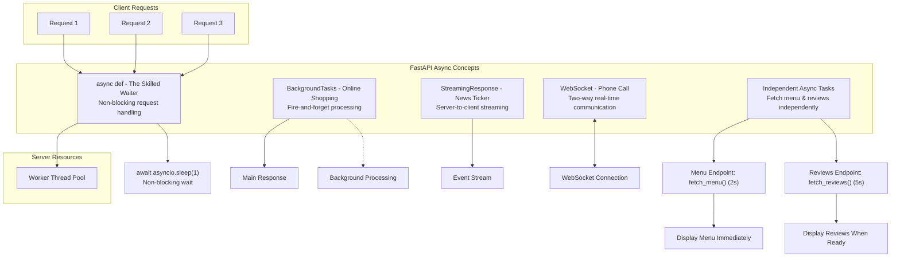
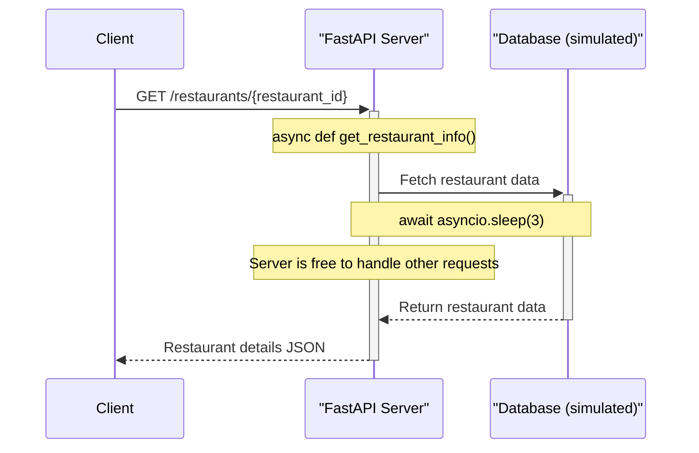
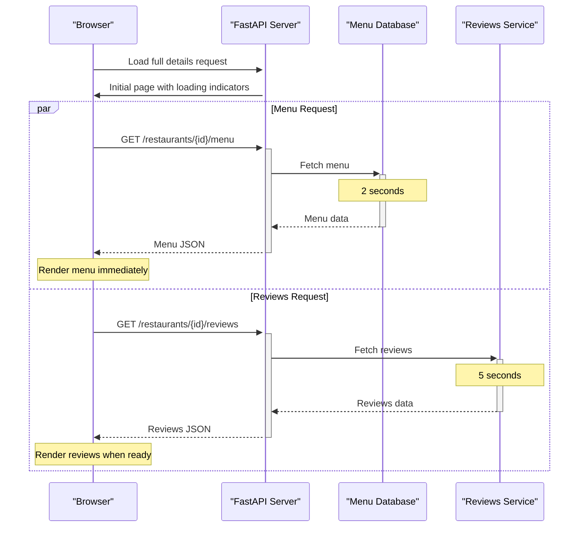
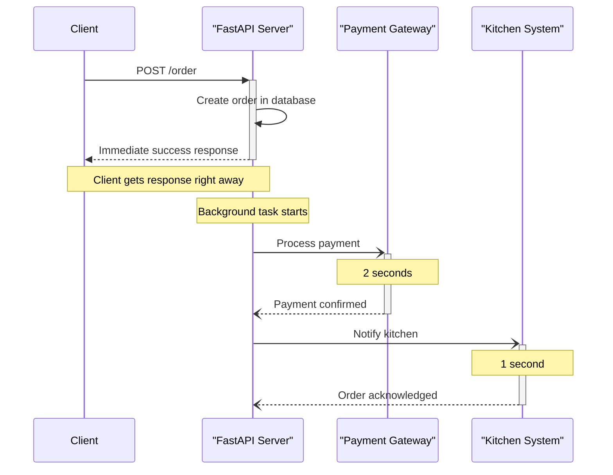
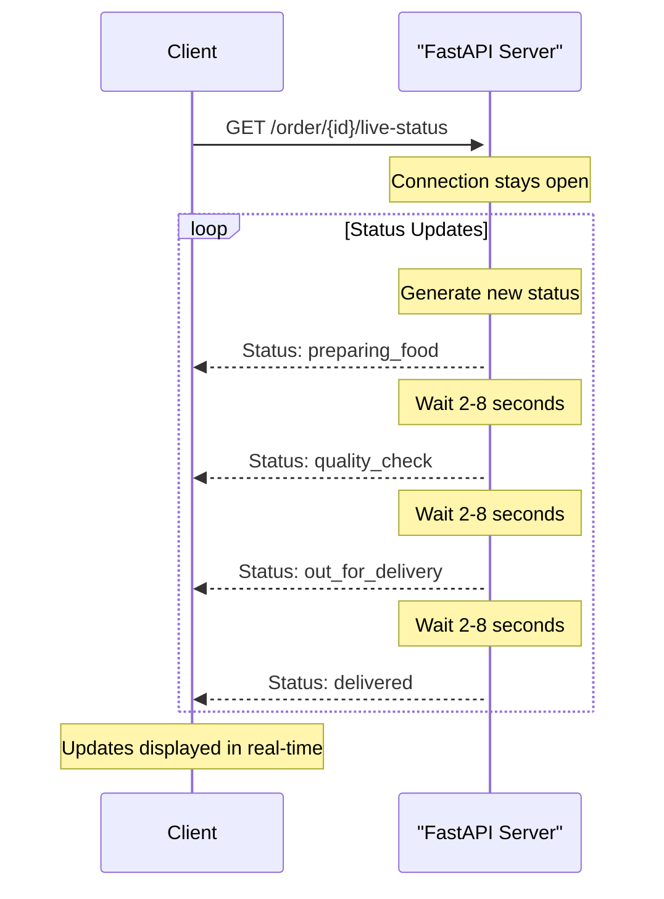
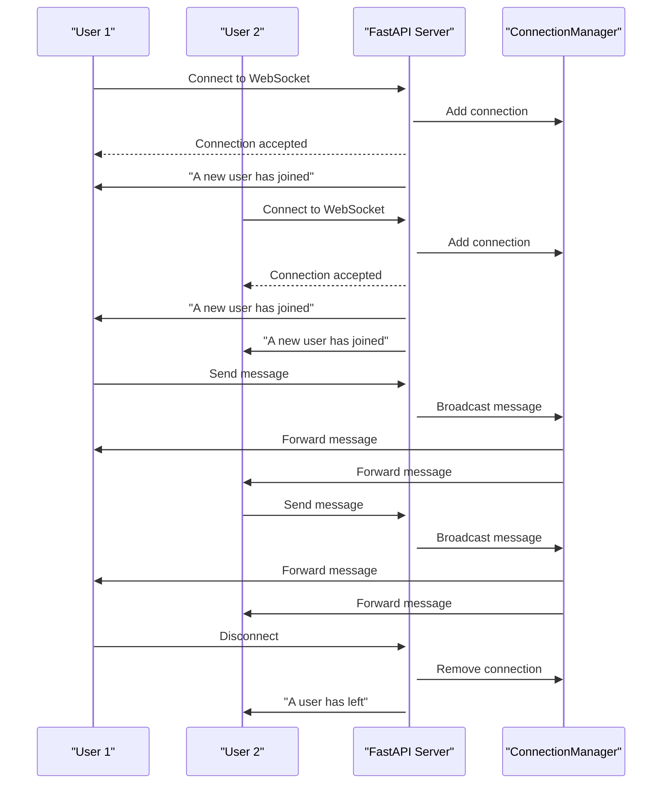

# 🚀 Section 7: FastAPI Async Showcase

This section provides a single, cohesive example to demonstrate FastAPI's core asynchronous features. We use a simple **Food Delivery App** concept, explained with real-world analogies, to tie everything together.

## 🎯 What You'll Learn

This example connects the following concepts using analogies:

-   **The Skilled Waiter** (`async def`): How to handle requests efficiently without blocking.
-   **Ordering Coffee & A Sandwich** (`asyncio.gather`): How to run multiple tasks concurrently to save time.
-   **The Online Shopping Experience** (`BackgroundTasks`): How to run "fire-and-forget" jobs after a response is sent.
-   **The Live Order Tracker** (`StreamingResponse`): How to push a one-way stream of data from the server.
-   **The Support Chat** (`WebSocket`): How to enable real-time, two-way communication.

## 📊 FastAPI Async Concepts



## 📋 Async Concepts Summary Table

| Async Concept | Real-World Analogy | Implementation | Benefits |
|---------------|-------------------|----------------|----------|
| **async def** | The Skilled Waiter | `async def get_restaurant_info()` | Handle multiple requests without blocking |
| **await** | Waiting for an order | `await asyncio.sleep(1)` | Pause execution without blocking the thread |
| **asyncio.gather**| Ordering Coffee & Sandwich | `await asyncio.gather(task1, task2)` | Run multiple operations concurrently |
| **BackgroundTasks**| Online Shopping Experience | `background_tasks.add_task(...)` | Process tasks after sending response |
| **StreamingResponse**| Live Order Tracker | `return StreamingResponse(...)` | Send continuous updates to client |
| **yield** | Delivering updates one by one | `yield f"data: ..."` | Stream data chunks incrementally |
| **WebSocket** | Phone Call / Support Chat | `@app.websocket("/ws/support-chat")`| Two-way real-time communication |
| **ConnectionManager**| Call Center | `manager.broadcast(message)` | Manage multiple WebSocket connections |
| **WebSocketDisconnect**| Hanging up | `except WebSocketDisconnect` | Handle connection termination |
| **Server-Sent Events**| Radio Broadcast / Live Feed | `media_type="text/event-stream"` | One-way streaming protocol |

---

## 🛠️ Running The Demo

1.  **Navigate to the directory:**
    ```bash
    cd 06-async
    ```

2.  **Install dependencies:**
    ```bash
    pip install "fastapi[all]"
    ```

3.  **Run the FastAPI server:**
    ```bash
    uvicorn main:app --reload
    ```

4.  **Open the demo page:**
    Visit **[http://localhost:8000](http://localhost:8000)** in your browser. This page demonstrates all five async features with an interactive UI.

## 🌟 Enhanced UI Features

The demo UI has been improved with the following features:

1. **Restaurant Selection** - Choose from multiple restaurants to see their details using async API calls
2. **Dynamic Menu Items** - Menu items change based on the selected restaurant
3. **Concurrent API Calls** - Load full restaurant details (menu and reviews) with parallel requests
4. **Interactive Chat** - Support for multiple users with customizable usernames and colors
5. **Real-time Order Tracking** - Place orders and watch their status update in real time

---

## 💻 Exploring the Features with Analogies

All features are explained with detailed, line-by-line comments in `main.py`. The web interface has been enhanced to provide a more interactive and comprehensive demonstration of all five async features. Here's a quick guide with the analogies.

### 1. Basic Async Endpoint: The Skilled Waiter
-   **Analogy**: A normal waiter takes an order, goes to the kitchen, and waits. An `async` waiter takes the order, gives it to the kitchen, and immediately serves other tables while the food cooks. This is far more efficient.
-   **Concept**: An `async` function allows the server to handle other requests while waiting for a slow I/O operation (like a database call) to complete.



-   **Code Block**:
    ```python
    @app.get("/restaurants/{restaurant_id}")
    async def get_restaurant_info(restaurant_id: str):
        """
        A basic async endpoint to fetch restaurant details.
        Simulates a non-blocking database call.
        """
        print(f"Fetching details for restaurant {restaurant_id}...")
        # `await asyncio.sleep(3)` simulates a database query.
        # While "waiting", the server can handle other requests.
        await asyncio.sleep(3)
        return fake_db["restaurants"].get(restaurant_id, {"error": "Restaurant not found"})
    ```
-   **Try it**: Visit [http://localhost:8000/restaurants/resto_123](http://localhost:8000/restaurants/resto_123).

### 2. Independent Async Tasks: Showing Results As They Arrive
-   **Analogy**: Instead of waiting for both coffee and sandwich to be ready before serving either, we now serve each item as soon as it's ready. The coffee (menu) is ready in 2 minutes, so the customer gets that first. The sandwich (reviews) takes 3 minutes and is served when it's ready.
-   **Concept**: Using separate API endpoints for different data allows the frontend to display results as they become available, creating a more responsive user experience.



-   **Backend Code**:
    ```python
    async def fetch_menu(restaurant_id: str):
        """Simulates fetching the menu from a database (takes 2 seconds)."""
        print(f"Fetching menu for {restaurant_id}...")
        await asyncio.sleep(2)
        # Return menu from our expanded fake database
        return {"menu": fake_db["menus"].get(restaurant_id, ["No items available"])}

    async def fetch_reviews(restaurant_id: str):
        """Simulates fetching reviews from another service (takes 5 seconds)."""
        print(f"Fetching reviews for {restaurant_id}...")
        await asyncio.sleep(5)
        return {"reviews": ["'Amazing food!'", "'A bit spicy for me.'"]}
        
    # Individual endpoints for separate menu and review fetching
    @app.get("/restaurants/{restaurant_id}/menu")
    async def get_restaurant_menu(restaurant_id: str):
        """Get just the menu for a restaurant (faster endpoint)."""
        return await fetch_menu(restaurant_id)

    @app.get("/restaurants/{restaurant_id}/reviews")
    async def get_restaurant_reviews(restaurant_id: str):
        """Get just the reviews for a restaurant (slower endpoint)."""
        return await fetch_reviews(restaurant_id)

    @app.get("/restaurants/{restaurant_id}/full-details")
    async def get_full_restaurant_details(restaurant_id: str):
        """Original endpoint that runs two I/O-bound tasks concurrently."""
        print(f"Fetching full details for restaurant {restaurant_id}...")
        menu_task = fetch_menu(restaurant_id)
        reviews_task = fetch_reviews(restaurant_id)
        menu, reviews = await asyncio.gather(menu_task, reviews_task)
        return {"info": fake_db["restaurants"].get(restaurant_id), **menu, **reviews}
    ```
    
-   **Frontend Code**:
    ```javascript
    // Feature 2 - Load all restaurant details individually as they become available
    async function loadFullDetails() {
        const restaurantId = currentRestaurantId;
        if (!restaurantId) {
            alert('Please select a restaurant first');
            return;
        }
        
        // Clear previous content and show loading state
        document.getElementById('menu-list').innerHTML = '<li>Loading menu...</li>';
        document.getElementById('reviews-list').innerHTML = '<li>Loading reviews...</li>';
        document.getElementById('full-details').style.display = 'block';
        
        // Fetch menu (faster - 2 seconds)
        fetchMenu(restaurantId);
        
        // Fetch reviews (slower - 5 seconds)
        fetchReviews(restaurantId);
    }

    // Fetch just the menu - should complete faster
    async function fetchMenu(restaurantId) {
        try {
            const response = await fetch(`/restaurants/${restaurantId}/menu`);
            const data = await response.json();
            
            // Update menu list as soon as it's available
            const menuList = document.getElementById('menu-list');
            menuList.innerHTML = '';
            data.menu.forEach(item => {
                const li = document.createElement('li');
                li.textContent = item;
                menuList.appendChild(li);
            });
        } catch (error) {
            document.getElementById('menu-list').innerHTML = '<li>Error loading menu</li>';
            console.error('Error loading menu:', error);
        }
    }

    // Fetch just the reviews - takes longer
    async function fetchReviews(restaurantId) {
        try {
            const response = await fetch(`/restaurants/${restaurantId}/reviews`);
            const data = await response.json();
            
            // Update reviews list as soon as it's available
            const reviewsList = document.getElementById('reviews-list');
            reviewsList.innerHTML = '';
            data.reviews.forEach(review => {
                const li = document.createElement('li');
                li.textContent = review;
                reviewsList.appendChild(li);
            });
        } catch (error) {
            document.getElementById('reviews-list').innerHTML = '<li>Error loading reviews</li>';
            console.error('Error loading reviews:', error);
        }
    }
    ```
-   **Try it**: Click "Load Full Details" on the [homepage](http://localhost:8000) after selecting a restaurant. Notice how the menu appears first (after ~2 seconds) and the reviews appear later (after ~5 seconds).

### 3. Background Tasks: The Online Shopping Experience
-   **Analogy**: You place an order online and get an "Order Confirmed" message instantly. The company handles the actual packing and shipping later, in the background. You don't have to wait on the website for that to finish.
-   **Concept**: This lets you run a "fire-and-forget" task after sending a response to the user.



-   **Code Block**:
    ```python
    async def process_payment_and_notify_kitchen(order_id: str, amount: float):
        """
        A background task that simulates processing a payment and notifying the kitchen.
        This runs *after* the user gets their response.
        """
        print(f"BACKGROUND: Processing payment for order {order_id}...")
        await asyncio.sleep(2)  # Simulate payment gateway
        print(f"BACKGROUND: Payment of ${amount} for order {order_id} successful.")
        fake_db["orders"][order_id]["payment_status"] = "paid"
        print(f"BACKGROUND: Notifying kitchen for order {order_id}...")
        await asyncio.sleep(1) # Simulate sending order to kitchen's system
        print(f"BACKGROUND: Kitchen Acknowledged order {order_id}.")
        fake_db["orders"][order_id]["kitchen_status"] = "acknowledged"

    @app.post("/order")
    async def place_order(restaurant_id: str, item: str, background_tasks: BackgroundTasks):
        """
        Places an order and schedules payment/kitchen notification to run in the background.
        The user gets an immediate response.
        """
        order_id = f"order_{random.randint(1000, 9999)}"
        order_details = {
            "id": order_id,
            "item": item,
            "status": "order_placed",
            "restaurant": restaurant_id,
        }
        fake_db["orders"][order_id] = order_details
        # This is the "fire-and-forget" part. The user won't wait for this to finish.
        background_tasks.add_task(process_payment_and_notify_kitchen, order_id, 15.50)
        return {"message": "Order placed successfully!", "order_id": order_id}
    ```
-   **How to test**: From the homepage UI at [http://localhost:8000](http://localhost:8000), select a restaurant from the dropdown, then click any of the dynamically loaded order buttons. You'll get an immediate response, and you can see the background task processing in your terminal.

### 4. Streaming Responses (SSE): The Live Order Tracker
-   **Analogy**: A live order tracker page. The server continuously pushes updates to your phone (e.g., "Preparing" -> "Out for Delivery"). It's a one-way stream of information.
-   **Concept**: Server-Sent Events (SSE) allow the server to push a continuous stream of data to the client over a single HTTP connection.



-   **Code Block**:
    ```python
    @app.get("/order/{order_id}/live-status", response_class=StreamingResponse)
    async def stream_order_status(order_id: str):
        """
        Streams the live status of an order using Server-Sent Events (SSE).
        """
        async def event_generator():
            # A sequence of possible order statuses.
            statuses = ["preparing_food", "quality_check", "out_for_delivery", "delivered"]
            for status in statuses:
                # Update the order status in our fake DB.
                if order_id in fake_db["orders"]:
                    fake_db["orders"][order_id]["status"] = status
                    event_data = {
                        "order_id": order_id,
                        "status": status,
                        "timestamp": datetime.now().isoformat()
                    }
                    # `yield` sends a data chunk. SSE format is "data: {json}\n\n".
                    yield f"data: {json.dumps(event_data)}\n\n"
                    # Wait for a random time before the next status update.
                    await asyncio.sleep(random.uniform(2, 8))

        return StreamingResponse(event_generator(), media_type="text/event-stream")
    ```
-   **Try it**: Watch the "Live Order Tracker" on the homepage after placing an order. It receives a new status update from the server every few seconds.

### 5. WebSockets: The Phone Call / Support Chat
-   **Analogy**: A phone call with your delivery driver. Both of you can speak and listen at any time. This real-time, two-way communication is exactly what WebSockets are for.
-   **Concept**: WebSockets provide a persistent, two-way communication channel between the client and server, perfect for real-time chat.



-   **Code Block**:
    ```python
    class ConnectionManager:
        """Manages WebSocket connections for a single chat room."""
        def __init__(self):
            self.active_connections: List[WebSocket] = []

        async def connect(self, websocket: WebSocket):
            await websocket.accept()
            self.active_connections.append(websocket)

        def disconnect(self, websocket: WebSocket):
            self.active_connections.remove(websocket)

        async def broadcast(self, message: str):
            for connection in self.active_connections:
                await connection.send_text(message)

    # We create one global manager for our single, mock chat room.
    manager = ConnectionManager()

    @app.websocket("/ws/support-chat")
    async def websocket_support_chat(websocket: WebSocket):
        """A simplified WebSocket endpoint for a mock support chat."""
        await manager.connect(websocket)
        await manager.broadcast("A new user has joined the mock chat.")
        try:
            while True:
                # Wait for a message from a client.
                data = await websocket.receive_text()
                # Broadcast the message to everyone in the chat room.
                # The format is expected to be "username|message|color"
                await manager.broadcast(f"Message: {data}")
        except WebSocketDisconnect:
            manager.disconnect(websocket)
            await manager.broadcast("A user has left the chat.")
    ```
-   **Try it**: Open the homepage in two separate browser windows. Enter different usernames and choose different colors for each window. Use the "Live Support Chat" box to send messages from one window and watch them appear instantly in the other, with distinct styling for each user.