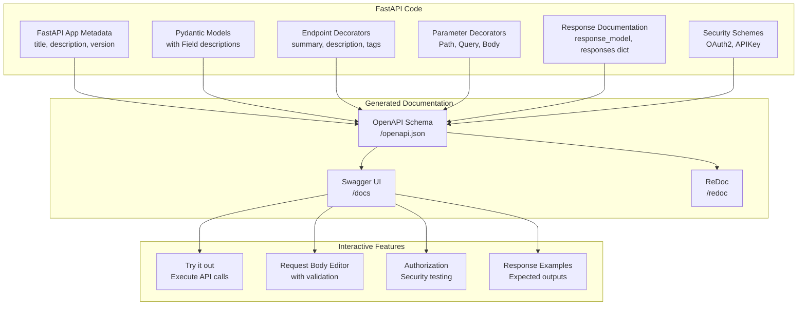

# 📚 Section 6: Mastering OpenAPI & Swagger Documentation with FastAPI

This project is a hands-on guide to creating beautiful, interactive, and comprehensive API documentation using FastAPI. It simplifies the "AI Assistant Marketplace" concept into a clear, feature-by-feature demonstration.

## 🎯 What This Demo Covers

The `main.py` file is structured as a tutorial, demonstrating how different parts of your FastAPI code translate into OpenAPI documentation features.

1.  **Top-Level Metadata**: How `FastAPI(...)` constructor arguments (`title`, `description`, `version`, `contact`, `servers`) build the main page of your docs.
2.  **Organizing with Tags**: Using `openapi_tags` to group related endpoints into logical sections for easy navigation.
3.  **Rich Model Documentation**: Leveraging Pydantic `BaseModel` and `Field` to define schemas with detailed `description`, `example` values, and validation rules. The `schema_extra` config provides full-body examples.
4.  **Enumerations**: Using Python's `Enum` to create dropdown selectors for valid parameter values in the interactive docs.
5.  **Endpoint Documentation**: Using decorator parameters (`summary`, `description`, `tags`, `response_model`, `status_code`) and function docstrings (which support Markdown) to describe each endpoint in detail.
    *   **Special Note on Request Body Parameters**: When you define a parameter using `item: Item = Body(...)` for `POST` or `PUT` endpoints, it is correctly identified as the **Request Body** by OpenAPI/Swagger UI, rather than a regular parameter (like `Query` or `Path`). This is because it represents the main payload of data sent in the request's body, and Swagger UI provides a dedicated, interactive section for it.
6.  **Parameter Documentation**: Using `Path`, `Query`, and `Body` to provide specific metadata (like `title`, `description`, `ge`, `le`) for different types of parameters.
7.  **Multi-Response Documentation**: Using the `responses` dictionary to document all possible outcomes of an API call, including success cases and error codes like `404 Not Found`.
8.  **Security Scheme Documentation**: Using FastAPI's security utilities (`APIKeyHeader`, `Depends`) to document protected endpoints, which adds an "Authorize" button to the Swagger UI.
9.  **Advanced Schema Customization**: Directly modifying the generated OpenAPI schema to add custom elements, such as a company logo.

## 📊 Documentation Generation Flow



## 📋 API Documentation Concepts Summary Table

| Documentation Feature | Description | Implementation | Benefits |
|----------------------|-------------|----------------|----------|
| **App Metadata** | Basic API information | `FastAPI(title="API Title", description="...")` | Clear API identity and purpose |
| **OpenAPI Tags** | Endpoint categorization | `tags=["users"]` or `openapi_tags=[...]` | Organized documentation structure |
| **Operation Summary** | Short endpoint description | `summary="Create new user"` | Quick understanding of endpoint purpose |
| **Operation Description** | Detailed endpoint info | `description="This endpoint creates..."` | Comprehensive endpoint documentation |
| **Path Parameters** | URL path variables | `Path(..., description="User ID")` | Clear parameter documentation |
| **Query Parameters** | URL query string params | `Query(None, description="Search term")` | Optional parameter documentation |
| **Request Body** | Request payload docs | `Body(..., example={"name": "John"})` | Clear input expectations |
| **Response Models** | Response structure docs | `response_model=UserResponse` | Clear output expectations |
| **Response Examples** | Sample responses | `responses={200: {"content": {...}}}` | Show what to expect from the API |
| **Status Codes** | HTTP response codes | `status_code=201` | Proper HTTP semantics |
| **Field Descriptions** | Model field documentation | `Field(..., description="User's email")` | Detailed data model documentation |
| **Schema Examples** | Sample data structures | `schema_extra = {"example": {...}}` | Show how to structure data |
| **Security Schemes** | Auth documentation | `security=[{"apiKeyAuth": []}]` | Document authentication methods |
| **External Docs** | Links to more info | `openapi_url="/api/v1/openapi.json"` | Extended documentation access |
| **Deprecation** | Mark outdated endpoints | `deprecated=True` | API lifecycle management |

## 🚀 Running the Documentation Demo

Get the server running to see the results of the code.

```bash
# Navigate to the project directory
cd 06-documentation

# Run the FastAPI application
uvicorn main:app --reload
```

Once running, you can access the documentation at these URLs:

-   **Swagger UI**: [http://localhost:8000/docs](http://localhost:8000/docs) (Interactive, "try it out" interface)
-   **ReDoc**: [http://localhost:8000/redoc](http://localhost:8000/redoc) (Alternative, clean documentation view)
-   **OpenAPI Schema**: [http://localhost:8000/openapi.json](http://localhost:8000/openapi.json) (The raw JSON schema)

## 🌐 Beyond OpenAPI: Other API Documentation Standards

While **OpenAPI Specification (OAS)** is the most widely adopted standard for REST APIs, it's helpful to know about others in the landscape.

| Standard / Format | Key Characteristics | Best For |
| :--- | :--- | :--- |
| **OpenAPI (Swagger)** | - Language-agnostic specification (JSON/YAML).<br>- Strong tooling ecosystem (Swagger UI, ReDoc, code generators).<br>- Supports both design-first and code-first approaches. | RESTful APIs. It is the de-facto industry standard. |
| **RAML** | - "RESTful API Modeling Language".<br>- YAML-based and designed to be highly readable and reusable.<br>- Encourages a design-first approach by modeling resources, methods, and patterns clearly. | API design and modeling before implementation. Strong in handling complex APIs with reusable patterns. |
| **API Blueprint** | - Markdown-based syntax.<br>- Very human-readable and easy to write.<br>- Good for collaboration and quick prototyping of API designs. | Early-stage API design, tutorials, and situations where collaboration with non-developers is key. |
| **AsyncAPI** | - An adaptation of OpenAPI for event-driven architectures.<br>- Describes asynchronous APIs (e.g., using WebSockets, Kafka, MQTT).<br>- Defines `channels`, `messages`, and `bindings` instead of `paths` and `operations`. | Documenting message-based and event-driven systems where communication is asynchronous. |
| **GraphQL SDL** | - "Schema Definition Language" for GraphQL.<br>- Not a REST standard, but a way to define the schema for a GraphQL API.<br>- Strongly typed, defining all possible queries, mutations, and subscriptions. | GraphQL APIs, where clients request exactly the data they need. |

---

**Key Takeaway**: Great documentation is your API's best feature. It transforms a complex tool into an accessible and enjoyable resource for developers. FastAPI makes creating world-class documentation an integral part of the development process. 📚✨ 