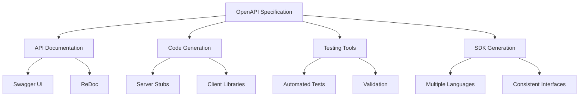
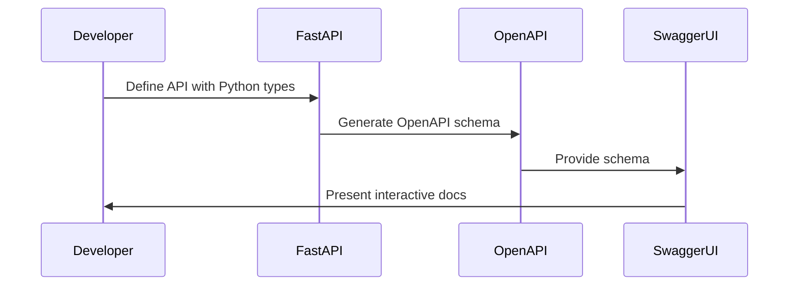

# Swagger UI and OpenAPI in FastAPI

FastAPI automatically generates interactive API documentation using Swagger UI and ReDoc, based on the OpenAPI standard. This makes it easy for developers to understand, test, and use your API.

## What is OpenAPI?

OpenAPI (formerly known as Swagger) is a specification for machine-readable interface files for describing, producing, consuming, and visualizing RESTful web services. It provides a standardized way to document your API.



## What is Swagger UI?

Swagger UI is an interactive documentation tool that allows users to:
- View all API endpoints
- Understand required parameters and response schemas
- Test API calls directly from the browser
- Explore relationships between endpoints

## FastAPI and OpenAPI Integration

FastAPI generates OpenAPI documentation from:
- Function parameters
- Type annotations
- Pydantic models
- Docstrings
- Path operation decorators



## Accessing API Documentation

FastAPI automatically provides:

1. **Swagger UI** at `/docs` 
   - Interactive documentation
   - Try-it-out functionality
   - Detailed parameter information

2. **ReDoc** at `/redoc`
   - Clean, three-panel documentation
   - Mobile-responsive design
   - Easy navigation

## Customizing API Documentation

### Basic API Metadata

```python
from fastapi import FastAPI

app = FastAPI(
    title="My Super API",
    description="This is a very fancy API",
    version="0.1.0",
    terms_of_service="https://example.com/terms/",
    contact={
        "name": "API Support",
        "url": "https://example.com/support",
        "email": "support@example.com",
    },
    license_info={
        "name": "Apache 2.0",
        "url": "https://www.apache.org/licenses/LICENSE-2.0.html",
    },
)
```

### Tags and Categories

Tags help organize and group your endpoints in the documentation:

```python
@app.get("/users/", tags=["users"])
def get_users():
    return [{"name": "Harry"}, {"name": "Ron"}]

@app.get("/items/", tags=["items"])
def get_items():
    return [{"name": "Wand"}, {"name": "Flying Broom"}]
```

You can add metadata to tags:

```python
app = FastAPI(
    # ...other parameters
    openapi_tags=[
        {
            "name": "users",
            "description": "Operations with users",
            "externalDocs": {
                "description": "Users external docs",
                "url": "https://example.com/users/",
            },
        },
        {
            "name": "items",
            "description": "Manage items",
        },
    ]
)
```

### Operation ID

```python
@app.get("/items/", operation_id="get_items")
def get_items():
    return [{"name": "Foo"}]
```

### Summary and Description

```python
@app.get(
    "/items/",
    summary="Retrieve a list of items",
    description="Get all items with their details. You can filter by ...",
)
def get_items():
    return [{"name": "Foo"}]
```

Using docstrings:

```python
@app.get("/items/")
def get_items():
    """
    Retrieve a list of items.

    Get all items with their details. You can filter by various parameters.
    """
    return [{"name": "Foo"}]
```

### Response Description

```python
@app.get(
    "/items/",
    response_description="List of available items",
)
def get_items():
    return [{"name": "Foo"}]
```

### Field Examples

```python
from pydantic import BaseModel, Field

class Item(BaseModel):
    name: str = Field(..., example="Foo")
    description: str = Field(None, example="A very nice Item")
    price: float = Field(..., example=35.4)
```

### Request Body Examples

```python
@app.post("/items/")
def create_item(
    item: Item = Body(
        ...,
        examples={
            "normal": {
                "summary": "A normal example",
                "description": "A normal item works correctly",
                "value": {
                    "name": "Foo",
                    "description": "A very nice Item",
                    "price": 35.4,
                },
            },
            "invalid": {
                "summary": "Invalid example",
                "description": "Invalid items will be rejected",
                "value": {
                    "name": "Bar",
                    "price": -1.0,
                },
            },
        },
    ),
):
    return item
```

### Including/Excluding Endpoints in Documentation

```python
@app.get("/internal/", include_in_schema=False)
def internal_function():
    return {"internal": True}
```

## Customizing OpenAPI Schema

If you need complete control over the OpenAPI schema:

```python
from fastapi import FastAPI
from fastapi.openapi.utils import get_openapi

app = FastAPI()

@app.get("/items/")
def read_items():
    return [{"name": "Foo"}]

def custom_openapi():
    if app.openapi_schema:
        return app.openapi_schema
        
    openapi_schema = get_openapi(
        title="Custom API",
        version="2.5.0",
        description="This is a very custom OpenAPI schema",
        routes=app.routes,
    )
    
    # Custom documentation, validation, etc.
    openapi_schema["info"]["x-logo"] = {
        "url": "https://example.com/logo.png"
    }
    
    app.openapi_schema = openapi_schema
    return app.openapi_schema

app.openapi = custom_openapi
```

## Disabling Documentation

If you need to disable the default documentation:

```python
from fastapi import FastAPI

app = FastAPI(docs_url=None, redoc_url=None)
```

## Documenting Advanced Features

### Path Parameters

```python
@app.get("/items/{item_id}")
def read_item(item_id: int = Path(..., title="The ID of the item", ge=1)):
    return {"item_id": item_id}
```

### Query Parameters

```python
from fastapi import Query

@app.get("/items/")
def read_items(
    q: str = Query(
        None,
        title="Query string",
        description="Query string for the items to search in the database",
        min_length=3,
        max_length=50,
        deprecated=False,
    )
):
    return {"q": q}
```

### Request Body

```python
@app.post("/items/")
def create_item(
    item: Item = Body(
        ...,
        title="The Item to create",
        description="Item model with all the information",
        example={
            "name": "Foo",
            "description": "A very nice Item",
            "price": 35.4,
        },
    )
):
    return item
```

### Dependencies

```python
from fastapi import Depends, FastAPI, Header, HTTPException

app = FastAPI()

async def verify_token(x_token: str = Header(..., description="Custom token header")):
    if x_token != "fake-super-secret-token":
        raise HTTPException(status_code=400, detail="X-Token header invalid")
    return x_token

@app.get("/items/", dependencies=[Depends(verify_token)])
def read_items():
    return [{"name": "Foo"}]
```

## OpenAPI Structure

The OpenAPI specification includes:

- `info`: General API information (title, description, version)
- `paths`: API endpoints, methods, parameters
- `components`: Reusable schema components
  - `schemas`: Data models
  - `responses`: Common responses
  - `parameters`: Reusable parameters
  - `examples`: Example objects
  - `requestBodies`: Reusable request bodies
  - `headers`: Reusable headers
  - `securitySchemes`: Authentication methods

```mermaid
graph TD
    A[OpenAPI Document] --> B[Info]
    A --> C[Paths]
    A --> D[Components]
    
    B --> B1[API Info<br/>Version, contact, etc]
    
    C --> C1[/endpoint1]
    C --> C2[/endpoint2]
    
    C1 --> C1a[GET]
    C1 --> C1b[POST]
    C2 --> C2a[GET]
    
    D --> D1[Schemas]
    D --> D2[Responses]
    D --> D3[Parameters]
    D --> D4[Security]
```

## Security Documentation

### API Key

```python
from fastapi import FastAPI, Depends, Security, HTTPException
from fastapi.security import APIKeyHeader

app = FastAPI()

api_key_header = APIKeyHeader(name="X-API-Key", auto_error=False)

@app.get("/secure")
async def secure_endpoint(api_key: str = Security(api_key_header)):
    if api_key != "correct_key":
        raise HTTPException(status_code=403, detail="Invalid API Key")
    return {"message": "You have access"}
```

### OAuth2 with Password, Bearer, etc.

```python
from fastapi import Depends, FastAPI, HTTPException, status
from fastapi.security import OAuth2PasswordBearer, OAuth2PasswordRequestForm

app = FastAPI()

oauth2_scheme = OAuth2PasswordBearer(tokenUrl="token")

@app.post("/token")
async def login(form_data: OAuth2PasswordRequestForm = Depends()):
    # Authenticate user
    if form_data.username != "user" or form_data.password != "password":
        raise HTTPException(
            status_code=status.HTTP_401_UNAUTHORIZED,
            detail="Incorrect username or password"
        )
    return {"access_token": "fake-token", "token_type": "bearer"}

@app.get("/users/me")
async def read_users_me(token: str = Depends(oauth2_scheme)):
    # Validate token
    if token != "fake-token":
        raise HTTPException(
            status_code=status.HTTP_401_UNAUTHORIZED,
            detail="Invalid authentication credentials"
        )
    return {"username": "user"}
```

## Benefits of API Documentation

1. **Developer Onboarding**: New developers can quickly understand the API
2. **Integration Testing**: Test endpoints directly from the browser
3. **Code Generation**: Generate client libraries in various languages
4. **API Consistency**: Ensure consistent API design and behavior
5. **Discoverability**: Make all features and endpoints easily discoverable

## Next Steps

In the next section, we'll explore asynchronous programming in FastAPI, which allows you to handle many concurrent requests efficiently.

## Practice Exercise

Create a FastAPI application with:

1. Custom API metadata (title, description, version)
2. Endpoints organized with at least 2 tags
3. Custom descriptions for operations
4. Examples for request bodies
5. Clear parameter documentation
6. A custom response model with documented fields 