# 📚 OpenAPI & Swagger Documentation - Build Beautiful API Docs!

Imagine you've built the most amazing AI Assistant Marketplace! 🤖 But how do you show the world how awesome your API is? How do developers quickly understand how to use it? **That's where OpenAPI and Swagger come to the rescue!** ✨

OpenAPI and Swagger are like having a **magical documentation fairy** that automatically creates beautiful, interactive documentation for your API - no extra work required!

## 🌟 What is OpenAPI & Swagger? (Your API's Autobiography!)

Think of OpenAPI and Swagger as your API's **interactive resume**:

- 📝 **OpenAPI**: The standard specification that describes your API
- 🎨 **Swagger UI**: Beautiful, interactive documentation interface  
- 🔍 **ReDoc**: Alternative clean documentation interface
- ✅ **Auto-generated**: Created automatically from your FastAPI code
- 🧪 **Interactive Testing**: Try endpoints directly in the browser
- 📊 **Visual Examples**: See request/response formats with real examples

## 🎯 Why Documentation Matters (Your API's First Impression!)

```mermaid
graph TD
    A[🚀 Great API] --> B{Good Documentation?}
    B -->|Yes ✅| C[😍 Happy Developers]
    B -->|No ❌| D[😤 Frustrated Developers]
    
    C --> C1[More Users<br/>Better Adoption<br/>Fewer Support Tickets]
    D --> D1[Confused Users<br/>Low Adoption<br/>Endless Questions]
```



**Amazing documentation means:**
- 📈 **Higher Adoption**: Developers can quickly understand and use your API
- 🎯 **Fewer Support Tickets**: Self-service answers to common questions  
- 💎 **Professional Image**: Shows you care about developer experience
- ⚡ **Faster Integration**: Developers can copy-paste working examples
- 🔄 **Better Feedback**: Users can easily experiment and provide input

## 🏗️ FastAPI's Documentation Magic

FastAPI automatically generates documentation from your code. Here's how the magic happens:

```python
from fastapi import FastAPI, Query, Path, Body
from pydantic import BaseModel, Field
from typing import List, Optional
from enum import Enum

# Your AI Assistant Marketplace API
app = FastAPI(
    title="🤖 AI Assistant Marketplace",
    description="""
    Welcome to the **AI Assistant Marketplace** - where cutting-edge AI meets human creativity! 🚀
    
    ## 🌟 What You Can Do Here
    * 🎨 **Creative Assistants**: Art, writing, music composition
    * 🧠 **Analytical Assistants**: Data analysis, research, problem-solving  
    * 💼 **Business Assistants**: Meeting scheduling, email management
    * 🎓 **Educational Assistants**: Tutoring, language learning
    
    ## 🔥 Key Features
    - **Instant AI Access**: Connect with any assistant in seconds
    - **Custom Training**: Train assistants on your specific needs
    - **Real-time Collaboration**: Work with AI assistants in real-time
    
    *Built with ❤️ using FastAPI - Making AI accessible to everyone!*
    """,
    version="3.0.0",
    contact={
        "name": "AI Marketplace Support Team",
        "url": "https://aimarketplace.com/support",
        "email": "support@aimarketplace.com",
    },
    license_info={
        "name": "MIT License",
        "url": "https://opensource.org/licenses/MIT",
    }
)
```

**What FastAPI automatically creates:**
- ✨ Interactive Swagger UI at `/docs`
- 📖 Clean ReDoc interface at `/redoc`  
- 🔧 OpenAPI JSON schema at `/openapi.json`
- 📊 All models, examples, and validation rules included

## 🎨 Customizing Your Documentation

### **Adding Rich Descriptions**

```python
class AISpecialty(str, Enum):
    """AI Assistant specialization areas"""
    CREATIVE = "creative"
    ANALYTICAL = "analytical"
    BUSINESS = "business"
    EDUCATIONAL = "educational"

class AIAssistantCreate(BaseModel):
    """Create a new AI assistant with specific capabilities and personality"""
    
    name: str = Field(
        ..., 
        min_length=1, 
        max_length=100,
        description="Name of your AI assistant",
        example="Creative Writing Companion"
    )
    description: str = Field(
        ..., 
        min_length=10, 
        max_length=1000,
        description="Detailed description of what this assistant does",
        example="An AI assistant specialized in creative writing, poetry, and storytelling."
    )
    specialty: AISpecialty = Field(
        ...,
        description="Primary specialization area",
        example=AISpecialty.CREATIVE
    )
    
    class Config:
        schema_extra = {
            "example": {
                "name": "Python Coding Mentor",
                "description": "Expert Python developer assistant for code review and debugging",
                "specialty": "technical"
            }
        }

@app.post(
    "/assistants/",
    response_model=AIAssistantResponse,
    status_code=201,
    tags=["🤖 AI Assistants"],
    summary="Create a new AI assistant",
    description="Design and deploy your own custom AI assistant with specific capabilities",
    response_description="Newly created assistant details"
)
def create_ai_assistant(assistant_data: AIAssistantCreate):
    """
    🎨 **Create Your Own AI Assistant!**
    
    Bring your vision to life by creating a custom AI assistant tailored to your needs.
    
    ### 🛠️ What You Can Customize:
    - **Personality**: Define how your assistant communicates
    - **Expertise**: Choose specialization areas and knowledge domains  
    - **Behavior**: Set response style, tone, and approach
    
    ### 💡 Creation Tips:
    - Be specific about the assistant's role and capabilities
    - Define clear personality traits for consistent interactions
    - Use relevant tags to help users discover your assistant
    """
    return create_new_assistant(assistant_data)
```

### **Organizing with Tags**

```python
app = FastAPI(
    openapi_tags=[
        {
            "name": "🤖 AI Assistants",
            "description": "Discover, create, and manage AI assistants",
            "externalDocs": {
                "description": "AI Assistant Guide",
                "url": "https://aimarketplace.com/docs/assistants"
            }
        },
        {
            "name": "💬 Conversations",
            "description": "Chat and interact with AI assistants"
        },
        {
            "name": "👤 Users",
            "description": "User management and profiles"
        },
        {
            "name": "🏪 Marketplace",
            "description": "Buy, sell, and discover AI assistant templates"
        }
    ]
)

@app.get("/assistants/", tags=["🤖 AI Assistants"])
def browse_assistants():
    """Browse available AI assistants"""
    pass

@app.post("/conversations/", tags=["💬 Conversations"])
def start_conversation():
    """Start chatting with an AI assistant"""  
    pass
```

## 🔧 Advanced Documentation Features

### **Custom Response Examples**

```python
@app.get(
    "/assistants/{assistant_id}",
    response_model=AIAssistantResponse,
    responses={
        200: {
            "description": "Assistant details retrieved successfully",
            "content": {
                "application/json": {
                    "example": {
                        "id": 123,
                        "name": "Creative Writing Companion",
                        "specialty": "creative",
                        "rating": 4.9,
                        "total_conversations": 1250
                    }
                }
            }
        },
        404: {
            "description": "Assistant not found",
            "content": {
                "application/json": {
                    "example": {
                        "detail": "🤖 Assistant not found. It might be in another dimension!"
                    }
                }
            }
        }
    }
)
def get_assistant_details(assistant_id: int):
    """🤖 Get complete assistant information with usage statistics"""
    pass
```

### **Detailed Parameter Documentation**

```python
@app.get("/assistants/")
def browse_assistants(
    specialty: Optional[AISpecialty] = Query(
        None,
        description="Filter by assistant specialty - choose the type that matches your needs",
        example=AISpecialty.CREATIVE
    ),
    min_rating: float = Query(
        0.0,
        ge=0.0,
        le=5.0,
        description="Minimum average rating (0-5 stars) - higher ratings indicate better performance",
        example=4.0
    ),
    max_price: Optional[float] = Query(
        None,
        ge=0,
        description="Maximum price per session in USD - set your budget limit",
        example=10.00
    ),
    tags: Optional[str] = Query(
        None,
        description="Comma-separated tags to search for (e.g., 'writing,creative,storytelling')",
        example="writing,creative,storytelling"
    ),
    sort_by: str = Query(
        "rating",
        description="Sort results by: rating, price, popularity, newest",
        example="rating"
    )
):
    """
    🔍 **Discover Amazing AI Assistants!**
    
    Browse our extensive collection of specialized AI assistants.
    
    ### 🎯 Popular Specialties:
    - **Creative**: Writing, art, music, design
    - **Analytical**: Data analysis, research, problem-solving
    - **Business**: Strategy, marketing, operations
    - **Educational**: Tutoring, language learning
    
    ### 💡 Pro Tips:
    - Use specific tags for better results
    - Higher-rated assistants typically provide better experiences
    - Try free assistants first to find your preferences
    """
    pass
```

### **Dependency Documentation**

```python
def get_api_key(x_api_key: Optional[str] = Header(None, description="Your API key for authentication")):
    """
    Validate API key for accessing premium features.
    
    Get your API key from: https://aimarketplace.com/settings/api-keys
    
    **Subscription Tiers:**
    - **Free**: 10 requests per day
    - **Basic**: 100 requests per day  
    - **Pro**: 1000 requests per day
    - **Enterprise**: Unlimited requests
    """
    if x_api_key is None:
        return {"tier": "free", "rate_limit": 10}
    
    # API key validation logic
    return {"tier": "pro", "rate_limit": 1000}

@app.get("/assistants/")
def browse_assistants(api_key = Depends(get_api_key)):
    """Browse assistants (requires API key for full access)"""
    pass
```

## 🎨 Custom OpenAPI Schema

For ultimate control, customize the OpenAPI schema directly:

```python
from fastapi.openapi.utils import get_openapi

def custom_openapi():
    if app.openapi_schema:
        return app.openapi_schema
    
    openapi_schema = get_openapi(
        title="🤖 AI Assistant Marketplace - The Future of Digital Assistance",
        version="3.0.0",
        description="""
        Welcome to the **AI Assistant Marketplace** - where cutting-edge artificial intelligence meets human creativity! 🚀
        
        ## 🌟 What You Can Do Here
        
        Our marketplace connects you with the most advanced AI assistants, each specialized in different areas:
        
        * 🎨 **Creative Assistants**: Art generation, writing, music composition
        * 🧠 **Analytical Assistants**: Data analysis, research, problem-solving  
        * 💼 **Business Assistants**: Meeting scheduling, email management, reporting
        
        ## 🛡️ Security & Privacy
        
        All interactions are encrypted and privacy-focused. Your data stays yours!
        
        *Built with ❤️ using FastAPI - Making AI accessible to everyone!*
        """,
        routes=app.routes,
        contact={
            "name": "AI Marketplace Support Team",
            "url": "https://aimarketplace.com/support",
            "email": "support@aimarketplace.com",
        },
        license_info={
            "name": "MIT License", 
            "url": "https://opensource.org/licenses/MIT",
        },
        servers=[
            {
                "url": "https://api.aimarketplace.com",
                "description": "Production server"
            },
            {
                "url": "https://staging-api.aimarketplace.com", 
                "description": "Staging server"
            },
            {
                "url": "http://localhost:8000",
                "description": "Development server"
            }
        ]
    )
    
    # Add custom branding
    openapi_schema["info"]["x-logo"] = {
        "url": "https://aimarketplace.com/logo.png"
    }
    
    app.openapi_schema = openapi_schema
    return app.openapi_schema

# Apply custom schema
app.openapi = custom_openapi
```

## 🚀 Documentation Best Practices

### **1. Write for Humans, Not Machines**

```python
# ❌ BAD - Too technical
@app.post("/assistants/")
def create_assistant(data: AssistantModel):
    """POST endpoint for assistant resource creation"""
    pass

# ✅ GOOD - Human-friendly
@app.post("/assistants/")
def create_assistant(data: AssistantModel):
    """
    🎨 Create your own AI assistant!
    
    Design a custom assistant with unique personality and capabilities.
    Perfect for automating tasks or enhancing creativity.
    """
    pass
```

### **2. Provide Realistic Examples**

```python
class ConversationStart(BaseModel):
    assistant_id: int = Field(..., example=123)
    initial_message: str = Field(
        ...,
        example="Hi! I'm working on a fantasy novel and need help developing my main character. Can you help me brainstorm some unique personality traits?"
    )
    context: Optional[str] = Field(
        None,
        example="I'm writing a fantasy novel set in a steampunk world with magical elements."
    )
    
    class Config:
        schema_extra = {
            "example": {
                "assistant_id": 456,
                "initial_message": "I need help analyzing customer data to find purchasing patterns.",
                "context": "I have a CSV file with 10,000 customer records including demographics and purchase history."
            }
        }
```

### **3. Use Emojis and Formatting Strategically**

```python
@app.get("/assistants/")
def browse_assistants():
    """
    🔍 **Discover Amazing AI Assistants!**
    
    Browse our collection of specialized AI assistants, each designed for specific tasks.
    
    ### 🎯 Filter Options:
    - **Specialty**: Choose creative, analytical, business, or educational
    - **Rating**: Find the highest-rated assistants (4+ stars recommended)
    - **Price**: Set your budget from free to premium options
    
    ### 💡 Pro Tips:
    - Try free assistants first to find your preferences
    - Read reviews and ratings from other users
    - Check conversation examples to see assistant capabilities
    
    **Popular this week:** Creative Writing Companion, Data Science Mentor, Business Strategy Advisor
    """
    pass
```

### **4. Document Error Responses**

```python
@app.get(
    "/assistants/{assistant_id}",
    responses={
        200: {"description": "Assistant found and returned successfully"},
        404: {
            "description": "Assistant not found",
            "content": {
                "application/json": {
                    "example": {
                        "detail": "🤖 Assistant #999 not found. It might be in another dimension of the AI multiverse!",
                        "suggestions": [
                            "Check the assistant ID is correct",
                            "Browse available assistants at /assistants/",
                            "Contact support if you believe this is an error"
                        ]
                    }
                }
            }
        },
        403: {
            "description": "Access denied - premium assistant requires subscription",
            "content": {
                "application/json": {
                    "example": {
                        "detail": "🔐 This premium assistant requires a Pro subscription",
                        "upgrade_url": "https://aimarketplace.com/upgrade"
                    }
                }
            }
        }
    }
)
def get_assistant_details(assistant_id: int):
    """Get detailed information about a specific AI assistant"""
    pass
```

## 🎯 Interactive Documentation Features

### **Try It Out Functionality**

Your FastAPI documentation automatically includes:

- 🧪 **Interactive Testing**: Click "Try it out" to test endpoints
- 📝 **Request Builder**: Fill forms to build requests
- 📊 **Response Preview**: See actual API responses
- 🔧 **Authentication**: Test with real API keys
- 📋 **Copy Examples**: Copy curl commands and code samples

### **Security Schemes**

```python
from fastapi.security import HTTPBearer, APIKeyHeader

# API Key authentication
api_key_header = APIKeyHeader(
    name="X-API-Key",
    description="Get your API key from https://aimarketplace.com/settings/api-keys"
)

# Bearer token authentication  
bearer_scheme = HTTPBearer(
    description="JWT token for authenticated requests"
)

@app.get("/premium-assistants/")
def get_premium_assistants(api_key: str = Depends(api_key_header)):
    """
    🌟 **Access Premium AI Assistants**
    
    Discover our most advanced assistants with cutting-edge capabilities.
    
    **Authentication Required:** This endpoint requires a valid API key.
    """
    pass
```

## 📱 Different Documentation Interfaces

### **Swagger UI (/docs)**
- 🎨 Interactive and visual
- 🧪 Built-in testing capabilities
- 📱 Mobile-friendly interface
- 🎯 Perfect for developers who want to experiment

### **ReDoc (/redoc)**
- 📖 Clean, reading-focused design
- 📊 Better for complex APIs
- 🎨 Professional appearance
- 📚 Ideal for documentation browsing

### **Custom Documentation**

```python
@app.get("/documentation/", response_class=HTMLResponse)
def custom_documentation():
    """Serve custom documentation page"""
    return """
    <!DOCTYPE html>
    <html>
        <head>
            <title>AI Assistant Marketplace - API Guide</title>
            <style>
                body { font-family: Arial, sans-serif; max-width: 1200px; margin: 0 auto; padding: 20px; }
                .hero { background: linear-gradient(135deg, #667eea 0%, #764ba2 100%); color: white; padding: 40px; border-radius: 10px; }
                .section { margin: 30px 0; }
                .endpoint { background: #f8f9fa; padding: 20px; border-radius: 8px; margin: 15px 0; }
            </style>
        </head>
        <body>
            <div class="hero">
                <h1>🤖 AI Assistant Marketplace API</h1>
                <p>The most comprehensive platform for AI assistant integration</p>
            </div>
            
            <div class="section">
                <h2>🚀 Getting Started</h2>
                <p>Welcome to the future of AI interaction! Our API provides access to specialized AI assistants.</p>
            </div>
            
            <div class="endpoint">
                <h3>GET /assistants/</h3>
                <p>Discover and browse available AI assistants</p>
                <a href="/docs#/🤖%20AI%20Assistants/browse_assistants_assistants__get">Try it in Swagger →</a>
            </div>
        </body>
    </html>
    """
```

## 🔄 Documentation Workflow


## 🎯 What You've Learned (You're a Documentation Master! 📚)

🎉 **Congratulations!** You now know how to:

- ✅ Create beautiful, auto-generated API documentation
- ✅ Write engaging descriptions with examples (`Field`, docstrings)
- ✅ Organize endpoints with tags and metadata
- ✅ Customize OpenAPI schemas for branding
- ✅ Document error responses and edge cases
- ✅ Add authentication schemes and security
- ✅ Use interactive testing features
- ✅ Choose between Swagger UI and ReDoc interfaces

## 🚀 What's Next?

In our final adventure, we'll explore **Asynchronous Programming** - the secret to building lightning-fast APIs that can handle thousands of users simultaneously! You'll learn how to make your AI Assistant Marketplace scale to serve millions of conversations! ⚡🚀

## 🏋️‍♀️ Practice Challenge: Document Your Dream API

Ready to become a documentation wizard? Let's document a comprehensive API:

### **Your Mission: AI Model Training Platform**

Create documentation for an AI model training platform with these features:

1. **Model Management** 
   - Upload training datasets
   - Configure model parameters  
   - Start/stop training jobs
   - Monitor training progress

2. **Deployment & Inference**
   - Deploy trained models to production
   - Make predictions via API
   - Monitor model performance
   - A/B test different model versions

3. **User Management**
   - User registration and authentication
   - Subscription tiers (Free, Pro, Enterprise)
   - Usage analytics and billing

### **Documentation Requirements:**

```python
from fastapi import FastAPI
from pydantic import BaseModel, Field
from typing import List, Optional
from enum import Enum

app = FastAPI(
    title="🧠 AI Model Training Platform",
    description="""
    **The Ultimate Platform for Training and Deploying Machine Learning Models**
    
    Transform your data into intelligent predictions with our comprehensive ML platform.
    
    ## 🎯 Key Features
    - **No-Code Training**: Train models without writing code
    - **Auto-Deployment**: Seamlessly deploy to production
    - **Real-time Monitoring**: Track performance and accuracy
    - **Collaborative Workspace**: Share models with your team
    
    ## 🚀 Getting Started
    1. Upload your dataset
    2. Choose your model type
    3. Configure training parameters
    4. Monitor training progress
    5. Deploy and start predicting!
    """,
    version="2.0.0",
    # Add contact info, license, servers
)

class ModelType(str, Enum):
    """Available machine learning model types"""
    CLASSIFICATION = "classification"
    REGRESSION = "regression"
    CLUSTERING = "clustering"
    TIME_SERIES = "time_series"

class TrainingJobCreate(BaseModel):
    """Configuration for starting a new model training job"""
    
    model_name: str = Field(
        ...,
        min_length=1,
        max_length=100,
        description="Unique name for your model",
        example="Customer Churn Predictor"
    )
    # Add more fields with rich documentation
    
    class Config:
        schema_extra = {
            "example": {
                "model_name": "Sales Forecasting Model",
                "model_type": "time_series", 
                "dataset_id": "dataset_12345"
            }
        }

@app.post(
    "/training-jobs/",
    response_model=TrainingJobResponse,
    status_code=201,
    tags=["🏋️ Model Training"],
    summary="Start training a new model",
    description="Begin training an AI model with your data",
    responses={
        201: {"description": "Training job started successfully"},
        400: {"description": "Invalid training configuration"},
        402: {"description": "Insufficient credits for training"}
    }
)
def start_training_job(job_config: TrainingJobCreate):
    """
    🏋️ **Train Your AI Model!**
    
    Start training a machine learning model with your uploaded data.
    
    ### 🎯 Training Process:
    1. **Data Validation**: We check your data quality and format
    2. **Model Selection**: Choose from pre-built algorithms or custom models
    3. **Training**: Our powerful GPUs train your model in the cloud
    4. **Validation**: Automatic testing ensures model accuracy
    5. **Deployment Ready**: Your model is ready for production use
    
    ### 💡 Pro Tips:
    - Ensure your dataset has at least 1000 rows for best results
    - Balance your target classes for classification problems
    - Include relevant features that correlate with your target
    - Set aside 20% of data for testing (we handle this automatically)
    
    ### ⚡ Training Times:
    - **Small datasets** (< 10K rows): 5-15 minutes
    - **Medium datasets** (10K-100K rows): 15-60 minutes  
    - **Large datasets** (> 100K rows): 1-6 hours
    """
    pass
```

### **Bonus Challenges:**
- Add custom OpenAPI schema with branding
- Create multiple server environments (dev, staging, prod)
- Document webhook endpoints for training notifications
- Add rate limiting and quota documentation
- Create custom error response formats
- Include code examples in multiple languages

### **Documentation Goals:**
- Make it so clear that a beginner can start training models in 5 minutes
- Include realistic examples for different industries (retail, finance, healthcare)
- Provide troubleshooting guides for common issues
- Add visual diagrams for complex workflows

**Remember:** Great documentation is like a bridge between your amazing API and the developers who want to use it. Make that bridge beautiful, sturdy, and easy to cross! 🌉✨

## 💡 Pro Tips for Production Documentation

1. **Keep Examples Current**: Update examples regularly as your API evolves
2. **Test Your Documentation**: Actually try the examples in your docs
3. **Include SDKs**: Link to client libraries and code samples
4. **Monitor Usage**: Track which endpoints are most accessed
5. **Gather Feedback**: Add feedback mechanisms to improve docs
6. **Version Your Docs**: Maintain documentation for different API versions
7. **Add Tutorials**: Include step-by-step guides for common use cases
8. **Optimize for Search**: Make your documentation easily searchable 