# 🎮 Section 7: Asynchronous Programming - Epic Real-time Gaming Platform

Welcome to the most **exciting** section of our FastAPI journey! 🚀 

Here we'll build an **Epic Real-time Gaming Platform** that handles thousands of concurrent players, real-time WebSocket connections, live tournaments, and streaming game analytics - all powered by FastAPI's incredible async superpowers! ⚡

> **🎯 Real-world Impact**: Gaming platforms like Fortnite, League of Legends, and Among Us serve millions of simultaneous players. By mastering async programming, you'll understand how they achieve ultra-low latency and massive scalability!

## 🔥 What Makes Our Gaming Platform Special?

Our platform showcases advanced async programming with:

- **🎮 Real-time Multiplayer**: Thousands of players battling simultaneously
- **⚡ WebSocket Magic**: Sub-millisecond response times for competitive gaming
- **🤖 Smart AI Opponents**: Async background tasks controlling intelligent bots
- **📊 Live Analytics**: Streaming real-time game statistics and leaderboards
- **🏆 Tournament System**: Automated matchmaking and live competitions
- **💾 Async File Operations**: Game replay storage and retrieval

## 🌟 Why Async Programming is a Game-Changer

Imagine trying to coordinate a massive online battle royale with 100 players:

### 😰 The Synchronous Nightmare:

```mermaid
sequenceDiagram
    participant P1 as Player 1
    participant P2 as Player 2  
    participant P3 as Player 3
    participant Server as Game Server
    
    P1->>Server: "I'm moving north!"
    Note over Server: Processing P1... everyone else waits 😴
    Server-->>P1: "Position updated!"
    
    P2->>Server: "I'm shooting!"
    Note over Server: Processing P2... P3 still waiting 😴
    Server-->>P2: "Shot registered!"
    
    P3->>Server: "I'm using a health potion!"
    Note over Server: Finally processing P3... 😅
    Server-->>P3: "Health restored!"
    
    Note over Server: Total time: 600ms 🐌<br/>Players experience lag!
```


### 🚀 The Async Superpower Solution:


## ⚡ Async vs Sync: The Gaming Perspective

### 🐌 Synchronous Gaming (The Horror Story)
```python
def handle_player_action_sync(player_id: str, action: str):
    # Each action blocks the entire server! 😱
    update_player_position(player_id)      # Wait 100ms
    check_collisions()                     # Wait 50ms  
    update_game_state()                    # Wait 75ms
    broadcast_to_all_players()             # Wait 200ms
    # Total: 425ms per player = 42.5 seconds for 100 players! 💀
```

### 🚀 Asynchronous Gaming (The Hero's Journey)
```python
async def handle_player_action_async(player_id: str, action: str):
    # All actions happen concurrently! 🎉
    await asyncio.gather(
        update_player_position(player_id),    # 100ms
        check_collisions(),                   # 50ms
        update_game_state(),                  # 75ms
        broadcast_to_all_players()            # 200ms
    )
    # Total: 200ms for ALL players simultaneously! ⚡
```

## 🎮 Key Async Concepts Through Gaming Examples

### 🎯 1. Async Functions (`async def`)
Think of async functions as **super-powered game abilities** that don't block other actions:

```python
# 🔥 Async superpower - can handle multiple players at once!
@app.post("/game/move")
async def move_player(player_id: str, new_position: Dict[str, float]):
    """Move player to new position without blocking other players"""
    await update_player_database(player_id, new_position)
    await broadcast_position_update(player_id, new_position)
    return {"status": "Player moved!", "position": new_position}

# 😴 Regular function - blocks everyone else
@app.post("/game/move-slow")
def move_player_sync(player_id: str, new_position: Dict[str, float]):
    """This blocks the entire game for everyone! 😱"""
    update_player_database_sync(player_id, new_position)  # Everyone waits...
    broadcast_position_update_sync(player_id, new_position)  # Still waiting...
    return {"status": "Player moved!", "position": new_position}
```

### ⚡ 2. Await - The Magic Pause Button
`await` is like pausing your character to let others act, then resuming:

```python
async def epic_battle_sequence(player_id: str):
    print(f"🗡️ {player_id} starts epic combo attack!")
    
    # Pause for attack animation, let other players act
    await asyncio.sleep(0.5)  # Other players can move during this time!
    
    print(f"💥 {player_id} lands devastating blow!")
    
    # Pause for damage calculation, other actions continue
    damage = await calculate_damage_async(player_id)
    
    print(f"🎯 {player_id} deals {damage} damage!")
    return damage
```

### 🏁 3. Concurrent Operations with `asyncio.gather()`
Execute multiple game systems simultaneously:

```python
@app.get("/game/dashboard/{player_id}")
async def get_player_dashboard(player_id: str):
    """Get complete player dashboard - everything loads at once! 🚀"""
    
    # All these operations happen simultaneously instead of waiting for each one!
    player_stats, recent_games, leaderboard_position, achievements = await asyncio.gather(
        fetch_player_stats_async(player_id),        # 150ms
        fetch_recent_games_async(player_id),        # 200ms  
        fetch_leaderboard_position_async(player_id), # 100ms
        fetch_achievements_async(player_id)         # 120ms
    )
    
    # Total time: ~200ms instead of 570ms! ⚡
    return {
        "stats": player_stats,
        "recent_games": recent_games,
        "rank": leaderboard_position,
        "achievements": achievements
    }
```

## 🌐 WebSocket Magic: Real-time Multiplayer

WebSockets enable **instant communication** between players:

```python
@app.websocket("/ws/game/{room_id}/{player_id}")
async def websocket_game_endpoint(websocket: WebSocket, room_id: str, player_id: str):
    """Real-time game connection - players communicate instantly! ⚡"""
    
    await manager.connect(websocket, player_id, room_id)
    
    try:
        while True:
            # Wait for player action (non-blocking!)
            action_data = await websocket.receive_json()
            
            # Process action asynchronously
            await process_player_action(room_id, player_id, action_data)
            
            # Instantly broadcast to all players in the room
            await manager.broadcast_to_room(
                json.dumps({
                    "type": "player_action",
                    "player": player_id,
                    "action": action_data
                }), 
                room_id
            )
            
    except WebSocketDisconnect:
        manager.disconnect(player_id)
        await manager.broadcast_to_room(
            f"🚪 Player {player_id} left the game", 
            room_id
        )
```

## 🤖 Background Tasks: AI That Never Sleeps

Background tasks power intelligent AI opponents:

```python
@app.post("/game/add-ai-opponent")
async def add_ai_opponent(room_id: str, background_tasks: BackgroundTasks):
    """Add an AI opponent that plays autonomously! 🤖"""
    
    ai_player_id = f"ai_{uuid.uuid4().hex[:8]}"
    
    # Start AI in background - doesn't block the response!
    background_tasks.add_task(simulate_ai_player_action, room_id, ai_player_id)
    
    return {
        "message": "AI opponent added!",
        "ai_player_id": ai_player_id,
        "status": "AI is now playing autonomously! 🎮"
    }

async def simulate_ai_player_action(room_id: str, ai_player_id: str):
    """AI that continuously plays the game"""
    while room_id in game_rooms and game_rooms[room_id].is_active:
        # AI thinks for 1-3 seconds
        await asyncio.sleep(random.uniform(1, 3))
        
        # AI makes intelligent move
        ai_action = generate_smart_ai_action(ai_player_id)
        
        # Broadcast AI action to all players
        await manager.broadcast_to_room(json.dumps(ai_action), room_id)
```

## 📊 Streaming Responses: Live Data Feeds

Stream real-time game data to spectators and analytics dashboards:

```python
@app.get("/stream/live-leaderboard")
async def stream_live_leaderboard():
    """Stream continuously updating leaderboard! 📈"""
    
    async def leaderboard_generator():
        while True:
            # Get latest leaderboard data
            leaderboard = await get_current_leaderboard()
            
            # Stream update to client
            yield f"data: {json.dumps(leaderboard)}\n\n"
            
            # Update every 2 seconds
            await asyncio.sleep(2)
    
    return StreamingResponse(
        leaderboard_generator(),
        media_type="text/stream-stream"
    )
```

## 🚀 Performance: The Numbers Game

Here's why async programming matters for gaming:

| Operation | Sync Performance | Async Performance | Improvement |
|-----------|------------------|-------------------|-------------|
| **100 player actions** | 42.5 seconds ☠️ | 0.2 seconds ⚡ | **212x faster!** |
| **Tournament with 1000 players** | 7+ minutes 😴 | 2 seconds 🚀 | **210x faster!** |
| **Real-time chat (100 messages)** | 30 seconds 🐌 | Instant ⚡ | **Infinitely faster!** |
| **Memory usage** | High (blocking threads) | Low (single thread) | **90% reduction** |

## 🎯 When to Use Async in Gaming

### ✅ Perfect for Async:
- **Player position updates** (database I/O)
- **Chat systems** (network communication)
- **Leaderboard fetching** (external API calls)
- **File uploads** (save game files)
- **AI opponent logic** (background processing)
- **Real-time notifications** (WebSocket broadcasts)

### ❌ Keep it Sync:
- **Game physics calculations** (CPU-intensive, no I/O)
- **Image processing** (pure computation)
- **Mathematical operations** (no waiting involved)

## 🔧 Async Database Operations

Handle thousands of concurrent database operations:

```python
import asyncpg

@app.get("/player/{player_id}/detailed-stats")
async def get_detailed_player_stats(player_id: str):
    """Fetch comprehensive player data from multiple tables"""
    
    async with asyncpg.create_pool(DATABASE_URL) as pool:
        async with pool.acquire() as connection:
            # Multiple database queries running concurrently!
            basic_stats, match_history, achievements, inventory = await asyncio.gather(
                connection.fetchrow("SELECT * FROM player_stats WHERE id = $1", player_id),
                connection.fetch("SELECT * FROM match_history WHERE player_id = $1 LIMIT 10", player_id),
                connection.fetch("SELECT * FROM achievements WHERE player_id = $1", player_id),
                connection.fetch("SELECT * FROM inventory WHERE player_id = $1", player_id)
            )
            
            return {
                "basic_stats": dict(basic_stats),
                "recent_matches": [dict(match) for match in match_history],
                "achievements": [dict(achievement) for achievement in achievements],
                "inventory": [dict(item) for item in inventory]
            }
```

## 🎮 Try It Yourself!

1. **Start the Epic Gaming Platform**:
   ```bash
   cd 07-async
   uvicorn main:app --reload
   ```

2. **Visit the WebSocket Demo**: `http://localhost:8000/ws-demo`

3. **Test Real-time Features**:
   - Create a game room: `POST /rooms/`
   - Join with WebSocket: `ws://localhost:8000/ws/game/{room_id}/{player_id}`
   - Watch live leaderboard: `GET /stream/leaderboard`

4. **Simulate High Load**:
   ```python
   import asyncio
   import aiohttp
   
   async def simulate_100_players():
       async with aiohttp.ClientSession() as session:
           tasks = [
               session.post("http://localhost:8000/game/move", 
                           json={"player_id": f"player_{i}", "position": {"x": i, "y": i}})
               for i in range(100)
           ]
           responses = await asyncio.gather(*tasks)
           print(f"✅ Handled {len(responses)} players simultaneously!")
   
   asyncio.run(simulate_100_players())
   ```

## 🏆 Challenge Yourself!

**🎯 Beginner Challenge**: Add a simple chat system to game rooms
**🔥 Intermediate Challenge**: Implement spectator mode with live game streaming
**🚀 Advanced Challenge**: Create an AI tournament system with automated brackets

## 🎉 Congratulations!

You've mastered asynchronous programming with FastAPI! You now understand:

- ⚡ How async/await creates non-blocking operations
- 🌐 WebSocket connections for real-time communication
- 🤖 Background tasks for autonomous systems
- 📊 Streaming responses for live data feeds
- 🚀 Performance optimization with concurrent operations

**Your gaming platform can now handle thousands of concurrent players with blazing-fast response times!** 

Next up: **Section 8 - Streaming** where we'll dive even deeper into real-time data flows! 🎬✨ 