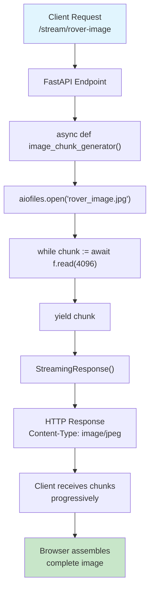
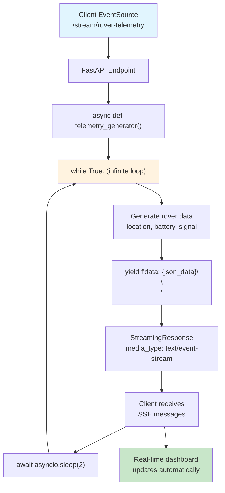
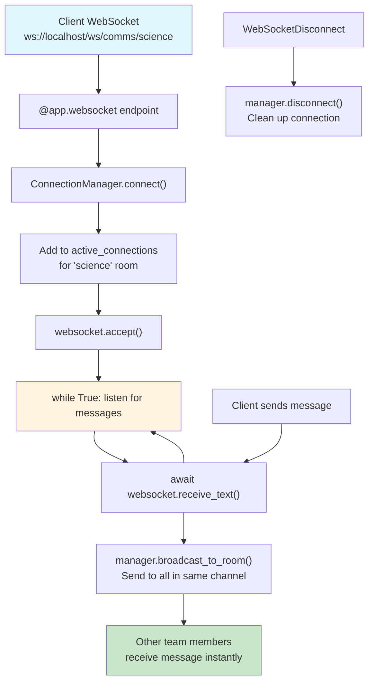

# 🛰️ Section 7: Advanced Streaming with "Cosmic Rover"

This section provides a focused, easy-to-understand example of advanced streaming concepts using a **"Cosmic Rover" Mission Control** theme. We'll explore how real-time data features are essential for communicating with and monitoring a rover on a distant planet.

## 🎯 Core Concepts Demonstrated

1.  **Streaming Large Responses**: Downloading a high-resolution image from the rover.
2.  **Server-Sent Events (SSE)**: Receiving a live telemetry feed of the rover's status.
3.  **Advanced WebSockets**: Creating separate communication channels for mission teams.

## 📊 Streaming Concepts Visualization

### Overview: All Three Streaming Concepts

```mermaid
graph LR
    subgraph "FastAPI Streaming Features"
    A["🖼️ StreamingResponse<br/>Large File Transfer"]
    B["📡 Server-Sent Events<br/>Real-time Updates"]
    C["💬 WebSockets<br/>Bidirectional Chat"]
    end
    
    A --> A1["Rover Image Feed"]
    B --> B1["Live Telemetry"]
    C --> C1["Team Communications"]
```


### Concept 1: StreamingResponse (Image Feed)


### Concept 2: Server-Sent Events (Telemetry)


### Concept 3: WebSockets (Team Communications)


## 📋 Streaming Concepts Summary Table

| Streaming Concept | Use Case | Implementation | Benefits |
|-------------------|----------|---------------|----------|
| **StreamingResponse** | Large file downloads | `StreamingResponse(image_chunk_generator())` | Low memory usage, immediate start |
| **Chunked Transfer** | High-resolution images | `while chunk := await f.read(4096): yield chunk` | Progressive loading, no timeout |
| **Server-Sent Events** | Live telemetry data | `media_type="text/event-stream"` | Real-time updates without polling |
| **SSE Format** | Structured event stream | `yield f"data: {json.dumps(data)}\n\n"` | Browser-compatible event format |
| **WebSockets** | Team communication | `@app.websocket("/ws/comms/{team_channel}")` | Full-duplex real-time messaging |
| **Connection Manager** | Multi-channel chat | `manager.broadcast_to_room(message, room)` | Organized communication channels |
| **Infinite Generators** | Continuous monitoring | `while True: yield data; await asyncio.sleep(2)` | Never-ending data streams |
| **Error Handling** | Robust connections | `try/except` around WebSocket operations | Graceful disconnection handling |
| **Media Types** | Content identification | `media_type="image/jpeg"` | Browser-compatible content rendering |

---

## 🚀 The "Cosmic Rover" Example

### 1. Streaming Response: The Rover Image Feed

-   **Analogy**: Sending a giant poster through a tiny mail slot. Instead of trying to shove the whole thing through at once (which would fail), you cut it into small, numbered puzzle pieces and send them one by one. The receiver assembles them on the other side.
-   **Concept**: `StreamingResponse` is ideal for large files (like images or videos). Instead of loading the entire file into memory, the server reads and sends it in small chunks. This keeps memory usage low and starts the transmission to the user almost instantly.
-   **Code Explanation**: The `/stream/rover-image` endpoint uses `aiofiles` to asynchronously read an actual image file (`rover_image.jpg`) from the disk. It reads the file in small 4KB chunks and `yield`s the raw bytes. The `Content-Type` header is set to `image/jpeg` so the browser knows how to handle the data.

    ```python
    @app.get("/stream/rover-image")
    async def stream_rover_image():
        """Streams a real image from the local filesystem chunk by chunk."""
        async def image_chunk_generator():
            async with aiofiles.open("rover_image.jpg", mode="rb") as f:
                while chunk := await f.read(4096):
                    yield chunk
        return StreamingResponse(image_chunk_generator(), media_type="image/jpeg")
    ```

    **Flow Diagram:**
    ```mermaid
    graph LR
        A["Client Request"] --> B["Read 4KB chunks"]
        B --> C["yield chunk"]
        C --> D["Browser assembles image"]
        style A fill:#e3f2fd
        style D fill:#e8f5e8
    ```

    - **Terminal (`curl`) Example**:
        ```bash
        # This will stream the raw image data to a new file named 'received_image.jpg'
        curl http://localhost:8000/stream/rover-image -o received_image.jpg
        ```

### 2. Server-Sent Events (SSE): The Live Telemetry Feed

-   **Analogy**: A radio station broadcasting live news. The station sends out information continuously. Anyone with a radio can tune in and listen, but they can't talk back to the announcer. It's a one-way street of information.
-   **Concept**: SSE is a standard for servers to push real-time updates to clients over a single, long-lived HTTP connection. It's simpler than WebSockets and perfect for when you only need one-way data flow (from server to client).
-   **Code Explanation**: The `/stream/rover-telemetry` endpoint uses a generator that runs in an infinite loop. Every two seconds, it gathers new (simulated) rover data, formats it as an SSE message (`data: ...\n\n`), and `yield`s it to the client.

    ```python
    @app.get("/stream/rover-telemetry")
    async def stream_rover_telemetry():
        """Streams live telemetry data from the rover using Server-Sent Events (SSE)."""
        async def telemetry_generator():
            while True:
                telemetry_data = { "location": ..., "battery_level": ... }
                yield f"data: {json.dumps(telemetry_data)}\n\n"
                await asyncio.sleep(2)
        return StreamingResponse(telemetry_generator(), media_type="text/event-stream")
    ```

    **Flow Diagram:**
    ```mermaid
    graph LR
        A["EventSource Connect"] --> B["while True: loop"]
        B --> C["Generate telemetry"]
        C --> D["yield SSE data"]
        D --> E["Client updates UI"]
        E --> F["sleep(2)"]
        F --> B
        style A fill:#e3f2fd
        style E fill:#e8f5e8
        style B fill:#fff8e1
    ```

    - **Terminal (`curl`) Example**:
        ```bash
        # The -N or --no-buffer flag is important to see messages as they arrive.
        curl -N http://localhost:8000/stream/rover-telemetry
        ```

### 3. WebSockets: Mission Control Comms Channels

-   **Analogy**: A multi-channel walkie-talkie system. The Engineering team tunes into Channel 1, and the Science team tunes into Channel 2. They can talk and listen in real-time, but their conversations are kept separate.
-   **Concept**: WebSockets provide a full, two-way communication channel. A `ConnectionManager` class helps organize connections into separate "rooms" or "channels," allowing you to broadcast messages only to specific groups of clients.
-   **Code Explanation**: The `/ws/comms/{team_channel}` endpoint uses a `ConnectionManager` to manage different chat rooms. When a user connects, they are added to the list for their specific `team_channel`. When they send a message, it is broadcast only to the other users in that same channel.

    ```python
    class ConnectionManager:
        # ... methods to connect, disconnect, and broadcast to a room ...

    manager = ConnectionManager()

    @app.websocket("/ws/comms/{team_channel}")
    async def websocket_comms_endpoint(websocket: WebSocket, team_channel: str):
        await manager.connect(websocket, team_channel)
        try:
            while True:
                data = await websocket.receive_text()
                await manager.broadcast_to_room(f"Message: {data}", team_channel)
        except WebSocketDisconnect:
            manager.disconnect(websocket, team_channel)
    ```

    **Flow Diagram:**
    ```mermaid
    graph LR
        A["WebSocket Connect"] --> B["Join team room"]
        B --> C["Listen for messages"]
        C --> D["Broadcast to room"]
        D --> E["Team members receive"]
        F["Send message"] --> C
        style A fill:#e3f2fd
        style E fill:#e8f5e8
        style C fill:#fff8e1
    ```

    - **Terminal (`wscat`) Example**:
        ```bash
        # curl cannot handle WebSockets. You can use a tool like wscat.
        # First, install it: npm install -g wscat
        # Then connect to a channel:
        wscat -c ws://localhost:8000/ws/comms/science
        ```


---

## 🛠️ How to Run the Demo

1.  Make sure you have the required packages installed. It's recommended to use the specific Python version (e.g., 3.11) that your project uses.
    ```bash
    # Use the pip associated with your project's python interpreter
    # e.g., py -3.11 -m pip install ...

    pip install "fastapi[all]"
    pip install aiofiles
    pip install requests
    ```
2.  Navigate into the streaming directory:
    ```bash
    cd 07-streaming
    ```
3.  From **inside the `streaming` directory**, run the Uvicorn server:
    ```bash
    uvicorn main:app --reload
    ```
4.  Open your browser and navigate to [http://localhost:8000](http://localhost:8000) to see the Mission Control dashboard in action. 