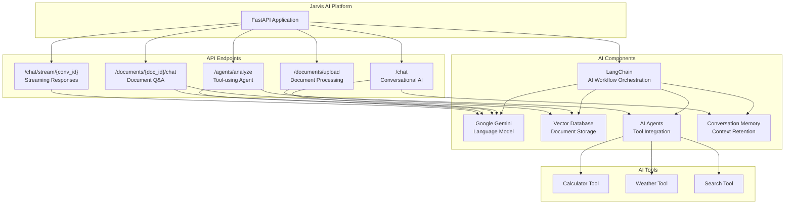

# 🤖 Section 9: AI Integration - Jarvis AI Personal Assistant Platform

Master **AI integration** by building an intelligent personal assistant! Learn how to integrate LangChain, Google Gemini, vector databases, and AI agents to create a powerful AI-driven platform using FastAPI.

## 🎯 What You'll Learn

- LangChain integration for AI workflows.
- Google Gemini API for powerful language models.
- Vector databases for semantic search and document Q&A.
- Building AI agents with custom tools for autonomous task execution.
- Streaming AI responses for a real-time chat experience.
- Managing conversation memory for contextual discussions.

## 🤖 Meet Jarvis AI Platform

Our AI assistant platform demonstrates cutting-edge integration through:

**Key Features:**
- 💬 **Conversational AI**: Engage in intelligent conversations with memory.
- 📚 **Document Q&A**: Upload documents and ask questions about their content.
- 🛠️ **AI Agents**: Autonomous agents that can use tools like a calculator or web search.
- ⚡ **Streaming Responses**: Get real-time AI feedback as it's being generated.

## 📊 AI Integration Architecture



## 📋 AI Integration Concepts Summary Table

| AI Component | Description | Implementation | Benefits |
|--------------|-------------|----------------|----------|
| **LangChain** | AI workflow orchestration | `from langchain.llms import GooglePalm` | Simplified AI integration patterns |
| **Language Models** | Text generation and understanding | `llm = ChatGooglePalm(model_name="...")` | Natural language processing capabilities |
| **Conversation Memory** | Context retention | `ConversationBufferWindowMemory(k=5)` | Maintain context across multiple interactions |
| **Vector Databases** | Semantic document storage | `FAISS.from_documents(docs, embeddings)` | Efficient similarity search for documents |
| **Embeddings** | Text-to-vector conversion | `GooglePalmEmbeddings()` | Convert text to numerical representations |
| **Document Loaders** | File processing | `PyPDFLoader(file_path)` | Extract text from various file formats |
| **Text Splitters** | Document chunking | `RecursiveCharacterTextSplitter(...)` | Break documents into manageable pieces |
| **Retrieval QA** | Document question answering | `ConversationalRetrievalChain.from_llm(...)` | Answer questions based on document content |
| **AI Agents** | Tool-using AI | `initialize_agent(tools, llm, ...)` | AI that can use external tools to solve tasks |
| **Custom Tools** | Extend AI capabilities | `class WeatherTool(BaseTool)` | Give AI access to external systems |
| **Streaming Responses** | Real-time AI output | `StreamingResponse(generate_streaming_response())` | Show AI responses as they're generated |
| **Async Processing** | Non-blocking AI operations | `async def chat_with_jarvis()` | Handle multiple AI requests efficiently |

## 🚀 Core AI Integration Concepts

### **1. LangChain Setup and Models**

```python
from langchain.llms import GooglePalm
from langchain.schema import HumanMessage, AIMessage, SystemMessage
from langchain.memory import ConversationBufferWindowMemory
from fastapi import FastAPI
import os

app = FastAPI(title="🤖 Jarvis AI Platform")

# Initialize AI models
try:
    # Gemini Pro for general conversations
    gemini_model = genai.GenerativeModel('gemini-pro')
    
    # LangChain integration with Google Palm
    llm = ChatGooglePalm(
        model_name="models/chat-bison-001",
        temperature=0.7,
        max_output_tokens=1024
    )
    
    # Embeddings for document processing
    embeddings = GooglePalmEmbeddings()
```

### **2. Document Q&A with Vector Search**

```python
from langchain.document_loaders import PyPDFLoader, TextLoader
from langchain.text_splitter import RecursiveCharacterTextSplitter
from langchain_google_genai import GoogleGenerativeAIEmbeddings
from langchain.vectorstores import Chroma
from langchain.chains import RetrievalQA

# Initialize embeddings and vector store
embeddings = GoogleGenerativeAIEmbeddings(model="models/embedding-001")
vector_store = Chroma(persist_directory="./chroma_db", embedding_function=embeddings)

class DocumentUpload(BaseModel):
    title: str
    description: Optional[str] = None

class DocumentQuestion(BaseModel):
    question: str
    document_ids: Optional[List[str]] = None

@app.post("/ai/upload-document")
async def upload_document(
    file: UploadFile = File(...),
    metadata: DocumentUpload = Depends()
):
    """Upload and process document for Q&A"""
    
    # Save uploaded file
    file_path = f"uploads/{file.filename}"
    with open(file_path, "wb") as buffer:
        content = await file.read()
        buffer.write(content)
    
    # Load and split document
    if file.filename.endswith('.pdf'):
        loader = PyPDFLoader(file_path)
    else:
        loader = TextLoader(file_path)
    
    documents = loader.load()
    
    # Split text into chunks
    text_splitter = RecursiveCharacterTextSplitter(
        chunk_size=1000,
        chunk_overlap=200
    )
    chunks = text_splitter.split_documents(documents)
    
    # Add metadata
    for chunk in chunks:
        chunk.metadata.update({
            "title": metadata.title,
            "description": metadata.description,
            "filename": file.filename
        })
    
    # Add to vector store
    document_ids = vector_store.add_documents(chunks)
    
    return {
        "message": "Document uploaded and processed",
        "document_ids": document_ids,
        "chunks_created": len(chunks)
    }

@app.post("/ai/ask-document")
async def ask_document(request: DocumentQuestion):
    """Ask questions about uploaded documents"""
    
    # Create retrieval QA chain
    qa_chain = RetrievalQA.from_chain_type(
        llm=llm,
        chain_type="stuff",
        retriever=vector_store.as_retriever(search_kwargs={"k": 5}),
        return_source_documents=True
    )
    
    # Get answer
    result = qa_chain({"query": request.question})
    
    # Extract sources
    sources = [doc.metadata.get("title", "Unknown") for doc in result["source_documents"]]
    
    return ChatResponse(
        response=result["result"],
        conversation_id=generate_conversation_id(),
        sources=list(set(sources))
    )
```

### **3. AI Agents with Custom Tools**

```python
from langchain.agents import initialize_agent, AgentType, Tool
from langchain.tools import BaseTool

# Define custom tools (e.g., Calculator, WebSearch)
class CalculatorTool(BaseTool):
    name = "calculator"
    description = "Perform mathematical calculations"
    
    def _run(self, expression: str) -> str:
        try:
            # Safe evaluation of mathematical expressions
            result = eval(expression, {"__builtins__": {}}, {
                "abs": abs, "round": round, "min": min, "max": max,
                "sum": sum, "pow": pow, "sqrt": lambda x: x**0.5
            })
            return f"Result: {result}"
        except:
            return "Invalid mathematical expression"

class WeatherTool(BaseTool):
    name = "weather"
    description = "Get current weather information for a city"
    
    def _run(self, city: str) -> str:
        # Mock weather API call
        api_key = "your-weather-api-key"
        url = f"http://api.openweathermap.org/data/2.5/weather?q={city}&appid={api_key}"
        
        try:
            response = requests.get(url)
            data = response.json()
            
            if response.status_code == 200:
                return f"Weather in {city}: {data['weather'][0]['description']}, Temperature: {data['main']['temp']}°K"
            else:
                return f"Could not get weather for {city}"
        except:
            return "Weather service unavailable"

# Initialize tools and agent
tools = [CalculatorTool(), WebSearchTool(), WeatherTool()]

# Initialize the agent
agent_chain = initialize_agent(
    tools, llm, agent=AgentType.CONVERSATIONAL_REACT_DESCRIPTION, verbose=True
)

class AgentRequest(BaseModel):
    task: str
    max_iterations: int = 5

@app.post("/ai/agent")
async def run_agent(request: AgentRequest):
    """Run AI agent with access to tools"""
    
    try:
        result = agent_chain.invoke({
            "input": request.task,
            "max_iterations": request.max_iterations
        })
        
        return {
            "result": result["output"],
            "intermediate_steps": result.get("intermediate_steps", [])
        }
    except Exception as e:
        return {"error": str(e), "result": "Agent execution failed"}
```

## 🔗 Streaming AI Responses

### **1. Streaming Chat with Server-Sent Events**

```python
from fastapi.responses import StreamingResponse
import asyncio

@app.post("/ai/chat-stream")
async def stream_chat(request: ChatRequest):
    """Stream AI responses in real-time"""
    
    async def generate_response():
        memory = ConversationBufferMemory(return_messages=True)
        
        # Load conversation history
        if request.conversation_id:
            previous_messages = load_conversation(request.conversation_id)
            for msg in previous_messages:
                memory.chat_memory.add_message(msg)
        
        memory.chat_memory.add_user_message(request.message)
        
        # Stream the response
        response_text = ""
        async for chunk in llm.astream(memory.chat_memory.messages):
            if chunk.content:
                response_text += chunk.content
                yield f"data: {json.dumps({'type': 'chunk', 'content': chunk.content})}\n\n"
                await asyncio.sleep(0.01)  # Small delay for smooth streaming
        
        # Send completion signal
        yield f"data: {json.dumps({'type': 'complete', 'full_response': response_text})}\n\n"
        
        # Save conversation
        memory.chat_memory.add_ai_message(response_text)
        conversation_id = request.conversation_id or generate_conversation_id()
        save_conversation(conversation_id, memory.chat_memory.messages)
    
    return StreamingResponse(
        generate_response(),
        media_type="text/event-stream",
        headers={
            "Cache-Control": "no-cache",
            "Connection": "keep-alive",
        }
    )
```

### **2. WebSocket Chat Interface**

```python
from fastapi import WebSocket, WebSocketDisconnect
from typing import Dict

class ChatManager:
    def __init__(self):
        self.active_connections: Dict[str, WebSocket] = {}
        self.conversations: Dict[str, ConversationBufferMemory] = {}

    async def connect(self, websocket: WebSocket, client_id: str):
        await websocket.accept()
        self.active_connections[client_id] = websocket
        self.conversations[client_id] = ConversationBufferMemory(return_messages=True)

    async def disconnect(self, client_id: str):
        if client_id in self.active_connections:
            del self.active_connections[client_id]
        if client_id in self.conversations:
            del self.conversations[client_id]

    async def send_message(self, client_id: str, message: dict):
        if client_id in self.active_connections:
            await self.active_connections[client_id].send_json(message)

chat_manager = ChatManager()

@app.websocket("/ai/ws-chat/{client_id}")
async def websocket_chat(websocket: WebSocket, client_id: str):
    await chat_manager.connect(websocket, client_id)
    
    try:
        while True:
            # Receive message from client
            data = await websocket.receive_json()
            user_message = data["message"]
            
            # Add to conversation memory
            memory = chat_manager.conversations[client_id]
            memory.chat_memory.add_user_message(user_message)
            
            # Send typing indicator
            await chat_manager.send_message(client_id, {"type": "typing", "status": True})
            
            # Generate AI response
            response = await llm.ainvoke(memory.chat_memory.messages)
            memory.chat_memory.add_ai_message(response.content)
            
            # Send response
            await chat_manager.send_message(client_id, {
                "type": "message",
                "content": response.content,
                "sender": "assistant"
            })
            
    except WebSocketDisconnect:
        await chat_manager.disconnect(client_id)
```

## 📊 Advanced AI Features

### **1. Conversation Analytics**

```python
from langchain.chains.summarize import load_summarize_chain

@app.get("/ai/conversation/{conversation_id}/summary")
async def get_conversation_summary(conversation_id: str):
    """Generate summary of conversation"""
    
    messages = load_conversation(conversation_id)
    
    # Convert messages to documents for summarization
    docs = [
        Document(page_content=f"{msg.type}: {msg.content}")
        for msg in messages
    ]
    
    # Generate summary
    summary_chain = load_summarize_chain(llm, chain_type="stuff")
    summary = summary_chain.run(docs)
    
    return {"summary": summary, "message_count": len(messages)}

@app.get("/ai/conversation/{conversation_id}/analytics")
async def get_conversation_analytics(conversation_id: str):
    """Get detailed conversation analytics"""
    
    messages = load_conversation(conversation_id)
    
    user_messages = [msg for msg in messages if isinstance(msg, HumanMessage)]
    ai_messages = [msg for msg in messages if isinstance(msg, AIMessage)]
    
    # Calculate metrics
    avg_user_length = sum(len(msg.content) for msg in user_messages) / len(user_messages) if user_messages else 0
    avg_ai_length = sum(len(msg.content) for msg in ai_messages) / len(ai_messages) if ai_messages else 0
    
    return {
        "total_messages": len(messages),
        "user_messages": len(user_messages),
        "ai_messages": len(ai_messages),
        "avg_user_message_length": round(avg_user_length, 2),
        "avg_ai_message_length": round(avg_ai_length, 2),
        "conversation_start": messages[0].timestamp if messages else None
    }
```

## 🎮 Key AI Endpoints

### **Core Chat Features**
```python
@app.post("/ai/chat", response_model=ChatResponse)
async def chat_with_ai(request: ChatRequest)

@app.post("/ai/chat-stream")
async def stream_chat(request: ChatRequest)

@app.websocket("/ai/ws-chat/{client_id}")
async def websocket_chat(websocket: WebSocket, client_id: str)
```

### **Document Intelligence**
```python
@app.post("/ai/upload-document")
async def upload_document(file: UploadFile = File(...))

@app.post("/ai/ask-document")
async def ask_document(request: DocumentQuestion)

@app.get("/ai/documents")
async def list_documents()
```

### **AI Agents & Tools**
```python
@app.post("/ai/agent")
async def run_agent(request: AgentRequest)

@app.get("/ai/tools")
async def list_available_tools()

@app.post("/ai/tools/custom")
async def create_custom_tool(tool_definition: ToolDefinition)
```

## 🛠️ Running the Jarvis AI Platform

1.  **Navigate to the directory:**
    ```bash
    cd 09-ai-integration
    ```

2.  **Install dependencies:**
    This project requires `fastapi`, `uvicorn`, `langchain`, `google-generativeai`, `faiss-cpu`, and `pypdf`.
    ```bash
    pip install "fastapi[all]" langchain google-generativeai "langchain[google_palm]" faiss-cpu pypdf
    ```

3.  **Set up your API Key:**
    In `main.py`, replace `"your-google-api-key-here"` with your actual Google AI API key.
    ```python
    # In main.py
    os.environ["GOOGLE_API_KEY"] = "your-google-api-key-here" 
    ```

4.  **Run the application:**
    ```bash
    uvicorn main:app --reload
    ```
    The server will start, and you can access the API at `http://localhost:8000`.

## 🎮 Trying Out the Endpoints

Once the server is running, you can use the interactive docs at [http://localhost:8000/docs](http://localhost:8000/docs) to test the features:

1.  **Upload a Document**: Use the `/documents/upload` endpoint to upload a PDF or TXT file. You'll get back a `document_id`.
2.  **Chat with the Document**: Use the `/documents/{document_id}/chat` endpoint, providing the ID from step 1 and a question about the document.
3.  **Use the AI Agent**: Use the `/agents/analyze` endpoint with a query like "What is the weather in New York?" or "What is 25 * 8?".
4.  **Have a Conversation**: Use the `/chat` endpoint to have a basic conversation with Jarvis.

---
**Key Takeaway**: FastAPI provides the perfect framework for building robust, production-ready APIs on top of powerful AI libraries like LangChain and Google Gemini. 🤖✨ 