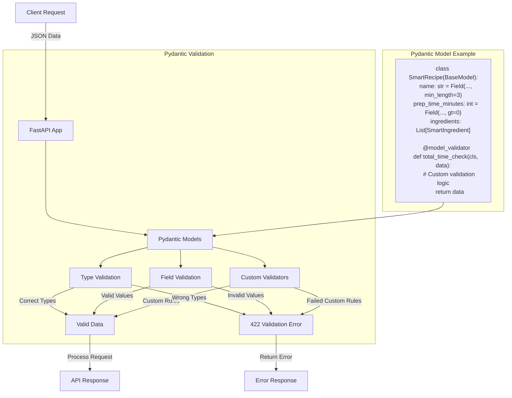

# 👨‍🍳 Section 3: Pydantic Data Validation - Recipe Master

This section introduces **Pydantic**, a powerful Python library that makes sure the data you're working with is always correct and in the right format. Think of it as a quality control system for your data!

## 🎯 What You'll Learn

- How to define simple data models with Pydantic.
- How to add rules (like "must be a number between 0 and 100") to your data using `Field`.
- How Pydantic helps you catch errors early and provides clear messages.
- How to implement custom validation logic using `@field_validator` and `@model_validator`.

## 👨‍🍳 Meet Recipe Master (Simplified!)

Our "Recipe Master" application now has a very focused set of features to demonstrate Pydantic:

**What Pydantic helps us do in this simplified example:**
- 🍳 Validate basic recipe details like name, description, and cooking times.
- 🥘 Check individual ingredient quantities.
- ⏰ Ensure total preparation and cooking times are reasonable.

## 📊 Pydantic Validation Flow



## 🔥 Pydantic in Action: Key Concepts

Pydantic works by letting you define data "schemas" using Python classes that inherit from `BaseModel`. You specify the expected type for each piece of data (e.g., `str` for text, `int` for whole numbers) and can add extra rules.

### **1. Basic Data Models & Field Validation**

You define a class, and each attribute becomes a data field. You can use `Field()` to add specific validation rules, like minimum/maximum lengths for text, or value ranges for numbers. If data doesn't meet these rules, Pydantic automatically flags it.

```python
# Example: See 'SmartIngredient' and 'SmartRecipe' models in main.py
```
*Purpose*: Ensures basic data types are correct and values meet predefined criteria (e.g., a recipe name has a minimum length, a quantity is a positive number).

### **2. Custom Validation Logic (`@field_validator` & `@model_validator`)**

For more complex rules that depend on specific business logic or relationships between different data fields, Pydantic allows you to write your own Python validation functions:

-   `@field_validator`: Checks a single field. (e.g., in `SmartIngredient`, checking if a `quantity` is unusually high).
-   `@model_validator`: Checks the entire model after all individual fields are validated. (e.g., in `SmartRecipe`, ensuring the `total_time` of prep and cooking isn't excessive).

```python
# Example: See the custom validators in 'SmartIngredient' and 'SmartRecipe' in main.py
```
*Purpose*: Allows you to implement any custom logic needed to validate your data, ensuring data integrity beyond simple type checks.

### **3. Enums for Fixed Choices**

Enums (enumerations) allow you to define a fixed set of allowed values for a field. This prevents typos and ensures consistency by limiting choices to a predefined list.

```python
# Example: See 'DifficultyLevel' and 'CuisineType' enums in main.py
```
*Purpose*: Guarantees that certain fields (like `difficulty` or `cuisine_type`) only accept predefined, valid options, improving data quality.

## 🚀 Pydantic + FastAPI: A Perfect Pair

FastAPI works seamlessly with Pydantic. When you define your API's expected input data using Pydantic models, FastAPI automatically:

-   **Validates Incoming Data**: Checks if the data sent by the user matches your Pydantic model's rules. If not, it sends clear error messages back (a `422 Unprocessable Entity` response with details).
-   **Generates API Documentation**: Automatically creates interactive documentation (Swagger UI/OpenAPI) showing exactly what data your API expects and returns. This makes it incredibly easy for others to understand and use your API.

```python
# Example: See the API endpoints in main.py where SmartRecipe is used as input
```

## 🛠️ Running Recipe Master

To see Pydantic in action:

```bash
cd 03-pydantic
pip install "fastapi[all]"  # Install FastAPI with all common extras, including Pydantic
uvicorn main:app --reload

# After running, open your browser to http://127.0.0.1:8000/docs to see the auto-generated API documentation.

# --- Example POST Requests ---
# Make sure the FastAPI application is running (uvicorn main:app --reload) before trying these.

# 1. Basic Recipe Creation (POST /recipes/)
#    This endpoint uses the SmartRecipe model for validation.

#    Example 1.1: Valid Request
#    Expected: 200 OK, with a success message and recipe details.
curl -X POST "http://127.0.0.1:8000/recipes/" \
     -H "Content-Type: application/json" \
     -d '{
  "name": "Delicious Vegan Pasta",
  "description": "A quick and easy pasta dish with fresh vegetables and a creamy sauce.",
  "difficulty": "beginner",
  "prep_time_minutes": 15,
  "cook_time_minutes": 20,
  "ingredients": [
    {"name": "Spaghetti", "quantity": 250, "unit": "g"},
    {"name": "Tomatoes", "quantity": 300, "unit": "g"}
  ],
  "cuisine_type": "italian"
}'

#    Example 1.2: Invalid Request (Missing 'name', 'description' too short)
#    Expected: 422 Unprocessable Entity, with detailed validation errors.
curl -X POST "http://127.0.0.1:8000/recipes/" \
     -H "Content-Type: application/json" \
     -d '{
  "description": "Too short",
  "difficulty": "intermediate",
  "prep_time_minutes": 5,
  "cook_time_minutes": 10,
  "ingredients": [
    {"name": "Water", "quantity": 1, "unit": "cup"}
  ],
  "cuisine_type": "american"
}'

# 2. Advanced Validation Example (POST /recipes/validate-advanced/)
#    This endpoint also uses the SmartRecipe model, demonstrating custom model-level validation.

#    Example 2.1: Valid Request
#    Expected: 200 OK, with a success message and calculated total time.
curl -X POST "http://127.0.0.1:8000/recipes/validate-advanced/" \
     -H "Content-Type: application/json" \
     -d '{
  "name": "Complex Beef Wellington",
  "description": "An elaborate and time-consuming dish for experienced chefs, perfect for special occasions.",
  "difficulty": "expert",
  "prep_time_minutes": 120,
  "cook_time_minutes": 240,
  "ingredients": [
    {"name": "Beef Tenderloin", "quantity": 1, "unit": "kg"},
    {"name": "Puff Pastry", "quantity": 500, "unit": "g"},
    {"name": "Mushrooms", "quantity": 200, "unit": "g"}
  ],
  "cuisine_type": "french"
}'

#    Example 2.2: Invalid Request (Total time exceeds 12 hours - custom model validator will fail)
#    Expected: 422 Unprocessable Entity, due to the 'total_time_check' validator.
curl -X POST "http://127.0.0.1:8000/recipes/validate-advanced/" \
     -H "Content-Type: application/json" \
     -d '{
  "name": "Marathon Stew",
  "description": "A stew that requires an absurdly long cooking time for maximum flavor extraction.",
  "difficulty": "advanced",
  "prep_time_minutes": 60,
  "cook_time_minutes": 700, 
  "ingredients": [
    {"name": "Beef", "quantity": 500, "unit": "g"},
    {"name": "Potatoes", "quantity": 2, "unit": "large"}
  ],
  "cuisine_type": "american"
}'
```

## 🔥 Why Pydantic is Awesome (Key Benefits)

| Benefit             | How Pydantic Helps                                            |
|---------------------|---------------------------------------------------------------|
| **Less Code**       | You write significantly less code for data validation, as Pydantic handles much of it automatically based on your model definitions. |
| **Clear Errors**    | Provides precise, machine-readable, and user-friendly error messages when data is invalid, making debugging and API usage simpler. |
| **Type Safety**     | Ensures that data conforms to expected Python types, reducing common programming mistakes and improving code reliability. |
| **Auto-Documentation**| Generates comprehensive API documentation for free, making it incredibly easy for developers to understand and interact with your API. |
| **Reliability**     | Makes your application more robust and predictable by ensuring all incoming and outgoing data adheres to defined schemas. |

## 💡 Best Practices

1.  **Use `Field()`**: Always use `Field()` for detailed validation rules (e.g., `min_length`, `gt`).
2.  **Custom Logic**: Implement complex business rules or cross-field validations using `@field_validator` and `@model_validator`.
3.  **Clear Models**: Keep your Pydantic models clear and representative of your data structure.

## 🚀 What's Next?

In **Section 4: Routing**, we'll explore how to organize more complex APIs into smaller, manageable parts using FastAPI's routing features!

**Key Takeaway**: Pydantic streamlines data validation, turning a tedious task into an efficient, robust, and self-documenting process! 👨‍🍳✨ 