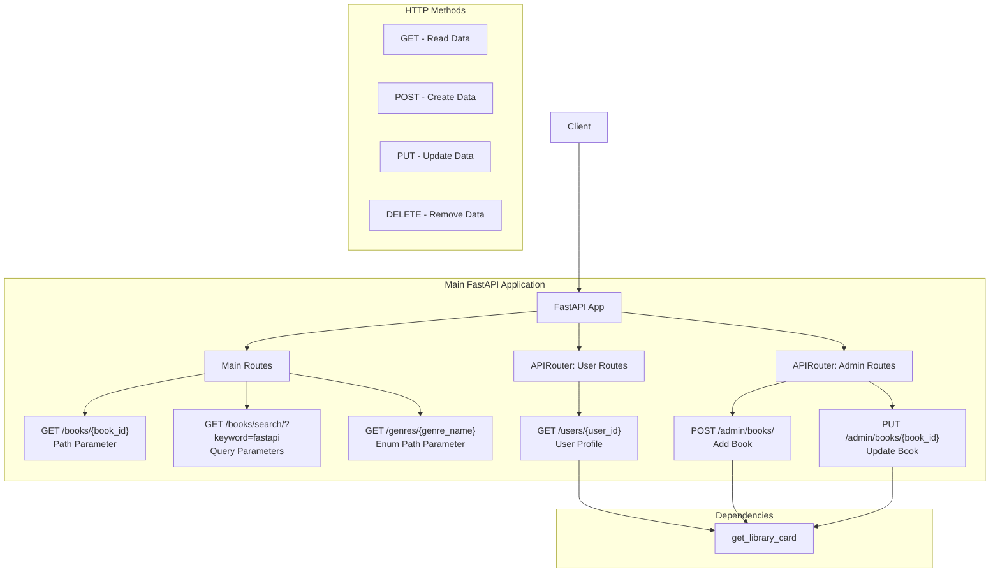

# 📚 Section 4: Routing - Magical Digital Library

Master **FastAPI routing** by understanding how to define routes, use parameters, and organize your API effectively.

## 🎯 What You'll Learn

- How to define API routes and HTTP methods (GET, POST, PUT).
- Using **Path Parameters** to identify specific resources.
- Using **Query Parameters** for flexible searching and filtering.
- Organizing routes with **APIRouter** for modular APIs.
- Implementing **Dependencies** for shared logic across routes.
- Leveraging **Enums** for clear path parameters.

## 📚 Meet the Simplified Digital Library

Our library system is now streamlined to focus purely on demonstrating routing concepts through book and user management:

**Key Features:**
- 📖 Retrieving book details by ID.
- 🔍 Searching for books with filters.
- 🏰 Browsing books by genre.
- 👤 Managing user profiles (modular routing example).
- 🔐 Basic access control using dependencies.
- ➕ Adding and updating books (admin routes example).

## 📊 FastAPI Routing Structure



## 🚀 Core Routing Concepts

FastAPI uses Python decorators (`@app.get()`, `@app.post()`, etc.) to define API endpoints (routes). These routes map HTTP requests to specific Python functions.

### **1. Path Parameters**

Path parameters are used to identify a specific resource within a collection. They are defined within curly braces `{}` in the path.

```python
# Example: See get_book_by_id in main.py
# GET /books/1
```
*Purpose*: Used when the parameter is part of the resource's unique identifier (e.g., getting a specific book by its ID).

### **2. Query Parameters**

Query parameters are optional key-value pairs added to the end of a URL after a question mark `?`. They are used for filtering, sorting, or pagination.

```python
# Example: See search_books in main.py
# GET /books/search/?keyword=fastapi&genre=sci_fi
```
*Purpose*: Used when you need to provide additional options or filters to retrieve resources.

### **3. Enum Path Parameters**

FastAPI allows you to define path parameters using Python Enums, ensuring that the input value is one of a predefined set of choices. This helps in validating input and provides great documentation.

```python
# Example: See explore_genre in main.py
# GET /genres/fantasy
```
*Purpose*: Guarantees type safety and provides clear validation for parameters that should only accept specific, known values.

## 🎯 Advanced Routing Patterns

### **1. Route Organization with APIRouter**

`APIRouter` allows you to split your API into smaller, modular parts. Each router can have its own prefix, tags (for documentation), and common responses, making your codebase more organized and scalable.

```python
# Example: See user_router and book_management_router in main.py
# Endpoints under user_router: /users/{user_id}
# Endpoints under book_management_router: /admin/books/, /admin/books/{book_id}
```
*Purpose*: Improves code organization, reusability, and enhances auto-generated API documentation.

### **2. Dependencies for Shared Logic**

Dependencies are functions or classes that FastAPI runs before your route operation function. They are perfect for sharing common logic like authentication, database connections, or validation.

```python
# Example: See get_library_card dependency in main.py
# This dependency is used in user_router and book_management_router.
# Access GET /users/101 with Header: X-Library-Card: VALID_CARD
```
*Purpose*: Reduces code duplication, improves maintainability, and ensures consistent application of logic across multiple routes.

## 📋 Routing Concepts Summary Table

| Routing Concept | Description | Example | Benefits |
|-----------------|-------------|---------|----------|
| **Basic Routes** | Simple endpoint definitions | `@app.get("/")` | Entry points to your API |
| **Path Parameters** | Variables in the URL path | `@app.get("/books/{book_id}")` | Identify specific resources |
| **Query Parameters** | Optional URL parameters | `?keyword=fastapi&max_pages=500` | Filtering and customization |
| **Enum Path Parameters** | Path params with fixed choices | `@app.get("/genres/{genre_name}")` | Type safety and validation |
| **APIRouter** | Modular route organization | `user_router = APIRouter(prefix="/users")` | Code organization and reusability |
| **Router Tags** | Group endpoints in docs | `tags=["users"]` | Better API documentation |
| **Router Prefixes** | Common path prefix | `prefix="/admin"` | Consistent URL structure |
| **Dependencies** | Shared logic between routes | `Depends(get_library_card)` | Code reuse and consistency |
| **HTTP Methods** | Different operation types | `GET`, `POST`, `PUT`, `DELETE` | RESTful API design |
| **Status Codes** | HTTP response status | `status_code=201` | Proper HTTP semantics |

## 🛠️ Running the Library

To see the routing in action:

```bash
cd 04-routing
uvicorn main:app --reload

# After running, open your browser to http://127.0.0.1:8000/docs to see the auto-generated API documentation.

# --- Example API Calls (using curl) ---

# 1. Path Parameter: Get book by ID
#    GET /books/1
curl http://127.0.0.1:8000/books/1

# 2. Query Parameters: Search books
#    GET /books/search/?keyword=fastapi&max_pages=500&genre=sci_fi
curl "http://127.0.0.1:8000/books/search/?keyword=fastapi&max_pages=500&genre=sci_fi"

# 3. Enum Path Parameter: Explore genre
#    GET /genres/fantasy
curl http://127.0.0.1:8000/genres/fantasy

# 4. APIRouter & Dependency: Get user profile
#    GET /users/101 (with valid header)
curl -H "X-Library-Card: VALID_CARD" http://127.0.0.1:8000/users/101
#    GET /users/101 (without valid header - expects 404/error for unauthorized)
curl http://127.0.0.1:8000/users/101

# 5. APIRouter (Admin): Add a new book
#    POST /admin/books/ (Requires valid library card)
curl -X POST "http://127.0.0.1:8000/admin/books/" \
     -H "X-Library-Card: VALID_CARD" \
     -H "Content-Type: application/json" \
     -d '{
  "title": "The Art of Routing",
  "author": "Route Weaver",
  "genre": "sci_fi"
}'

# 6. APIRouter (Admin): Update an existing book
#    PUT /admin/books/1 (Requires valid library card)
curl -X PUT "http://127.0.0.1:8000/admin/books/1" \
     -H "X-Library-Card: VALID_CARD" \
     -H "Content-Type: application/json" \
     -d '{
  "title": "The Art of Routing - Updated Edition",
  "author": "Route Weaver",
  "genre": "mystery"
}'
```

## 📊 Routing Best Practices

| Practice | Description | Example |
|----------|-------------|---------|
| **Logical Grouping** | Group related endpoints using `APIRouter` | `/books/`, `/users/`, `/admin/books/` |
| **Consistent Naming** | Use clear, predictable URL patterns and singular/plural conventions | `/books/{book_id}` |
| **HTTP Methods** | Use appropriate HTTP verbs for actions: GET (read), POST (create), PUT (update), DELETE (remove) | `GET /items`, `POST /items` |
| **Dependencies** | Extract and reuse common logic like authentication, validation, or database sessions | `Depends(get_library_card)` |
| **Clear Parameters** | Provide descriptions for Path and Query parameters using `Path()` and `Query()` | `book_id: int = Path(..., description="...")` |

## 💡 Key Benefits of FastAPI Routing

- **🏗️ Organization**: `APIRouter` keeps your codebase modular and easy to navigate for large APIs.
- **📖 Documentation**: FastAPI automatically generates interactive API documentation (Swagger UI) from your route definitions and Pydantic models.
- **🔒 Security**: Dependencies provide a clean way to implement authentication and authorization checks.
- **🎯 Validation**: Path and Query parameters, along with Pydantic models, ensure that incoming data is valid.
- **⚡ Performance**: FastAPI is built on Starlette, known for its high performance.

**Key Takeaway**: Effective routing is crucial for a well-structured and maintainable API. FastAPI provides powerful tools to define clear, flexible, and organized routes! ✨ 